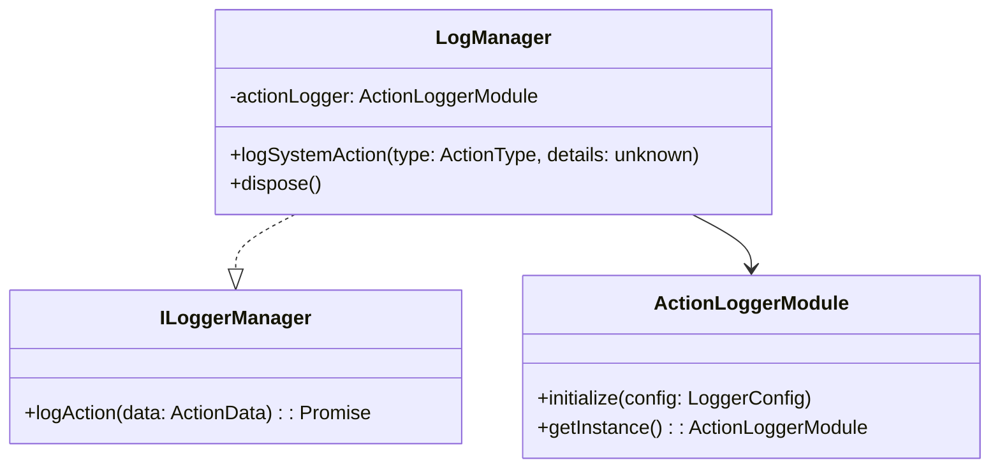
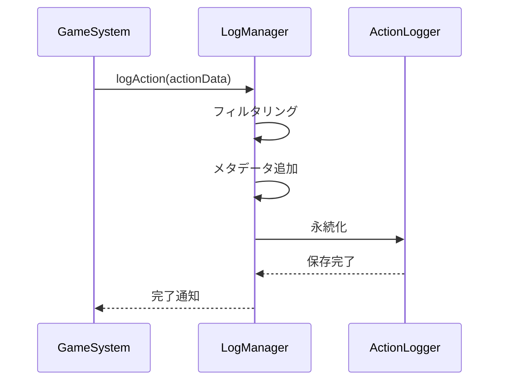
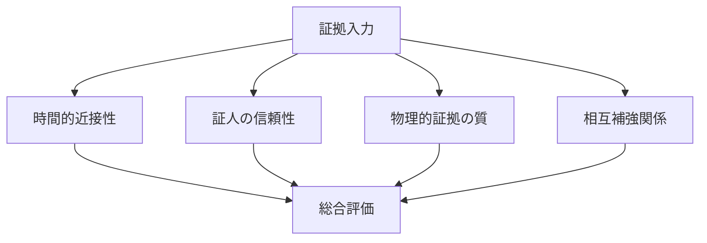
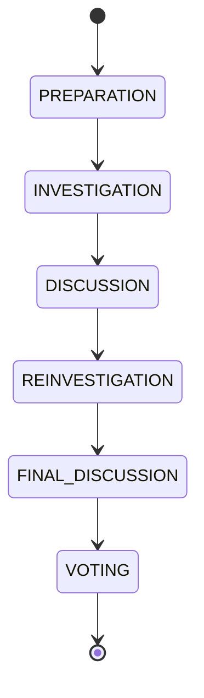
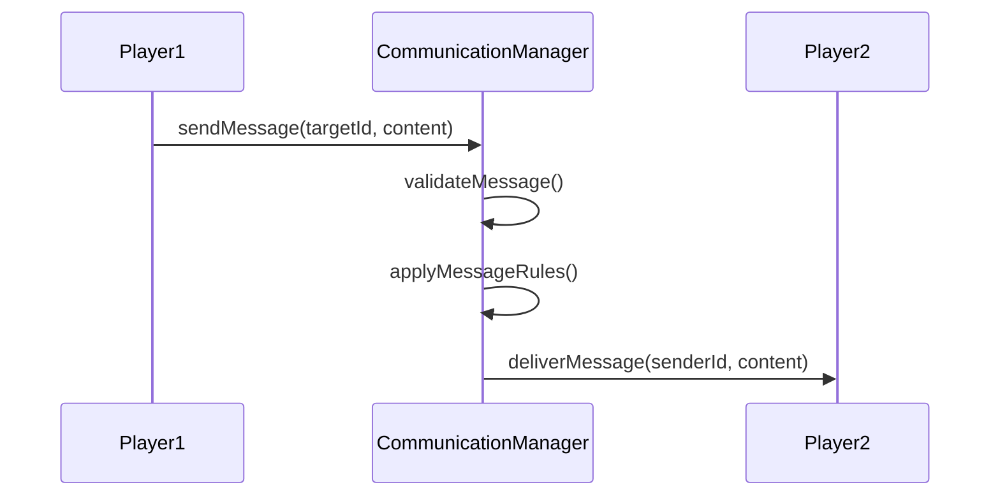

# マーダーミステリーゲーム 詳細設計書

## 1. アクションログ機能

### 1.1 目的と概要
アクションログ機能は、ゲーム内で発生するすべてのアクションを記録し、後の分析や証拠としての利用を可能にするシステムです。

#### 主な目的
- ゲーム内アクションの正確な記録
- プレイヤーの行動履歴の追跡
- 証拠分析のためのデータ提供
- ゲームの公平性担保

### 1.2 詳細設計

#### クラス構造


#### 設定パラメータ
```typescript
interface LoggerConfig {
  gameTime: {
    initialTime: number;
    timeScale: number;
    dayLength: number;
  };
  filters: {
    minLogLevel: number;
    includedActionTypes: ActionType[];
  };
}
```

### 1.3 データフロー


### 1.4 設定項目
- gameTime: ゲーム内時間のスケール設定
- filters: ログフィルタリング条件
- minLogLevel: 最小ログレベル
- includedActionTypes: 記録対象アクションタイプ

### 1.5 エラーハンドリング
- ログ書き込みエラー時の再試行メカニズム
- 非同期処理のエラーハンドリング
- メモリ使用量の監視と制御

## 2. 証拠分析システム

### 2.1 目的と概要
証拠分析システムは、収集された証拠の信頼性評価、関連性分析、証拠チェーンの構築を行います。

#### 主要機能
- 証拠の信頼性評価
- 証拠間の関連性分析
- 証拠チェーンの構築と管理
- 時系列分析

### 2.2 分析アルゴリズム

#### 信頼性評価要素


### 2.3 データ構造
```typescript
interface EvidenceAnalysis {
  evidenceId: string;
  analysisId: string;
  analyzedBy: string;
  timestamp: number;
  reliabilityFactors: Map<ReliabilityFactor, number>;
  conclusionStrength: number;
  notes: string;
  linkedAnalyses: string[];
}

interface EvidenceChain {
  chainId: string;
  name: string;
  description: string;
  evidenceIds: string[];
  relations: EvidenceRelation[];
  createdBy: string;
  timestamp: number;
  reliability: number;
  conclusionStrength: number;
}
```

### 2.4 信頼性評価の仕組み
- 時間的近接性評価（30分以内: 0.8-1.0, 2時間以内: 0.5-0.8）
- 証人の信頼性評価（探偵: +0.3ボーナス）
- 物理的証拠の品質評価（基本: 0.7, 検証済み: +0.2）
- 証拠間の相互補強関係評価

### 2.5 拡張性
- カスタム評価アルゴリズムの追加
- 新しい証拠タイプへの対応
- 分析結果のエクスポート機能

## 3. ゲームフェーズ管理

### 3.1 各フェーズの詳細

#### フェーズ構成


#### タイミング設定
```typescript
interface PhaseTimings {
  preparation: number;    // 600秒
  investigation: number;  // 1200秒
  discussion: number;    // 900秒
  reinvestigation: number; // 900秒
  finalDiscussion: number; // 600秒
  voting: number;        // 300秒
}
```

### 3.2 状態遷移
- 準備フェーズ → 調査フェーズ: 最小プレイヤー数達成時
- 調査フェーズ → 議論フェーズ: 時間経過または全証拠収集時
- 議論フェーズ → 再調査フェーズ: 時間経過または投票実施時
- 再調査フェーズ → 最終議論フェーズ: 時間経過時
- 最終議論フェーズ → 投票フェーズ: 時間経過時

### 3.3 イベントハンドリング
- フェーズ変更通知
- タイマーイベント
- プレイヤーアクション
- システムイベント

### 3.4 プレイヤー管理
```typescript
interface PlayerState {
  playerId: string;
  role: RoleType;
  collectedEvidence: string[];
  votingHistory: string[];
  isActive: boolean;
}
```

## 4. コミュニケーション管理

### 4.1 メッセージング機能
- プレイヤー間直接通信
- グループ通信
- システムアナウンス

### 4.2 プレイヤー間通信


### 4.3 システムメッセージ
- フェーズ変更通知
- 証拠発見通知
- 投票結果通知
- ゲーム状態更新通知

### 4.4 通信制御
- ロールベースの通信制限
- フェーズベースの通信制限
- メッセージフィルタリング
- スパム防止