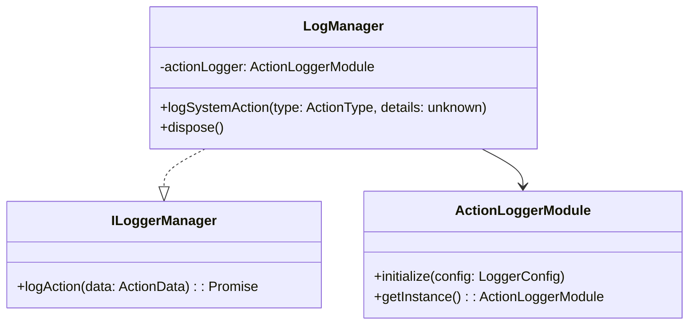
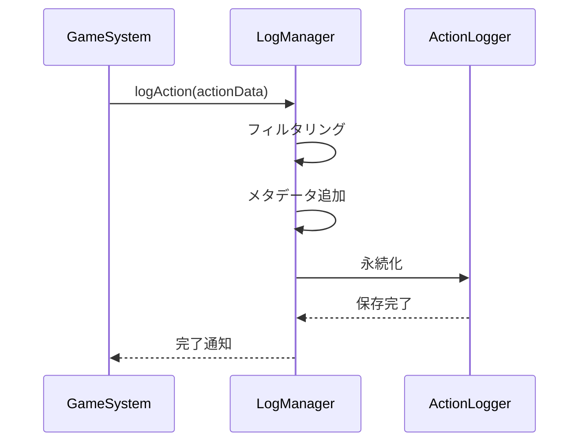
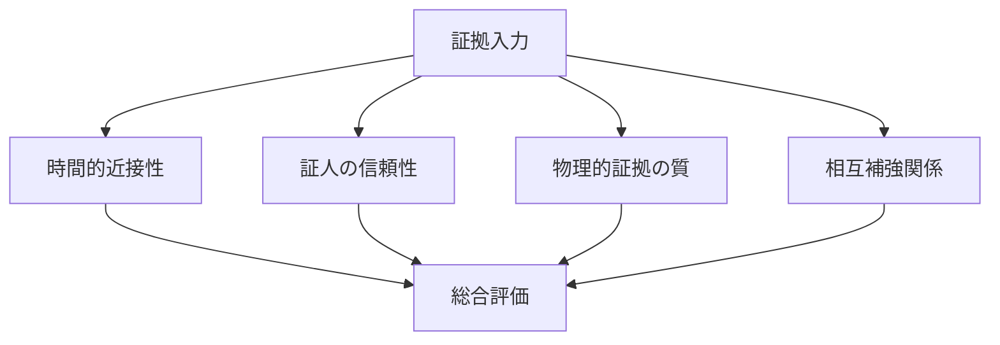
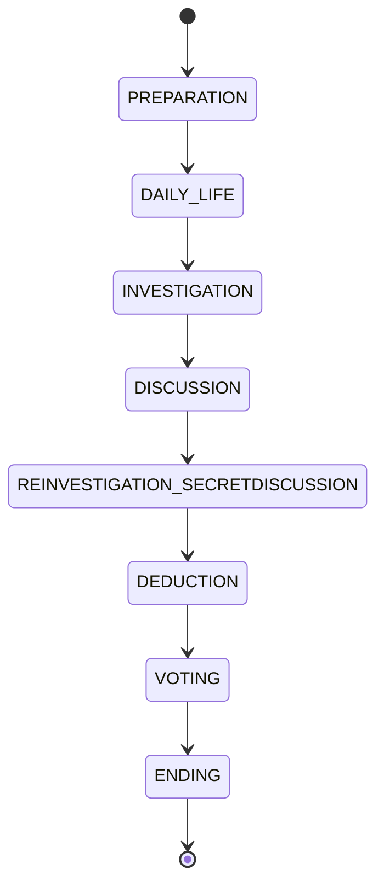
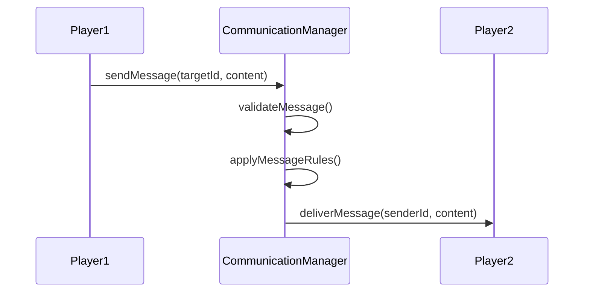

# マーダーミステリーゲーム 詳細設計書

## 1. アクションログ機能

### 1.1 目的と概要
アクションログ機能は、ゲーム内で発生するすべてのアクションを記録し、後の分析や証拠としての利用を可能にするシステムです。

#### 主な目的
- ゲーム内アクションの正確な記録
- プレイヤーの行動履歴の追跡
- 証拠分析のためのデータ提供
- ゲームの公平性担保

### 1.2 詳細設計

#### クラス構造


#### 設定パラメータ
```typescript
interface LoggerConfig {
  gameTime: {
    initialTime: number;
    timeScale: number;
    dayLength: number;
  };
  filters: {
    minLogLevel: number;
    includedActionTypes: ActionType[];
  };
}
```

### 1.3 データフロー


### 1.4 設定項目
- gameTime: ゲーム内時間のスケール設定
- filters: ログフィルタリング条件
- minLogLevel: 最小ログレベル
- includedActionTypes: 記録対象アクションタイプ

### 1.5 エラーハンドリング
- ログ書き込みエラー時の再試行メカニズム
- 非同期処理のエラーハンドリング
- メモリ使用量の監視と制御

## 2. 証拠分析システム

### 2.1 目的と概要
証拠分析システムは、収集された証拠の信頼性評価、関連性分析、証拠チェーンの構築を行います。

#### 主要機能
- 証拠の信頼性評価
- 証拠間の関連性分析
- 証拠チェーンの構築と管理
- 時系列分析

### 2.2 分析アルゴリズム

#### 信頼性評価要素


### 2.3 データ構造
```typescript
interface EvidenceAnalysis {
  evidenceId: string;
  analysisId: string;
  analyzedBy: string;
  timestamp: number;
  reliabilityFactors: Map<ReliabilityFactor, number>;
  conclusionStrength: number;
  notes: string;
  linkedAnalyses: string[];
}

interface EvidenceChain {
  chainId: string;
  name: string;
  description: string;
  evidenceIds: string[];
  relations: EvidenceRelation[];
  createdBy: string;
  timestamp: number;
  reliability: number;
  conclusionStrength: number;
}
```

### 2.4 信頼性評価の仕組み
- 時間的近接性評価（事件直前: 0.8-1.0, フェーズ前半: 0.5-0.8）
- 証人の信頼性評価（探偵: +0.3ボーナス）
- 物理的証拠の品質評価（基本: 0.7, 検証済み: +0.2）
- 証拠間の相互補強関係評価

### 2.5 拡張性
- カスタム評価アルゴリズムの追加
- 新しい証拠タイプへの対応
- 分析結果のエクスポート機能

## 3. ゲームフェーズ管理（拡張設計）

### 3.1 7フェーズシステム詳細

#### フェーズ構成（ルール要件対応）


#### 各フェーズの特徴と機能
1. **準備フェーズ (PREPARATION)**
   - ロール・ジョブ確認UI表示
   - 能力確認とマップ散策
   - 初期タスクの説明

2. **生活フェーズ (DAILY_LIFE)**
   - マイクラ内3日間（実際は15-20分）
   - ジョブ固有タスク実行
   - 犯人による事件発生可能
   - 行動証拠自動記録

3. **調査フェーズ (INVESTIGATION)**
   - 証拠収集と探索
   - 能力行使によるヒント獲得
   - マップ上証拠アイテム発見

4. **会議フェーズ (DISCUSSION)**
   - チャットでの議論
   - 証拠共有と推理

5. **再調査・密談フェーズ (REINVESTIGATION_SECRETDISCUSSION)**
   - 追加証拠収集
   - 密談エリア開放
   - プレイヤー間取引可能

6. **推理フェーズ (DEDUCTION)**
   - 各プレイヤーの推理発表
   - 最終証拠提示

7. **投票フェーズ (VOTING)**
   - 犯人投票
   - 目的達成処理
   - スコア計算と勝利判定

#### タイミング設定
```typescript
interface PhaseTimings {
  preparation: number;    // 600秒
  investigation: number;  // 1200秒
  discussion: number;    // 900秒
  reinvestigation: number; // 900秒
  finalDiscussion: number; // 600秒
  voting: number;        // 300秒
}
```

### 3.2 状態遷移
- 準備フェーズ → 調査フェーズ: 最小プレイヤー数達成時
- 調査フェーズ → 議論フェーズ: 時間経過または全証拠収集時
- 議論フェーズ → 再調査フェーズ: 時間経過または投票実施時
- 再調査フェーズ → 最終議論フェーズ: 時間経過時
- 最終議論フェーズ → 投票フェーズ: 時間経過時

### 3.3 イベントハンドリング
- フェーズ変更通知
- タイマーイベント
- プレイヤーアクション
- システムイベント

### 3.4 プレイヤー管理
```typescript
interface PlayerState {
  playerId: string;
  role: RoleType;
  collectedEvidence: string[];
  votingHistory: string[];
  isActive: boolean;
}
```

## 4. コミュニケーション管理

### 4.1 メッセージング機能
- プレイヤー間直接通信
- グループ通信
- システムアナウンス

### 4.2 プレイヤー間通信


### 4.3 システムメッセージ
- フェーズ変更通知
- 証拠発見通知
- 投票結果通知
- ゲーム状態更新通知

### 4.4 通信制御
- ロールベースの通信制限
- フェーズベースの通信制限
- メッセージフィルタリング
- スパム防止

## 5. 拡張設計（ルール要件対応）

### 5.1 ファンタジー城下町設定

#### 世界観設計
- **舞台**: 中世ファンタジーの西洋城下町
- **階級制度**: 王族 > 貴族 > 市民 > 使用人
- **職業体系**: 10種類のジョブ（王、近衛隊長、行商人、ギルド受付等）
- **マップ構成**: 城、市街地、商業区、住宅区、郊外

#### ゲーム開始システム
```typescript
interface GameStartTrigger {
  itemType: "minecraft:clock";
  triggerAction: "item_use";
  minimumPlayers: 4;
  maximumPlayers: 20;
}
```

### 5.2 7フェーズゲーム進行

#### 詳細フェーズ設計
1. **準備フェーズ** (10分)
   - ロール・ジョブ・能力確認UI
   - マップ散策と初期配置
   - チュートリアル表示

2. **生活フェーズ** (15-20分)
   - マイクラ内3日間の時間経過
   - ジョブ固有タスクの実行
   - 犯人による自由なタイミングでの事件発生
   - 全プレイヤー行動のScriptEvent記録

3. **調査フェーズ** (12分)
   - 証拠収集と分析
   - 物理的証拠アイテムの発見
   - 能力使用による情報収集

4. **会議フェーズ** (9分)
   - プレイヤー間チャット議論
   - 証拠共有と推理発表

5. **再調査・密談フェーズ** (9分)
   - 追加証拠収集
   - 密談エリア開放（合意制）
   - プレイヤー間取引可能

6. **推理フェーズ** (6分)
   - 各プレイヤーの最終推理発表
   - 証拠の総合的提示

7. **投票フェーズ** (3分)
   - 犯人投票実施
   - 特殊目的の処理（浮気暴露等）
   - 最終スコア計算

### 5.3 3つの能力システム

#### 能力付与システム
```typescript
interface PlayerAbilitySet {
  roleAbility: Ability;    // ロール固有能力
  jobAbility: Ability;     // ジョブ固有能力  
  randomAbility: Ability;  // ランダム能力
}
```

#### 犯人固有システム
- **キル能力**: 半径4ブロック以内のプレイヤーをキル
- **事件タイミング**: 生活フェーズ中の任意のタイミング
- **証拠生成**: 自動的に物理的証拠と行動証拠を生成

### 5.4 3つの目的システム

#### 目的カテゴリー
```typescript
interface PlayerObjectiveSet {
  roleObjective: Objective;    // ロール固有目的
  jobObjective: Objective;     // ジョブ固有目的
  randomObjective: Objective;  // ランダム目的
}
```

#### 多様な目的例
- **生存系**: 「投票で1位にならない」「最後まで生き残る」
- **社会系**: 「浮気を暴露されない」「信頼を獲得する」
- **経済系**: 「10万円稼ぐ」「商売を成功させる」
- **調査系**: 「5つの証拠を収集」「真犯人を特定」

### 5.5 証拠システム（ScriptEvent）

#### 行動記録システム
```typescript
// 全プレイヤー行動を自動記録
world.afterEvents.playerMove.subscribe(event => {
  system.run(() => {
    world.getDimension("overworld").runCommand(
      `scriptevent mdms:track_movement ${JSON.stringify({
        player: event.player.id,
        location: event.player.location,
        timestamp: system.currentTick
      })}`
    );
  });
});
```

#### 証拠抽出・配布
- 事件発覚時にそれまでの生活フェーズ内の行動を抽出
- 各プレイヤーに個人証拠をserver-ui経由で配布
- マップ上に物理的証拠アイテムを配置

### 5.6 技術実装要件

#### Package.json対応
```json
{
  "dependencies": {
    "@minecraft/server": "^2.0.0",
    "@minecraft/server-ui": "^2.0.0"
  }
}
```

#### 主要技術要素
- **ScriptAPI**: ゲームロジック制御
- **server-ui**: プレイヤーインターフェース
- **ScriptEvent**: 行動記録システム
- **Timer**: フェーズ管理
- **ActionForm**: 各種UI表示

## 6. パフォーマンス最適化

### 6.1 メモリ管理
- 証拠データの圧縮保存
- 不要データの定期クリーンアップ
- キャッシュサイズ制限

### 6.2 処理負荷分散
- 非同期処理による応答性向上
- バッチ処理によるパフォーマンス最適化
- リアルタイム更新の最適化

この詳細設計により、rule.mdの要件とpackage.jsonの技術制約に完全に対応した、包括的なマーダーミステリーゲームシステムが実現されます。