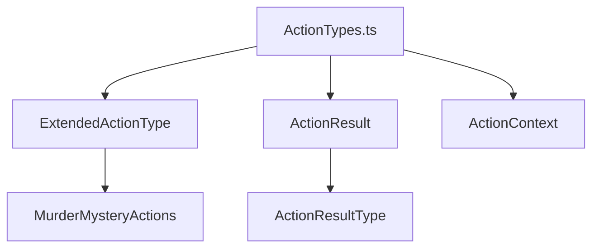

# ActionTypes.ts 詳細設計書

## 1. 型定義の責務と概要

### 1.1 ファイルの目的
- マーダーミステリーゲームにおける全てのアクション種別を定義
- アクション実行結果の型を提供
- アクション実行コンテキストの型を提供

### 1.2 定義される型の概要
- `MurderMysteryActions`: ゲーム固有のアクション種別を定義するenum
- `ExtendedActionType`: 基本アクションと拡張アクションを含む統合型
- `ActionResultType`: アクション実行結果の種別を定義するenum
- `ActionResult`: アクション実行結果のインターフェース
- `ActionContext`: アクション実行時のコンテキスト情報のインターフェース

### 1.3 使用される文脈
- ゲームマネージャーでのアクションログ記録
- 証拠分析システムでのアクション評価
- プレイヤーアクションの実行と結果処理
- システムイベントの記録と管理

## 2. 型定義の詳細

### 2.1 MurderMysteryActions
```typescript
export enum MurderMysteryActions {
  // プレイヤーの基本アクション
  TALK_TO_NPC = "talk_to_npc",
  COLLECT_EVIDENCE = "collect_evidence",
  INVESTIGATE_SCENE = "investigate_scene",
  ANALYZE_EVIDENCE = "analyze_evidence",
  EVIDENCE_SHARE = "evidence_share",
  VOTE_CAST = "vote_cast",

  // 役職固有のアクション
  PERFORM_MURDER = "perform_murder",
  CREATE_ALIBI = "create_alibi",
  VERIFY_EVIDENCE = "verify_evidence",
  TAMPER_EVIDENCE = "tamper_evidence",

  // システムアクション
  PHASE_CHANGE = "phase_change",
  GAME_START = "game_start",
  GAME_END = "game_end",
  MURDER_DISCOVERED = "murder_discovered",
}
```

### 2.2 ExtendedActionType
```typescript
export type ExtendedActionType = MurderMysteryActions | string;
```

### 2.3 ActionResultType
```typescript
export enum ActionResultType {
  SUCCESS = "success",
  FAILURE = "failure",
  PARTIAL = "partial",
  ERROR = "error",
}
```

### 2.4 ActionResult
```typescript
export interface ActionResult {
  type: ActionResultType;
  success: boolean;
  message?: string;
  details?: Record<string, unknown>;
}
```

### 2.5 ActionContext
```typescript
export interface ActionContext {
  playerId: string;
  phase: string;
  timestamp: number;
  location?: {
    x: number;
    y: number;
    z: number;
    dimension: string;
  };
  metadata?: Record<string, unknown>;
}
```

## 3. 型の関係性

### 3.1 依存関係


### 3.2 継承関係
- `ExtendedActionType`は`MurderMysteryActions`を包含する上位型
- 全てのアクション結果は`ActionResult`インターフェースを実装

### 3.3 Union Types/Intersection Types
- `ExtendedActionType = MurderMysteryActions | string`：基本アクションと拡張アクションの統合

## 4. 使用方法

### 4.1 GameManagerでの使用例
```typescript
// アクションのロギング
public async logAction(data: {
  type: string;
  playerId: string;
  details: unknown;
}): Promise<void> {
  await this.logSystemAction(data.type, {
    playerId: data.playerId,
    details: data.details,
  });
}
```

### 4.2 EvidenceAnalyzerでの使用例
```typescript
// アクション結果の生成
const result: ActionResult = {
  type: ActionResultType.SUCCESS,
  success: true,
  message: "証拠の分析が完了しました",
  details: {
    evidenceId: "...",
    reliability: 0.85
  }
};
```

### 4.3 型の組み合わせ例
```typescript
// アクションコンテキストとの組み合わせ
type ActionWithContext = {
  action: MurderMysteryActions;
  context: ActionContext;
  result: ActionResult;
};
```

## 5. 設計上の注意点

### 5.1 型の安全性
- enumの使用による型安全性の確保
- 必須プロパティの明確な定義
- オプショナルプロパティの適切な使用

### 5.2 拡張性への考慮
- `ExtendedActionType`による新規アクション追加の容易さ
- `metadata`フィールドによる追加情報の柔軟な保持
- 各インターフェースの拡張可能性

### 5.3 命名規則
- アクション名は大文字のスネークケース
- インターフェース名は`I`プレフィックスなし
- 型名は目的を明確に示す命名

## 6. テスト方針

### 6.1 型チェックのテスト
```typescript
// コンパイル時の型チェック
const validateActionType = (action: MurderMysteryActions) => {
  // 列挙型の値チェック
};

const validateActionResult = (result: ActionResult) => {
  // インターフェースの実装チェック
};
```

### 6.2 エッジケースの検証
- 不正なアクション種別の検出
- 必須フィールドの欠落チェック
- 型変換時のエラー処理

### 6.3 コンパイル時チェック
- TypeScriptの厳格モード有効化
- 非nullアサーションの最小化
- 型推論の活用

## 7. 改善提案

### 7.1 短期的な改善点
- アクション種別ごとの型定義の追加
- バリデーション関数の実装
- エラーメッセージの標準化

### 7.2 中長期的な改善点
- アクション間の関係性の型定義
- カスタムアクション定義の仕組み
- 型の自動生成システムの検討