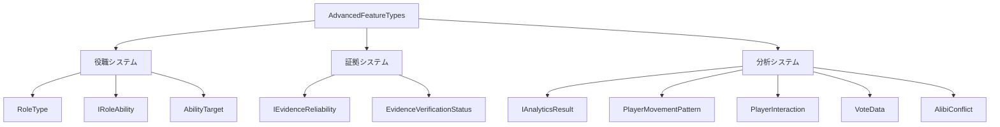
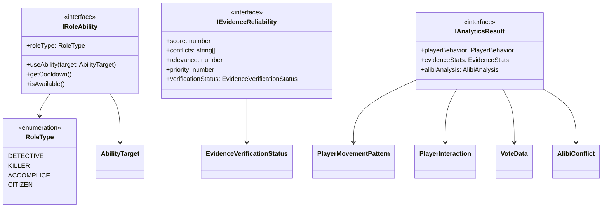

# AdvancedFeatureTypes.ts 詳細設計書

## 1. 型定義の責務と概要

### 1.1 ファイルの目的
`AdvancedFeatureTypes.ts`は、マーダーミステリーゲームにおける高度な機能に関する型定義を提供します。主に以下の機能をカバーします：

- 役職システムと特殊能力
- 証拠の信頼性評価システム
- プレイヤー行動分析システム
- 投票パターン分析
- アリバイ分析

### 1.2 定義される型の概要



### 1.3 使用される文脈
- AdvancedFeaturesManagerによる高度な機能の実装
- プレイヤーの役職と能力の管理
- 証拠の信頼性評価と分析
- プレイヤーの行動パターン分析
- ゲーム進行の統計分析

## 2. 型定義の詳細

### 2.1 役職システム

#### RoleType
```typescript
enum RoleType {
  DETECTIVE = "detective",
  KILLER = "killer",
  ACCOMPLICE = "accomplice",
  CITIZEN = "citizen"
}
```
各役職の基本的な種類を定義します。

#### IRoleAbility
```typescript
interface IRoleAbility {
  roleType: RoleType;
  useAbility(target: AbilityTarget): Promise<boolean>;
  getCooldown(): number;
  isAvailable(): boolean;
}
```
役職ごとの特殊能力の実装インターフェース。

#### AbilityTarget
```typescript
type AbilityTarget = {
  targetType: "player" | "evidence" | "location";
  targetId: string;
  additionalData?: Record<string, unknown>;
};
```
能力のターゲット指定に使用する型。

### 2.2 証拠システム

#### IEvidenceReliability
```typescript
interface IEvidenceReliability {
  score: number;          // 0-100の信頼性スコア
  conflicts: string[];    // 矛盾する証拠のID
  relevance: number;      // 0-100の関連性スコア
  priority: number;       // 1-5の優先度
  verificationStatus: EvidenceVerificationStatus;
}
```

#### EvidenceVerificationStatus
```typescript
enum EvidenceVerificationStatus {
  UNVERIFIED = "unverified",
  VERIFIED = "verified",
  SUSPICIOUS = "suspicious",
  INVALID = "invalid"
}
```

### 2.3 分析システム

#### IAnalyticsResult
```typescript
interface IAnalyticsResult {
  playerBehavior: {
    movements: PlayerMovementPattern[];
    interactions: PlayerInteraction[];
    votingHistory: VoteData[];
  };
  evidenceStats: {
    totalEvidence: number;
    verifiedEvidence: number;
    suspiciousEvidence: number;
    reliabilityAverage: number;
  };
  alibiAnalysis: {
    consistencyScore: number;
    conflicts: AlibiConflict[];
  };
}
```

## 3. 型の関係性

### 3.1 型階層図



### 3.2 型の合成パターン
- `IAnalyticsResult`は複数のサブ型を組み合わせて包括的な分析結果を表現
- `AbilityTarget`は共用型を使用してターゲットの多様性を表現
- `IEvidenceReliability`は証拠の品質を複数の指標で評価

## 4. 使用方法

### 4.1 AdvancedFeaturesManagerでの使用例
```typescript
class AdvancedFeaturesManager {
  // 役職能力の管理
  private roleAbilities: Map<RoleType, IRoleAbility>;
  
  // 証拠の信頼性管理
  private evidenceReliability: Map<string, IEvidenceReliability>;
  
  // 分析結果の通知
  private notifyAnalyticsUpdate(result: Partial<IAnalyticsResult>): void;
}
```

### 4.2 プラグイン開発での使用例
```typescript
// カスタム役職能力の実装
const detectiveAbility: IRoleAbility = {
  roleType: RoleType.DETECTIVE,
  async useAbility(target: AbilityTarget): Promise<boolean> {
    if (target.targetType !== "evidence") return false;
    // 証拠調査ロジック
    return true;
  },
  getCooldown: () => 30000,
  isAvailable: () => true
};
```

## 5. 設計上の注意点

### 5.1 型の安全性
- 共用型とユニオン型を適切に使用して型安全性を確保
- readonly修飾子を使用して不変性を保証
- 必要に応じてGenericsを活用して型の再利用性を向上

### 5.2 拡張性への考慮
- 新しい役職や能力の追加が容易な設計
- 分析システムの拡張が可能な柔軟な構造
- プラグインシステムとの統合を考慮した設計

### 5.3 バージョン管理とマイグレーション
- 型の変更は下位互換性を維持
- 破壊的変更を行う場合は適切なマイグレーションパスを提供
- 型定義の変更履歴をドキュメント化

## 6. テスト方針

### 6.1 型チェックのテスト
```typescript
// 型の整合性テスト
type AssertRoleType = RoleType extends string ? true : false;
type AssertAbilityTarget = AbilityTarget extends { targetId: string } ? true : false;
```

### 6.2 実装テスト
```typescript
describe('RoleAbility', () => {
  it('should implement all required methods', () => {
    const ability: IRoleAbility = {
      roleType: RoleType.DETECTIVE,
      useAbility: async () => true,
      getCooldown: () => 0,
      isAvailable: () => true
    };
    expect(ability).toHaveProperty('useAbility');
    expect(ability).toHaveProperty('getCooldown');
    expect(ability).toHaveProperty('isAvailable');
  });
});
```

### 6.3 統合テスト
- 異なる型の組み合わせテスト
- エッジケースの検証
- 非同期処理の型安全性確認