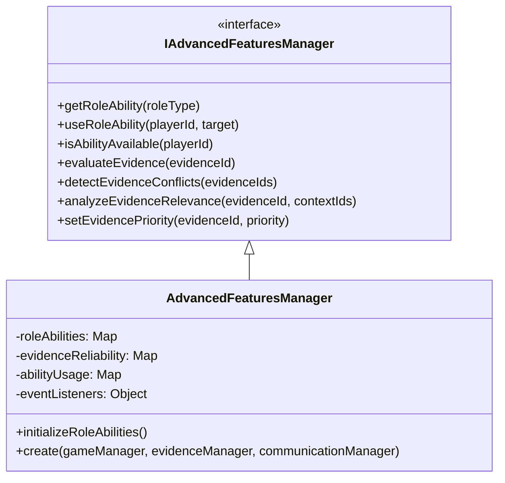
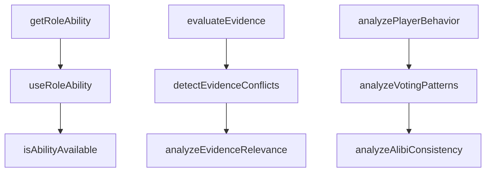
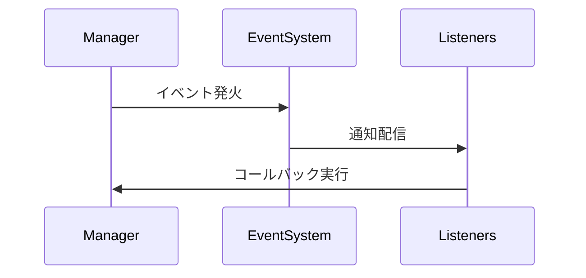
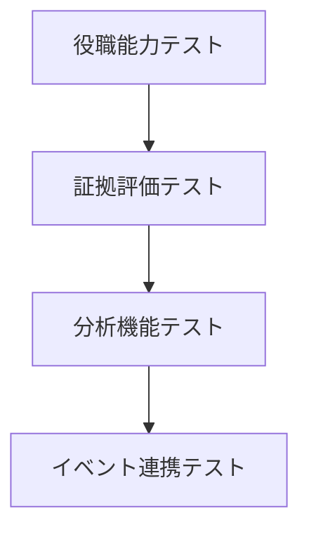

# AdvancedFeaturesManager 詳細設計書

## 1. クラスの責務と概要

### 1.1 基本概念
AdvancedFeaturesManagerは、マーダーミステリーゲーム内の高度な機能を管理する中核コンポーネントです。主に以下の機能を提供します：

- 役職特殊能力システムの管理
- 証拠の信頼性評価システム
- プレイヤー行動の分析機能
- 投票パターンの分析
- アリバイの整合性チェック

### 1.2 IAdvancedFeaturesManagerインターフェースの実装方針



### 1.3 プラグインシステムの実装方法
- シングルトンパターンによる一元管理
- イベントリスナーベースの拡張性設計
- 役職能力のプラグイン化対応

### 1.4 他のマネージャーとの連携方針
- GameManagerとの連携：プレイヤー状態の管理
- EvidenceManagerとの連携：証拠の取得と更新
- CommunicationManagerとの連携：イベント通知

## 2. クラス構造

### 2.1 プロパティ定義
```typescript
private static _instance: AdvancedFeaturesManager | null
private roleAbilities: Map<RoleType, IRoleAbility>
private evidenceReliability: Map<string, IEvidenceReliability>
private abilityUsage: Map<string, number>
private readonly eventListeners: {
  evidenceState: Array<(evidenceId: string, newState: IEvidenceReliability) => void>
  abilityUse: Array<(playerId: string, ability: IRoleAbility, target: AbilityTarget) => void>
  analyticsUpdate: Array<(result: Partial<IAnalyticsResult>) => void>
}
```

### 2.2 コア機能メソッド群


## 3. 機能実装詳細

### 3.1 役職能力システム
- クールダウン管理
- 能力使用条件の検証
- 効果の適用と結果の通知

### 3.2 証拠評価システム


#### 信頼性スコアの計算ロジック
1. 基本スコア（50点）
2. 証拠タイプによる補正
   - 物理的証拠: +20
   - 証言: +10
   - 状況証拠: +5
3. 信頼性係数による補正（最大30点）
4. 検証状態による補正（+20点）

### 3.3 分析システム
- プレイヤー行動パターンの追跡
- 投票傾向の分析
- アリバイの整合性検証

## 4. イベント管理システム

### 4.1 イベントタイプ
1. 証拠状態変更イベント
2. 能力使用イベント
3. 分析結果更新イベント

### 4.2 イベント通知フロー


## 5. 実装上の注意点

### 5.1 パフォーマンス最適化
- Map構造体の効率的な使用
- 非同期処理の適切な活用
- メモリリーク防止策の実装

### 5.2 エラーハンドリング
```typescript
try {
  // 操作実行
} catch (error) {
  // エラーログ記録
  // 適切なフォールバック処理
  // ユーザーへの通知
}
```

### 5.3 セキュリティ対策
- 入力値の検証
- 権限チェック
- データの整合性確保

## 6. テスト方針

### 6.1 単体テスト
- 各メソッドの独立したテスト
- エッジケースの検証
- エラーハンドリングの確認

### 6.2 統合テスト


### 6.3 パフォーマンステスト
- 大量データでの動作検証
- メモリ使用量の監視
- 応答時間の計測

## 7. 依存関係

### 7.1 必要なインポート
```typescript
import type { IGameManager } from "./interfaces/IGameManager";
import type { ICommunicationManager } from "./interfaces/ICommunicationManager";
import type { EvidenceManager } from "./EvidenceManager";
import type {
  IRoleAbility,
  IEvidenceReliability,
  IAnalyticsResult,
  AbilityTarget,
} from "../types/AdvancedFeatureTypes";
```

### 7.2 外部システムとの連携
- GameManager: プレイヤー状態管理
- EvidenceManager: 証拠データ操作
- CommunicationManager: イベント通信

## 8. 将来の拡張性

### 8.1 拡張ポイント
- 新しい役職能力の追加
- 分析アルゴリズムの改善
- イベントシステムの拡張

### 8.2 設計上の考慮事項
- インターフェースの安定性維持
- 下位互換性の確保
- プラグインシステムの柔軟性