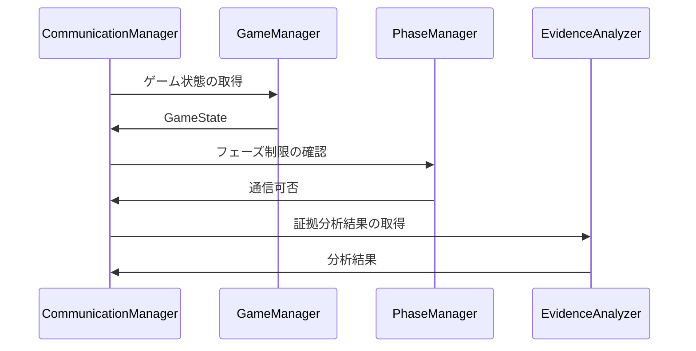

# CommunicationManager 詳細設計書

## 1. クラスの責務と概要

### ICommunicationManagerインターフェースの実装方針

CommunicationManagerは、マルチプレイヤー環境でのプレイヤー間コミュニケーションを管理する中核コンポーネントです。以下の主要機能を提供します：

- チャットシステム（プライベート/ブロードキャスト/NPC対話）
- 証拠・調査結果の共有システム
- 投票システムの管理
- コミュニケーション制限の実装

```mermaid
classDiagram
    class ICommunicationManager {
        <<interface>>
        +sendMessage(fromId: string, toId: string, message: string): Promise<boolean>
        +broadcastMessage(fromId: string, message: string): Promise<boolean>
        +sendNPCMessage(npcId: string, playerId: string, message: string): Promise<boolean>
        +shareEvidence(fromId: string, toId: string, evidence: Evidence): Promise<boolean>
        +shareInvestigationResult(fromId: string, result: string): Promise<boolean>
        +shareAlibi(playerId: string, alibi: string, timestamp: number): Promise<boolean>
        +startVoting(): Promise<boolean>
        +castVote(fromId: string, targetId: string): Promise<boolean>
        +endVoting(): Promise<{ suspect: string; voteCount: number }>
    }
    class CommunicationManager {
        -gameState: GameState
        -loggerManager: ILoggerManager
        -messageHistory: Map<string, string[]>
        -isVotingPhase: boolean
        -votes: Map<string, string>
        -voteCount: Map<string, number>
        +constructor(gameState: GameState, loggerManager: ILoggerManager)
    }
    ICommunicationManager <|-- CommunicationManager
```

### コミュニケーションシステムの実装方法

1. メッセージング基盤
   - Map構造を使用したメッセージ履歴の管理
   - 非同期通信によるメッセージの送受信
   - タイムスタンプ付きのログ記録

2. アクセス制御
   - ロールベースのアクセス制御（探偵、殺人者、共犯者等）
   - フェーズベースの制限（調査フェーズ、議論フェーズ等）
   - 証拠共有の権限管理

### 他のマネージャーとの連携方針



## 2. クラス構造

### メッセージ管理プロパティ

```typescript
class CommunicationManager {
    private gameState: GameState;
    private loggerManager: ILoggerManager;
    private messageHistory: Map<string, string[]>;
    private isVotingPhase: boolean;
    private votes: Map<string, string>;
    private voteCount: Map<string, number>;
}
```

### 通信メソッド群

1. メッセージング
```typescript
async sendMessage(fromId: string, toId: string, message: string): Promise<boolean>
async broadcastMessage(fromId: string, message: string): Promise<boolean>
async sendNPCMessage(npcId: string, playerId: string, message: string): Promise<boolean>
```

2. 情報共有
```typescript
async shareEvidence(fromId: string, toId: string, evidence: Evidence): Promise<boolean>
async shareInvestigationResult(fromId: string, result: string): Promise<boolean>
async shareAlibi(playerId: string, alibi: string, timestamp: number): Promise<boolean>
```

### イベントハンドラ

- フェーズ変更時のコミュニケーション制限更新
- 投票イベントの管理
- メッセージ履歴の更新

### プライベートヘルパーメソッド

```typescript
private addToHistory(playerId: string, message: string): void
```

### 型定義

- Evidence型（証拠情報）
- GameState型（ゲーム状態）
- RoleType型（プレイヤーロール）

## 3. コミュニケーションシステムの実装詳細

### メッセージの送受信方法

1. メッセージバリデーション
   - 送信者/受信者の存在確認
   - メッセージ内容の検証
   - 通信権限の確認

2. 履歴管理
   - タイムスタンプ付きでメッセージを保存
   - 送受信者双方の履歴を更新
   - ログマネージャーへの記録

### チャット制限の実装

```typescript
canCommunicate(fromRole: RoleType, toRole: RoleType): boolean {
    // 探偵は誰とでも会話可能
    if (fromRole === "detective") return true;

    // 殺人者と共犯者は互いに会話可能
    if ((fromRole === "murderer" && toRole === "accomplice") ||
        (fromRole === "accomplice" && toRole === "murderer")) {
        return true;
    }

    // その他の組み合わせは、現在のフェーズに依存
    return this.gameState.phase !== "investigation";
}
```

### 投票システムの統合

1. 投票フェーズの管理
   - 開始/終了の制御
   - 投票状態の追跡
   - 結果の集計

2. 投票の検証
   - 投票資格の確認
   - 重複投票の防止
   - 期限切れチェック

### プレイヤー間の通信制御

- ロールベースのフィルタリング
- フェーズ依存の制限
- 証拠共有の権限管理

## 4. 他のマネージャーとの連携

### GameManagerとの連携

- ゲーム状態の監視
- プレイヤー情報の取得
- イベント通知の送受信

### PhaseManagerとの連携

1. フェーズ変更時の処理
   ```typescript
   // PhaseManagerからの通知を受けてチャット制限を更新
   onPhaseChange(newPhase: GamePhase): void {
       this.updateCommunicationRestrictions(newPhase);
   }
   ```

2. フェーズ依存の制限
   - 調査フェーズでの制限付きコミュニケーション
   - 議論フェーズでの自由な会話
   - 投票フェーズでのチャット禁止

### EvidenceAnalyzerとの連携

1. 証拠共有時の処理
   ```typescript
   async shareEvidence(fromId: string, toId: string, evidence: Evidence): Promise<boolean> {
       if (!this.canShareEvidence(fromId, toId, evidence)) return false;
       // 証拠の信頼性を分析
       const reliability = await this.evidenceAnalyzer.evaluateReliability(evidence);
       // 共有処理...
   }
   ```

2. 分析結果の共有
   - 信頼性スコアの伝達
   - 関連証拠の提示
   - 分析コメントの共有

### イベントの発行と購読

- アクションログの記録
- ゲーム状態の更新通知
- プレイヤーステータスの変更通知

## 5. 実装上の注意点

### 同期制御

1. メッセージ送受信の非同期処理
   ```typescript
   async sendMessage(fromId: string, toId: string, message: string): Promise<boolean> {
       try {
           await this.validateMessage(fromId, toId, message);
           await this.loggerManager.logAction({ ... });
           this.addToHistory(fromId, toId, message);
           return true;
       } catch (error) {
           console.error("Message sending failed:", error);
           return false;
       }
   }
   ```

2. 競合状態の防止
   - 投票の同時処理
   - メッセージ履歴の更新
   - 状態変更の排他制御

### パフォーマンス最適化

1. メモリ管理
   - メッセージ履歴の定期的なクリーンアップ
   - 不要なログの削除
   - メモリ使用量の監視

2. 処理の効率化
   - バッチ処理の活用
   - キャッシュの利用
   - 不要な再計算の防止

### エラーハンドリング

```typescript
class CommunicationError extends Error {
    constructor(
        public readonly code: string,
        message: string,
        public readonly details?: any
    ) {
        super(message);
    }
}

// エラーハンドリングの実装例
async sendMessage(fromId: string, toId: string, message: string): Promise<boolean> {
    try {
        if (!this.gameState.players.has(fromId)) {
            throw new CommunicationError(
                "INVALID_SENDER",
                "送信者が見つかりません"
            );
        }
        // ... 処理の続き
    } catch (error) {
        await this.loggerManager.logError(error);
        return false;
    }
}
```

### セキュリティ対策

1. 入力検証
   - メッセージ内容の検証
   - プレイヤーIDの検証
   - アクション権限の確認

2. 通信制限
   - レート制限の実装
   - スパム対策
   - 不正なアクセスの防止

## 6. テスト方針

### メッセージング機能のテスト

```typescript
describe('CommunicationManager - Messaging', () => {
    it('should send private message successfully', async () => {
        const result = await communicationManager.sendMessage(
            'player1',
            'player2',
            'Hello'
        );
        expect(result).toBe(true);
    });

    it('should reject message to invalid player', async () => {
        const result = await communicationManager.sendMessage(
            'player1',
            'invalid-player',
            'Hello'
        );
        expect(result).toBe(false);
    });
});
```

### 制限機能のテスト

1. ロールベースの制限
   - 探偵の通信権限テスト
   - 殺人者と共犯者の通信テスト
   - 一般プレイヤーの制限テスト

2. フェーズベースの制限
   - 各フェーズでの通信可否テスト
   - フェーズ切り替え時の動作テスト
   - 投票システムの制限テスト

### 統合テスト

```typescript
describe('CommunicationManager - Integration', () => {
    it('should handle phase changes correctly', async () => {
        await phaseManager.startPhase(GamePhase.INVESTIGATION);
        const canChat = communicationManager.canCommunicate(
            'player1',
            'player2'
        );
        expect(canChat).toBe(false);
    });
});
```

### 負荷テスト

1. 同時接続テスト
   - 多数のメッセージ同時送信
   - 投票の同時処理
   - システムリソースの監視

2. パフォーマンステスト
   - レスポンス時間の計測
   - メモリ使用量の追跡
   - CPU負荷の監視