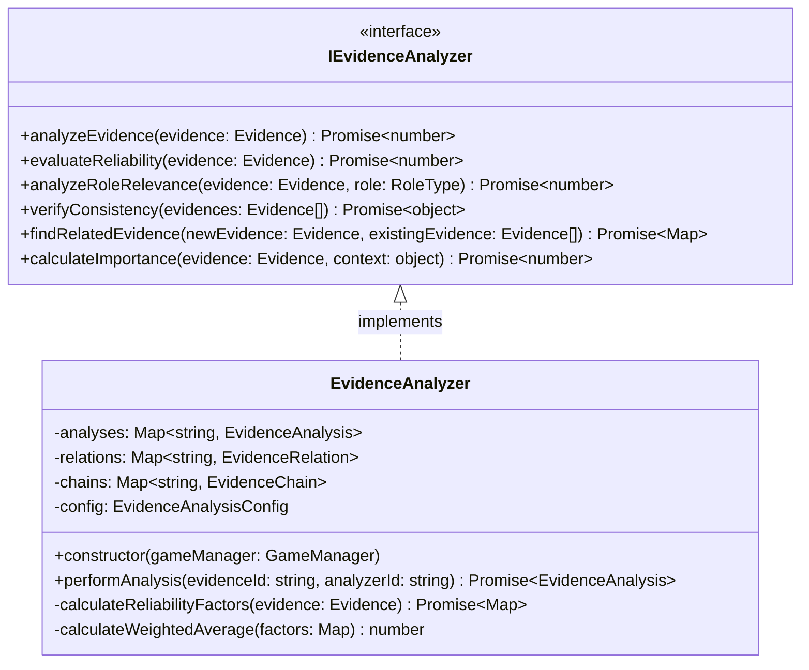
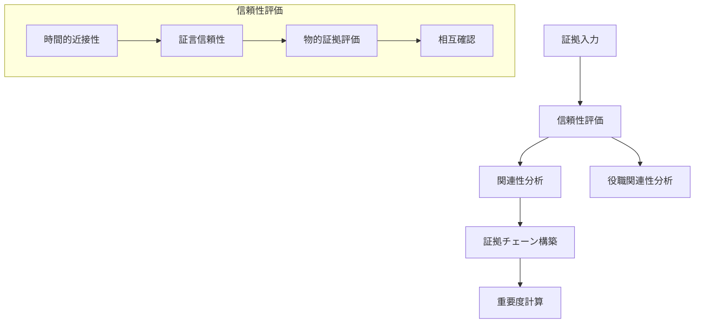
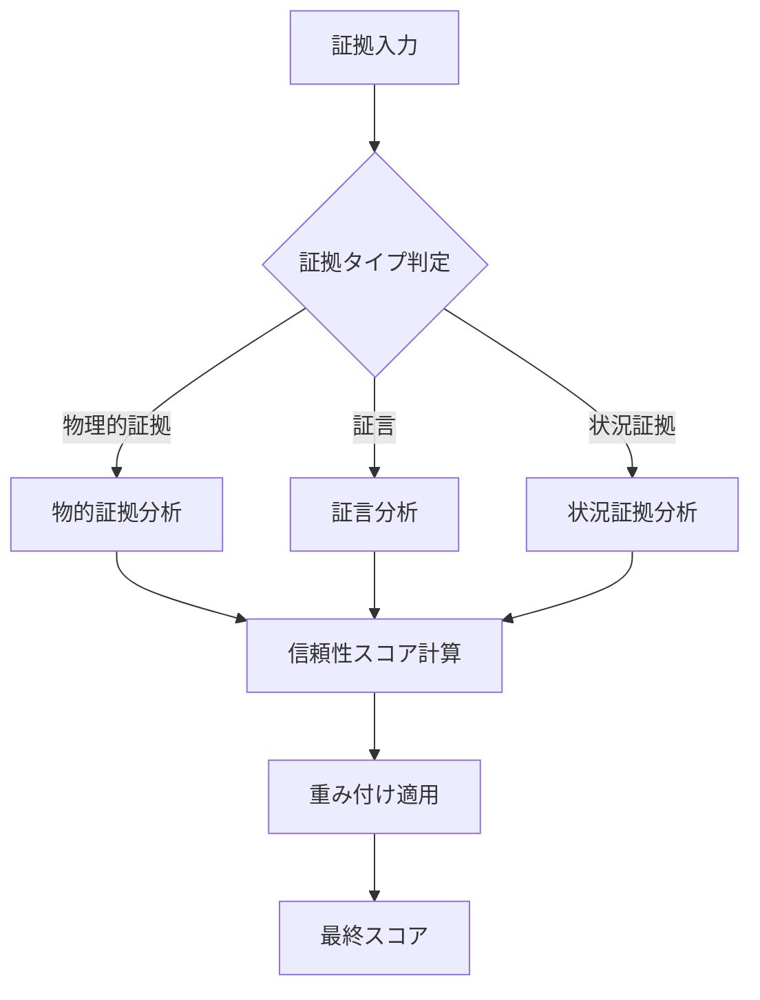
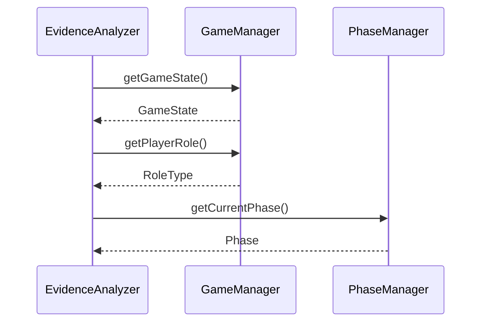

# EvidenceAnalyzer詳細設計書

## 1. クラスの責務と概要

### 1.1 主要な責務
- 証拠の信頼性評価と分析
- 証拠間の関連性分析
- 証拠チェーンの構築と管理
- 役職との関連性分析

### 1.2 IEvidenceAnalyzerインターフェースの実装方針


### 1.3 証拠分析システムの概要


## 2. クラス構造

### 2.1 プロパティ
```typescript
private analyses: Map<string, EvidenceAnalysis>  // 証拠分析結果の保持
private relations: Map<string, EvidenceRelation> // 証拠間の関連性
private chains: Map<string, EvidenceChain>      // 証拠チェーン
private readonly config: EvidenceAnalysisConfig  // 分析設定
```

### 2.2 分析メソッド群
- **analyzeEvidence**: 総合的な証拠分析
- **evaluateReliability**: 信頼性評価
- **analyzeRoleRelevance**: 役職との関連性分析
- **verifyConsistency**: 整合性検証
- **findRelatedEvidence**: 関連証拠の検索
- **calculateImportance**: 重要度計算

### 2.3 イベントハンドラ
- 新規証拠発見時の自動分析
- 証拠更新時の再分析トリガー
- 証拠チェーン更新通知

### 2.4 型定義
```typescript
interface EvidenceAnalysisResult {
    score: number;
    confidence: number;
    relevance: Map<string, number>;
    recommendations: string[];
}

interface AnalysisContext {
    phase: string;
    discoveredEvidence: Evidence[];
    suspectRoles: RoleType[];
    timeConstraints: number;
}
```

## 3. 証拠分析システムの実装詳細

### 3.1 証拠の収集方法
1. GameManagerからの証拠情報取得
2. 証拠のバリデーションと前処理
3. メタデータの付与と整理

### 3.2 分析アルゴリズム


### 3.3 重み付けシステム
```typescript
const weights = {
    timeProximity: 0.2,      // 時間的近接性
    witnessCredibility: 0.25, // 証言の信頼性
    physicalEvidence: 0.3,    // 物的証拠
    corroboration: 0.15,      // 相互確認
    expertise: 0.1            // 専門性
};
```

### 3.4 結果の評価方法
1. スコアの正規化（0-100）
2. 信頼区間の計算
3. 矛盾点の検出
4. 推奨アクションの生成

## 4. 他のマネージャーとの連携

### 4.1 GameManagerとの連携


### 4.2 PhaseManagerとの連携
- フェーズ変更時の分析戦略調整
- フェーズ固有の重み付け適用
- タイミング制約の管理

### 4.3 イベントの発行と購読
```typescript
// イベント定義
interface AnalysisEvent {
    type: 'new_evidence' | 'update_evidence' | 'chain_update';
    evidenceId: string;
    analysis: EvidenceAnalysis;
    timestamp: number;
}
```

### 4.4 状態の同期方法
1. 分析結果のキャッシュ管理
2. 定期的な再分析スケジューリング
3. 差分更新の最適化

## 5. 実装上の注意点

### 5.1 データの整合性確保
- トランザクション的な分析処理
- 分析結果の不変性保証
- 競合状態の回避

### 5.2 パフォーマンス最適化
```typescript
// キャッシュ戦略
private analysisCache: LRUCache<string, EvidenceAnalysis>;
private readonly CACHE_SIZE = 1000;
private readonly CACHE_TTL = 300000; // 5分
```

### 5.3 エラーハンドリング
```typescript
class AnalysisError extends Error {
    constructor(
        message: string,
        public readonly evidenceId: string,
        public readonly errorType: 'validation' | 'analysis' | 'system',
        public readonly details?: any
    ) {
        super(message);
    }
}
```

### 5.4 メモリ管理
- 定期的なキャッシュクリーンアップ
- 大規模データセットの効率的な処理
- メモリリーク防止策

## 6. テスト方針

### 6.1 分析アルゴリズムのテスト
- 各証拠タイプでの正確性検証
- エッジケースの処理確認
- 重み付けの妥当性評価

### 6.2 エッジケースの検証
- 極端な証拠数での動作
- 矛盾する証拠セット
- 不完全なデータ

### 6.3 統合テスト
```typescript
describe('EvidenceAnalyzer Integration', () => {
    let analyzer: EvidenceAnalyzer;
    let gameManager: GameManager;

    beforeEach(() => {
        gameManager = new GameManager();
        analyzer = new EvidenceAnalyzer(gameManager);
    });

    test('複数の証拠チェーン分析', async () => {
        // テストケース実装
    });
});
```

### 6.4 パフォーマンステスト
- 大量データでの応答時間測定
- メモリ使用量の監視
- 並行処理の安定性確認