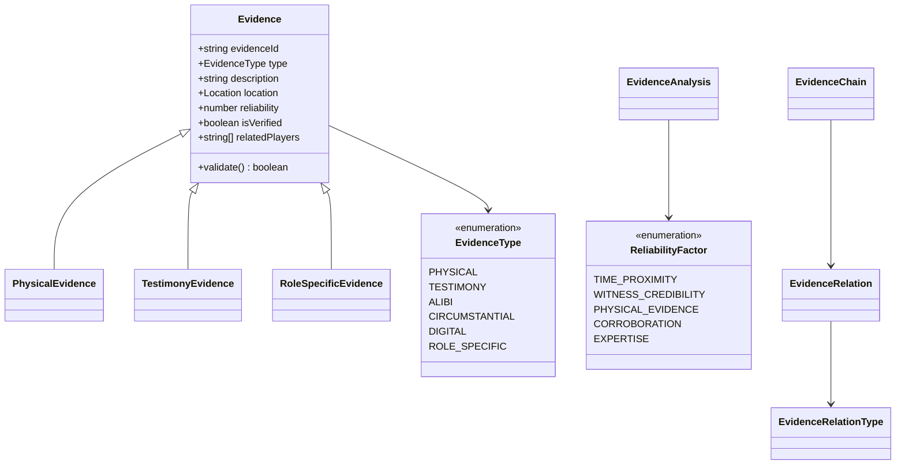
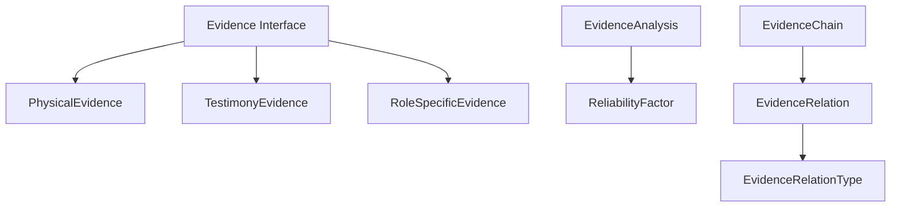

# EvidenceTypes.ts 詳細設計書

## 1. 型定義の責務と概要

### 1.1 ファイルの目的
`EvidenceTypes.ts`は、マーダーミステリーゲームにおける証拠システムの型定義を提供します。このファイルは以下の責務を持ちます：

- 証拠に関する基本的なデータ構造の定義
- 証拠の分類と種類の定義
- 証拠の分析と評価に必要な型の提供
- 証拠間の関連性を表現する型の定義

### 1.2 定義される型の概要



### 1.3 使用される文脈
- 証拠の収集と管理（`EvidenceManager`）
- 証拠の分析と評価（`EvidenceAnalyzer`）
- ゲームの進行管理（`GameManager`）
- プレイヤーのインベントリ管理（`PlayerState`）

## 2. 型定義の詳細

### 2.1 証拠の基本型

```typescript
interface Evidence {
  evidenceId: string;        // 一意の識別子
  type: EvidenceType;        // 証拠の種類
  description: string;       // 証拠の説明
  discoveredBy: string;      // 発見者のID
  discoveryTime: number;     // 発見時刻
  location: Location;        // 発見場所
  reliability: number;       // 信頼性スコア（0-1）
  isVerified: boolean;      // 検証済みフラグ
  relatedPlayers: string[]; // 関連プレイヤー
  linkedEvidence: string[]; // 関連する他の証拠
}
```

### 2.2 証拠カテゴリーの型
各証拠カテゴリーは基本型を拡張し、特有のプロパティとメソッドを追加します：

#### 物理的証拠
```typescript
interface PhysicalEvidence extends Evidence {
  itemId: string;           // アイテムの一意識別子
  condition: string;        // 物理的状態
  fingerprints?: string[];  // 検出された指紋
  degradationRate: number;  // 劣化率
  analyzeDetails(): {       // 詳細分析メソッド
    conditionAnalysis: string;
    preservationStatus: string;
    matchProbability: number;
  };
}
```

#### 証言証拠
```typescript
interface TestimonyEvidence extends Evidence {
  witnessId: string;        // 証言者ID
  statement: string;        // 証言内容
  emotionalState: string;   // 証言時の感情状態
  consistencyScore: number; // 一貫性スコア
  verifyCredibility(): {    // 信頼性検証メソッド
    credibilityScore: number;
    consistencyAnalysis: string;
    emotionalAnalysis: string;
  };
}
```

### 2.3 分析と関連性の型

#### 証拠分析結果
```typescript
interface EvidenceAnalysis {
  evidenceId: string;
  analysisId: string;
  analyzedBy: string;
  timestamp: number;
  reliabilityFactors: Map<ReliabilityFactor, number>;
  conclusionStrength: number;
  notes: string;
  linkedAnalyses: string[];
}
```

#### 証拠間の関連性
```typescript
interface EvidenceRelation {
  relationId: string;
  sourceEvidenceId: string;
  targetEvidenceId: string;
  relationType: EvidenceRelationType;
  strength: number;
  description: string;
}
```

## 3. 型の関係性

### 3.1 GameTypesとの連携
- `GameState`インターフェースに`evidenceList: Evidence[]`として組み込まれる
- `PlayerState`の`collectedEvidence: string[]`で参照される
- `GameConfig`の`evidenceSettings`で証拠システムの設定を定義

### 3.2 ActionTypesとの連携
- 証拠の収集、分析、共有に関するアクションの型定義で使用
- プレイヤーのアクションログにおける証拠関連アクションの記録

### 3.3 型の階層構造



## 4. 使用方法

### 4.1 EvidenceAnalyzerでの使用例
```typescript
// 証拠の分析
async function analyzeEvidence(evidence: Evidence): Promise<number> {
  const factors = await calculateReliabilityFactors(evidence);
  return calculateWeightedAverage(factors);
}

// 証拠チェーンの作成
function createEvidenceChain(
  evidenceIds: string[],
  relations: EvidenceRelation[]
): EvidenceChain {
  // チェーンの作成ロジック
}
```

### 4.2 バリデーション方法
```typescript
function validateEvidence(evidence: Evidence): boolean {
  // 必須フィールドの存在確認
  if (!evidence.evidenceId || !evidence.type) return false;
  
  // 型固有のバリデーション
  switch (evidence.type) {
    case EvidenceType.PHYSICAL:
      return validatePhysicalEvidence(evidence as PhysicalEvidence);
    case EvidenceType.TESTIMONY:
      return validateTestimonyEvidence(evidence as TestimonyEvidence);
    // その他の型のバリデーション
  }
}
```

## 5. 設計上の注意点

### 5.1 型の安全性
- Union型とジェネリック型の適切な使用
- 必須プロパティと任意プロパティの明確な区別
- 型ガード関数の提供による型安全性の確保

### 5.2 拡張性への考慮
- 新しい証拠タイプの追加が容易な設計
- カスタム分析メソッドの追加可能性
- プラグイン可能な検証システム

### 5.3 パフォーマンスへの影響
- 大量の証拠データ処理時の考慮
- 効率的なインデックス構造
- メモリ使用量の最適化

### 5.4 循環参照の防止
- 証拠間の関連性における循環参照チェック
- 型定義の依存関係の整理
- インポート構造の最適化

## 6. テスト方針

### 6.1 型チェックのテスト
```typescript
describe('Evidence Type Validation', () => {
  it('should validate physical evidence correctly', () => {
    const evidence: PhysicalEvidence = {
      // テストデータ
    };
    expect(validatePhysicalEvidence(evidence)).toBe(true);
  });
});
```

### 6.2 エッジケースの検証
- 不完全なデータの処理
- 境界値のテスト
- 無効なデータの処理

### 6.3 シリアライゼーションのテスト
- JSON変換テスト
- ネットワーク転送テスト
- データ永続化テスト

### 6.4 コンパイル時チェック
- TypeScriptの`strict`モード使用
- 型定義の完全性確認
- 依存関係の整合性確認