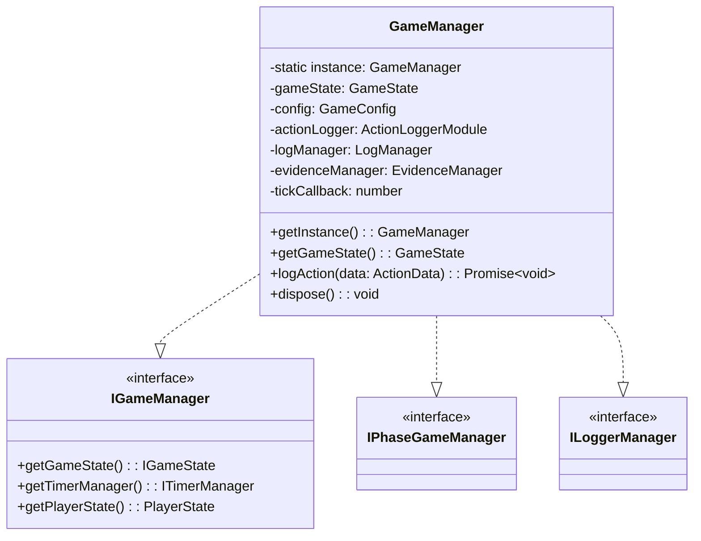
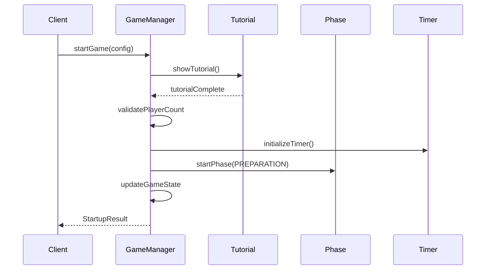
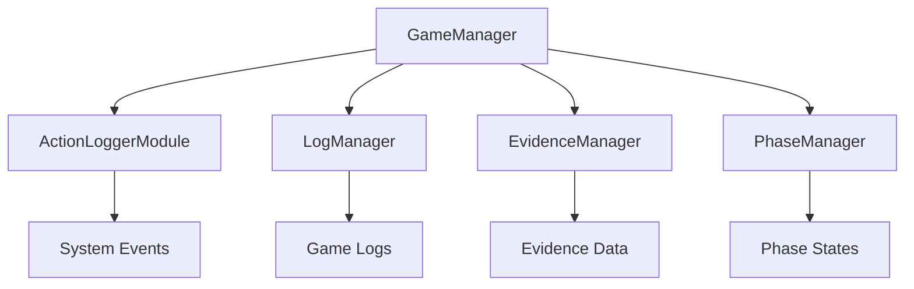

# GameManager クラス詳細設計書

## 1. クラスの責務と概要

GameManagerクラスは、マーダーミステリーゲームの中核となるコンポーネントで、以下の主要な責務を持ちます：

- ゲーム全体の状態管理と制御
- 各種マネージャーの統括と連携
- ゲーム内時間の管理
- プレイヤー状態の追跡
- アクションのロギング

### 1.1 インターフェースの実装



### 1.2 シングルトンパターンの実装

- 単一インスタンスの保証
- スレッドセーフな初期化
- 適切なリソース管理

### 1.3 状態管理の方針

- イミュータブルな状態管理
- 状態更新の一元化
- イベントベースの状態同期
- メモリ効率を考慮したデータ構造

## 2. クラス構造

### 2.1 プロパティ

```typescript
private static instance: GameManager | null;
private gameState: GameState;
private config: GameConfig;
private actionLogger: ActionLoggerModule;
private logManager: LogManager;
private evidenceManager: EvidenceManager;
private tickCallback: number | undefined;
```

| プロパティ名 | 型 | 目的 |
|------------|-----|------|
| instance | static GameManager | シングルトンインスタンスの保持 |
| gameState | GameState | ゲームの現在の状態を保持 |
| config | GameConfig | ゲーム設定の保持 |
| actionLogger | ActionLoggerModule | アクションログの記録 |
| logManager | LogManager | ログ管理の統括 |
| evidenceManager | EvidenceManager | 証拠管理の統括 |
| tickCallback | number | ゲーム更新用タイマーID |
| tutorialState | TutorialState | チュートリアルの進行状態 |

### 2.1.1 チュートリアル状態の管理

```typescript
interface TutorialState {
    shown: boolean;        // チュートリアル表示済みフラグ
    currentPage: number;   // 現在のページ番号
    totalPages: number;    // 総ページ数
}
```

チュートリアルの状態管理において以下の点を考慮：
- 表示状態の永続化
- ページ遷移の制御
- プレイヤーの操作応答

### 2.2 メソッド実装詳細

#### 2.2.1 コンストラクタとインスタンス管理

```typescript
private constructor()
public static getInstance(): GameManager
```

- コンストラクタはprivateで、getInstance経由でのみインスタンス化可能
- 初期化時に各種マネージャーを生成
- リソースの適切な初期化を保証

#### 2.2.2 状態管理メソッド

```typescript
private createInitialGameState(): GameState
private createDefaultConfig(): GameConfig
public getGameState(): GameState
```

- イミュータブルな状態オブジェクトの生成
- デフォルト設定の提供
- 状態のディープコピーによる安全な参照

#### 2.2.3 ゲーム制御メソッド

```typescript
public async startGame(config: GameStartupConfig): Promise<StartupResult>
public pauseGame(): void
public resumeGame(): void
public endGame(): void
```

#### ゲーム開始処理の詳細フロー



##### 開始処理の検証項目
- プレイヤー数の妥当性（4-20人）
- アドオンの有効化状態
- 必要リソースの利用可能性
- 初期状態の整合性

##### エラーハンドリング
```typescript
interface StartupError {
    code: 'INVALID_PLAYER_COUNT' | 'ADDON_NOT_ENABLED' | 'RESOURCE_UNAVAILABLE';
    message: string;
    details?: unknown;
}

// エラー発生時の処理
private handleStartupError(error: StartupError): StartupResult {
    this.logSystemAction('GAME_START_ERROR', error);
    return {
        success: false,
        gameId: '',
        startTime: 0,
        initialPhase: GamePhase.PREPARATION,
        error: error.message
    };
}
```

- ゲームのライフサイクル管理
- 状態遷移の制御
- リソースの適切な管理

#### 2.2.4 プレイヤー管理メソッド

```typescript
public getPlayerRole(playerId: string): RoleType | undefined
public getPlayerState(playerId: string): PlayerState | undefined
public updatePlayerState(playerId: string, updates: Partial<PlayerState>): void
```

- プレイヤー情報の取得と更新
- ロールベースのアクセス制御
- 状態更新の検証

### 2.3 プライベートヘルパーメソッド

```typescript
// 基本ヘルパーメソッド
private initializeActionLogger(): void
private validateGameState(): boolean
private handleStateUpdate(newState: Partial<GameState>): void

// チュートリアル関連メソッド
private async showTutorial(): Promise<boolean>
private async waitForNextPage(): Promise<void>

// チュートリアルのコンテンツ定義
private readonly tutorialPages: Array<{
    title: string;
    content: string[];
}> = [
    {
        title: "【基本ルール】",
        content: [
            "ゲームの概要と基本ルール",
            "チーム分けと目標",
            "プレイ人数と時間"
        ]
    },
    {
        title: "【操作方法】",
        content: [
            "基本操作の説明",
            "アイテムの使用方法",
            "コミュニケーション方法"
        ]
    },
    {
        title: "【ゲームの流れ】",
        content: [
            "各フェーズの説明",
            "時間制限",
            "勝利条件"
        ]
    }
];
```

- 内部状態の整合性チェック
- 設定の検証
- エラー状態のハンドリング

### 2.4 イベントハンドラ

```typescript
private onTick(): void
private onPlayerJoin(player: Player): void
private onPlayerLeave(player: Player): void
private onPhaseChange(phase: GamePhase): void
```

- システムイベントの処理
- プレイヤーイベントの処理
- フェーズ遷移の管理

## 3. 他のマネージャーとの連携

### 3.1 依存性の注入



### 3.2 イベントの発行と購読

| イベント名 | 発行タイミング | 購読者 |
|-----------|--------------|--------|
| gameStateChanged | 状態更新時 | UI, Logger |
| phaseChanged | フェーズ遷移時 | All Managers |
| playerStateUpdated | プレイヤー状態変更時 | Logger, Evidence |
| evidenceCollected | 証拠収集時 | Evidence, Logger |

### 3.3 状態の同期方法

- イベントベースの非同期通知
- 定期的な状態同期
- 差分更新の最適化

## 4. 実装上の注意点

### 4.1 スレッドセーフティ

```typescript
private synchronizedUpdate(operation: () => void): void {
    // クリティカルセクションの保護
    this.lock.acquire();
    try {
        operation();
    } finally {
        this.lock.release();
    }
}
```

### 4.2 エラーハンドリング

```typescript
class GameManagerError extends Error {
    constructor(message: string, public code: ErrorCode) {
        super(message);
    }
}

private handleError(error: GameManagerError): void {
    this.logManager.logError(error);
    // エラー復旧処理
}
```

### 4.3 パフォーマンス最適化

- 状態更新の最適化
- メモリ使用量の制御
- イベント発行の効率化

### 4.4 メモリ管理

- リソースの適切な解放
- 循環参照の防止
- キャッシュの最適化

## 5. テスト方針

### 5.1 統合テストシナリオ

#### ゲーム開始フロー
- **最小プレイヤー数での開始テスト**
  - 4人構成での正常開始
  - チュートリアル表示確認
  - 役職割り当て検証
  - フェーズ初期化確認

- **最大プレイヤー数での開始テスト**
  - 20人構成での動作確認
  - リソース管理の検証
  - パフォーマンス確認

- **異常系テスト**
  - プレイヤー数不足時の処理
  - アドオン未有効時の処理
  - エラーログ記録の確認

#### チュートリアル機能
- **表示制御**
  - 自動表示機能
  - ページ送り動作
  - プレイヤー応答処理
  - 表示内容の正確性

#### フェーズ管理
- **フェーズ遷移**
  - 準備フェーズからの遷移
  - タイマー連動
  - 役職割り当て
  - エラー処理

### 5.2 実装要件

- **パフォーマンス基準**
  - フェーズ遷移遅延: 100ms以内
  - タイマー更新遅延: 16ms以内
  - メモリ使用量の制限

- **セキュリティ要件**
  - 役職情報の保護
  - 不正遷移の防止
  - ログデータの整合性

### 5.3 テスト環境構築

```typescript
interface TestEnvironment {
    gameManager: GameManager;
    players: Map<string, PlayerState>;
    config: GameStartupConfig;
}

function createTestEnvironment(playerCount: number): TestEnvironment {
    const gameManager = GameManager.getInstance();
    const players = new Map();
    const config = {
        playerCount,
        timeSettings: DEFAULT_TIME_SETTINGS,
        evidenceSettings: DEFAULT_EVIDENCE_SETTINGS,
        roleDistribution: DEFAULT_ROLE_DISTRIBUTION
    };
    return { gameManager, players, config };
}
```

## 6. 設計の根拠と代替案の検討

### 6.1 採用した設計パターンの理由

1. **シングルトンパターン**
   - ゲーム状態の一元管理が必要
   - リソースの効率的な共有
   - グローバルアクセスポイントの提供

2. **イベントベース・アーキテクチャ**
   - 疎結合な設計
   - 拡張性の確保
   - 非同期処理の効率化

### 6.2 検討した代替案

1. **Factory Pattern + DI Container**
   - メリット: テスト容易性向上
   - デメリット: 実装の複雑化

2. **State Pattern for Game Phases**
   - メリット: フェーズ遷移の明確化
   - デメリット: ボイラープレート増加

### 6.3 トレードオフの分析

| 設計選択 | メリット | デメリット | 採用理由 |
|---------|---------|------------|----------|
| シングルトン | 状態管理の一元化 | テスト難度上昇 | ゲーム状態の整合性確保 |
| イベントベース | 疎結合化 | デバッグ難度上昇 | スケーラビリティ確保 |
| イミュータブル状態 | 予測可能性向上 | メモリ使用量増加 | バグ防止と追跡容易性 |