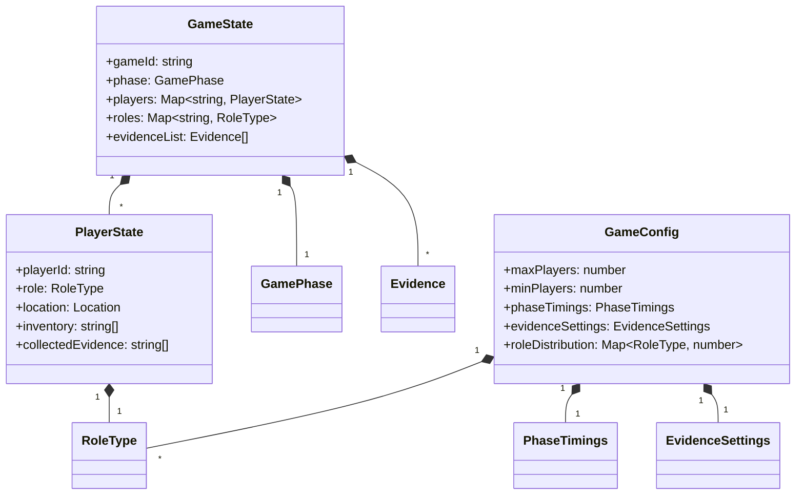

# GameTypes.ts 詳細設計書

## 1. 型定義の責務と概要

### 1.1 ファイルの目的
このファイルは、Murder Mystery ゲームにおける核となる型定義を提供します。ゲームの状態、プレイヤーの状態、フェーズ管理、設定など、ゲームシステム全体で使用される基本的な型を定義します。

### 1.2 定義される型の概要
- 列挙型（Enums）
  - `GamePhase`: ゲームの進行フェーズを定義
  - `RoleType`: プレイヤーの役職を定義

- インターフェース
  - `PlayerState`: 個々のプレイヤーの状態を表現
  - `GameState`: ゲーム全体の状態を管理
  - `PhaseTimings`: フェーズごとの時間設定
  - `EvidenceSettings`: 証拠関連の設定
  - `GameConfig`: ゲーム全体の設定

### 1.3 使用される文脈
- GameManagerでのゲーム状態管理
- PhaseManagerでのフェーズ遷移制御
- EvidenceManagerでの証拠管理
- プレイヤーの行動と状態の追跡
- ゲーム設定の構成管理

## 2. 型定義の詳細

### 2.1 ゲームフェーズ関連の型
```typescript
export enum GamePhase {
  PREPARATION = "preparation",
  DAILY_LIFE = "daily_life",
  INVESTIGATION = "investigation",
  DISCUSSION = "discussion",
  REINVESTIGATION = "reinvestigation",
  FINAL_DISCUSSION = "final_discussion",
  VOTING = "voting",
}

export interface PhaseTimings {
  preparation: number;   // 準備フェーズの制限時間
  investigation: number; // 調査フェーズの制限時間
  discussion: number;    // 議論フェーズの制限時間
  reinvestigation: number; // 再調査フェーズの制限時間
  finalDiscussion: number; // 最終議論フェーズの制限時間
  voting: number;         // 投票フェーズの制限時間
}
```

### 2.2 プレイヤー関連の型
```typescript
export enum RoleType {
  VILLAGER = "villager",     // 一般市民
  DETECTIVE = "detective",   // 探偵
  MURDERER = "murderer",     // 殺人者
  ACCOMPLICE = "accomplice", // 共犯者
}

export interface PlayerState {
  playerId: string;          // プレイヤー固有のID
  role: RoleType;           // プレイヤーの役職
  location: {               // プレイヤーの現在位置
    x: number;
    y: number;
    z: number;
    dimension: string;
  };
  inventory: string[];      // 所持アイテム
  collectedEvidence: string[]; // 収集した証拠のID
  isAlive: boolean;        // 生存状態
  hasVoted: boolean;       // 投票済みフラグ
  actionLog: string[];     // アクションログ
  abilities: Map<string, boolean>; // 使用可能なアビリティ
  skills: PlayerSkills;           // プレイヤーのスキル
}

/**
 * プレイヤーのスキルを定義するインターフェース
 */
export interface PlayerSkills {
  activeSkills: Map<string, SkillState>;  // アクティブスキル
  passiveSkills: Map<string, boolean>;    // パッシブスキル
  skillPoints: number;                    // スキルポイント
}

/**
 * スキルの状態を定義するインターフェース
 */
export interface SkillState {
  isUnlocked: boolean;    // スキルがアンロックされているか
  cooldown: number;       // クールダウン時間
  charges: number;        // 使用可能回数
  level: number;         // スキルレベル
}
```

### 2.3 カスタムイベント関連の型
```typescript
/**
 * ゲーム内イベントの種類
 */
export enum GameEventType {
  SKILL_ACTIVATION = "skill_activation",
  EVIDENCE_DISCOVERY = "evidence_discovery",
  PLAYER_INTERACTION = "player_interaction",
  SPECIAL_EVENT = "special_event"
}

/**
 * ゲーム内イベントの基本インターフェース
 */
export interface GameEvent {
  eventId: string;
  type: GameEventType;
  timestamp: number;
  sourceId: string;
  targetId?: string;
  metadata: Record<string, unknown>;
}

/**
 * カスタムイベントの登録情報
 */
export interface CustomEventRegistration {
  eventType: string;
  handler: (event: GameEvent) => void;
  priority: number;
  filters?: Record<string, unknown>;
}
```

### 2.4 ゲーム状態管理の型
```typescript
export interface GameState {
  gameId: string;           // ゲームインスタンスのID
  phase: GamePhase;         // 現在のゲームフェーズ
  startTime: number;        // ゲーム開始時刻
  currentDay: number;       // 現在の日数
  players: Map<string, PlayerState>;  // プレイヤー状態の管理
  roles: Map<string, RoleType>;      // 役職の割り当て
  evidenceList: Evidence[];          // 発見可能な証拠リスト
  collectedEvidence: Map<string, Set<string>>; // プレイヤーごとの収集済み証拠
  votes: Map<string, string>;        // 投票状況
  isActive: boolean;                 // ゲームの実行状態
  murderCommitted: boolean;          // 殺人発生フラグ
  investigationComplete: boolean;    // 調査完了フラグ
  murderTime?: number;               // 殺人発生時刻
}
```

### 2.4 設定関連の型
```typescript
export interface EvidenceSettings {
  maxPhysicalEvidence: number;    // 物理的証拠の最大数
  maxTestimonies: number;         // 証言の最大数
  reliabilityThreshold: number;   // 証拠の信頼性閾値
}

export interface GameConfig {
  maxPlayers: number;            // 最大プレイヤー数
  minPlayers: number;           // 最小プレイヤー数
  phaseTimings: PhaseTimings;   // フェーズごとの時間設定
  evidenceSettings: EvidenceSettings; // 証拠関連の設定
  roleDistribution: {           // 役職の配分設定
    [key in RoleType]?: number;
  };
}
```

## 3. 型の関係性

### 3.1 型の依存関係図


### 3.2 ActionTypesとの連携
- `GamePhase`は`MurderMysteryActions.PHASE_CHANGE`アクションと連動
- `PlayerState`の更新は各種アクションによってトリガー
- 証拠収集アクションは`EvidenceTypes`と連携

### 3.3 Union/Intersection Types
- ゲーム内のエンティティIDを表す型エイリアスの検討
- フェーズ固有の設定をUnion Typesで表現可能

### 3.4 ジェネリック型の活用
- マップやセットでのプレイヤーID、証拠IDの型安全性確保
- 将来の拡張性を考慮したジェネリックな設定型の検討

## 4. 使用方法

### 4.1 GameManagerでの使用例
```typescript
class GameManager {
  private gameState: GameState;
  private config: GameConfig;

  public initialize(): void {
    this.gameState = {
      gameId: crypto.randomUUID(),
      phase: GamePhase.PREPARATION,
      // ... other initializations
    };
  }

  public getPlayerRole(playerId: string): RoleType | undefined {
    return this.gameState.roles.get(playerId);
  }
}
```

### 4.2 PhaseManagerでの使用例
```typescript
class PhaseManager {
  private currentPhase: GamePhase;
  private timings: PhaseTimings;

  public transitionToPhase(newPhase: GamePhase): void {
    // Phase transition logic
  }
}
```

### 4.3 バリデーション方法
```typescript
function validateGameConfig(config: GameConfig): boolean {
  return (
    config.maxPlayers >= config.minPlayers &&
    config.minPlayers >= Object.values(config.roleDistribution).reduce((a, b) => a + b, 0)
  );
}
```

## 5. 設計上の注意点

### 5.1 型の安全性
- `undefined`の可能性がある値の明示的な型付け
- Map, Setの適切な使用によるデータ整合性の確保
- 列挙型の網羅的なハンドリング

### 5.2 拡張性への考慮
- 新しいゲームフェーズの追加が容易な設計
- 役職の追加・変更に対する柔軟性
- 設定パラメータの追加のしやすさ

### 5.3 命名規則
- 一貫した命名パターンの使用
- 明確で説明的な型名
- プレフィックス/サフィックスの統一

### 5.4 循環参照の防止
- 型定義間の依存関係の整理
- インポート/エクスポートの最適化
- インターフェースの適切な分割

## 6. テスト方針

### 6.1 型チェックのテスト
- 各型定義の整合性検証
- 必須プロパティの存在確認
- Union/Intersection Typesの動作確認

### 6.2 エッジケースの検証
```typescript
describe('GameTypes Validation', () => {
  it('should handle empty player list', () => {
    const gameState: GameState = {
      players: new Map(),
      // ... other required properties
    };
    expect(validateGameState(gameState)).toBeTruthy();
  });
});
```

### 6.3 コンパイル時チェック
- 型の互換性テスト
- ジェネリック型の制約テスト
- 列挙型の網羅性チェック
- カスタムイベント型の検証
- スキル型の制約チェック

### 6.4 シリアライゼーション
```typescript
describe('GameTypes Serialization', () => {
  it('should correctly serialize and deserialize GameState', () => {
    const originalState: GameState = {
      // ... state initialization
    };
    const serialized = JSON.stringify(originalState);
    const deserialized = JSON.parse(serialized) as GameState;
    
    expect(validateGameState(deserialized)).toBeTruthy();
    expect(deserialized).toEqual(originalState);
  });

  it('should handle complex types during serialization', () => {
    const state: PlayerState = {
      abilities: new Map([['ability1', true]]),
      skills: {
        activeSkills: new Map([['skill1', { isUnlocked: true, cooldown: 0, charges: 3, level: 1 }]])
      }
    };
    const serialized = JSON.stringify(state, (key, value) =>
      value instanceof Map ? Array.from(value.entries()) : value
    );
    expect(JSON.parse(serialized)).toBeDefined();
  });
});
```

### 6.5 ランタイムバリデーション
```typescript
function validatePlayerState(state: PlayerState): boolean {
  return (
    typeof state.playerId === 'string' &&
    state.collectedEvidence instanceof Array &&
    state.inventory instanceof Array &&
    typeof state.isAlive === 'boolean'
  );
}