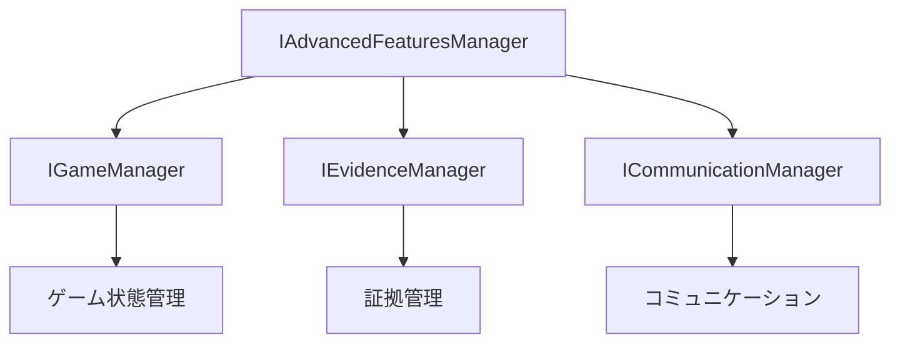

# IAdvancedFeaturesManager インターフェース詳細設計書

## 1. インターフェースの責務

IAdvancedFeaturesManagerは、マーダーミステリーゲーム内の高度な機能を管理する中核インターフェースです。以下の主要な責務を持ちます：

- 役職固有の特殊能力システムの管理
- 証拠の信頼性評価と分析
- プレイヤーの行動パターン分析
- 投票行動の追跡と分析
- アリバイの整合性チェック
- イベント通知システムの提供

## 2. メソッド一覧

### 役職特殊能力システム

#### getRoleAbility(roleType: RoleType): IRoleAbility
- **目的**: 指定された役職の特殊能力情報を取得する
- **パラメータ**:
  - `roleType`: 役職タイプ（DETECTIVE、KILLER、ACCOMPLICE、CITIZEN）
- **戻り値**: 役職の特殊能力情報（IRoleAbility）
- **使用シーン例**: 探偵が証拠調査能力を使用する前に、能力の詳細情報を確認する場合

#### useRoleAbility(playerId: string, target: AbilityTarget): Promise<boolean>
- **目的**: プレイヤーの特殊能力を使用する
- **パラメータ**:
  - `playerId`: 能力を使用するプレイヤーのID
  - `target`: 能力の対象（プレイヤー、証拠、場所）
- **戻り値**: 能力使用の成功/失敗
- **使用シーン例**: 探偵が特定の証拠を詳しく調査する場合

#### isAbilityAvailable(playerId: string): boolean
- **目的**: プレイヤーの特殊能力が使用可能か確認する
- **パラメータ**:
  - `playerId`: 確認するプレイヤーのID
- **戻り値**: 能力が使用可能かどうか
- **使用シーン例**: UIでの能力ボタンの有効/無効状態の制御

### 証拠分析システム

#### evaluateEvidence(evidenceId: string): Promise<IEvidenceReliability>
- **目的**: 証拠の信頼性を総合的に評価する
- **パラメータ**:
  - `evidenceId`: 評価する証拠のID
- **戻り値**: 証拠の信頼性評価結果
- **使用シーン例**: 新しい証拠が発見された時の自動評価

#### detectEvidenceConflicts(evidenceIds: string[]): Promise<string[][]>
- **目的**: 証拠間の矛盾を検出する
- **パラメータ**:
  - `evidenceIds`: 検査対象の証拠IDリスト
- **戻り値**: 矛盾する証拠のIDペアリスト
- **使用シーン例**: 複数の証言の整合性をチェックする場合

#### analyzeEvidenceRelevance(evidenceId: string, contextEvidenceIds: string[]): Promise<number>
- **目的**: 証拠の関連性を分析する
- **パラメータ**:
  - `evidenceId`: 分析対象の証拠ID
  - `contextEvidenceIds`: 比較対象の証拠IDリスト
- **戻り値**: 関連性スコア（0-100）
- **使用シーン例**: 新しい証拠と既存の証拠群との関連性を評価する場合

#### setEvidencePriority(evidenceId: string, priority: number): Promise<void>
- **目的**: 証拠の優先度を設定する
- **パラメータ**:
  - `evidenceId`: 証拠ID
  - `priority`: 優先度（1-5）
- **使用シーン例**: 重要な証拠をハイライトする場合

### 分析機能

#### analyzePlayerBehavior(playerId: string): Promise<IAnalyticsResult["playerBehavior"]>
- **目的**: プレイヤーの行動パターンを分析する
- **パラメータ**:
  - `playerId`: 分析対象のプレイヤーID
- **戻り値**: 行動分析結果（移動、相互作用、投票履歴）
- **使用シーン例**: プレイヤーの不審な行動を発見する場合

#### analyzeEvidenceStatistics(): Promise<IAnalyticsResult["evidenceStats"]>
- **目的**: 証拠の統計情報を分析する
- **戻り値**: 証拠の統計情報（総数、検証済み数、不審な証拠数、平均信頼性）
- **使用シーン例**: 調査の進捗状況を確認する場合

#### analyzeVotingPatterns(): Promise<VotingPatternAnalysis>
- **目的**: 投票パターンを分析する
- **戻り値**: 投票パターン分析結果
- **使用シーン例**: 不自然な投票行動を検出する場合

#### analyzeAlibiConsistency(playerId: string): Promise<IAnalyticsResult["alibiAnalysis"]>
- **目的**: アリバイの整合性を分析する
- **パラメータ**:
  - `playerId`: 分析対象のプレイヤーID
- **戻り値**: アリバイ分析結果（整合性スコア、矛盾点）
- **使用シーン例**: プレイヤーのアリバイを検証する場合

### イベントリスナー

#### onEvidenceStateChange(callback: (evidenceId: string, newState: IEvidenceReliability) => void): void
- **目的**: 証拠状態の変更を監視する
- **パラメータ**:
  - `callback`: 状態変更時のコールバック関数
- **使用シーン例**: UIの証拠リストを自動更新する場合

#### onAbilityUse(callback: (playerId: string, ability: IRoleAbility, target: AbilityTarget) => void): void
- **目的**: 特殊能力の使用を監視する
- **パラメータ**:
  - `callback`: 能力使用時のコールバック関数
- **使用シーン例**: 能力使用のログを記録する場合

#### onAnalyticsUpdate(callback: (result: Partial<IAnalyticsResult>) => void): void
- **目的**: 分析結果の更新を監視する
- **パラメータ**:
  - `callback`: 分析更新時のコールバック関数
- **使用シーン例**: リアルタイムの分析データをUIに表示する場合

## 3. 関連インターフェースとの依存関係

### 主要な依存関係
- **IGameManager**: ゲーム状態管理、プレイヤー情報の取得
- **IEvidenceManager**: 証拠の取得・管理
- **ICommunicationManager**: プレイヤー間のコミュニケーション管理

### 連携方法

### 拡張機能の統合ポイント
- 役職能力システムへの新規能力追加
- 証拠分析アルゴリズムの拡張
- カスタム分析機能の追加
- イベントリスナーを活用した機能拡張

## 4. 拡張機能の設計方針

### プラグイン機能の設計
1. **能力プラグイン**
   - IRoleAbilityインターフェースを実装
   - 新規役職タイプの追加に対応
   - クールダウンや使用条件のカスタマイズ

2. **分析プラグイン**
   - IAnalyticsResultインターフェースの拡張
   - カスタム分析ロジックの追加
   - 独自の評価指標の実装

### カスタム機能の追加方法
1. 適切なインターフェースの拡張
2. 新規型定義の追加（必要な場合）
3. イベントリスナーの実装
4. 既存機能との統合テスト

### 機能の有効化/無効化の制御
- 設定ファイルによる機能の制御
- 実行時の動的な機能切り替え
- パーミッション管理との連携

## 5. 設計上の注意点・制約事項

### パフォーマンスへの影響
- **非同期処理の活用**
  - 重い分析処理の非同期実行
  - Promise.allによる並列処理の活用
  - キャッシュ機構の実装

- **メモリ管理**
  - イベントリスナーの適切な解除
  - 大量データのストリーミング処理
  - メモリリークの防止

### 安全性の確保
- **データの整合性**
  - トランザクション的な処理の実装
  - 状態変更の原子性確保
  - エラー発生時のロールバック

- **不正利用の防止**
  - 能力使用の適切な制限
  - データ改ざんの検知
  - プレイヤー権限の検証

### 既存機能との整合性
- 基本ゲームルールの遵守
- UI/UXの一貫性維持
- エラーハンドリングの統一

## 6. 拡張性についての考慮事項

### 新機能追加のガイドライン
1. インターフェースの拡張性を保持
2. 下位互換性の確保
3. テスト容易性の確保
4. ドキュメントの整備

### バージョン管理方針
- セマンティックバージョニングの採用
- 破壊的変更の明確な記録
- マイグレーションパスの提供

### 後方互換性の維持
- インターフェースの安定性確保
- 非推奨機能の段階的な廃止
- 互換性レイヤーの提供（必要な場合）