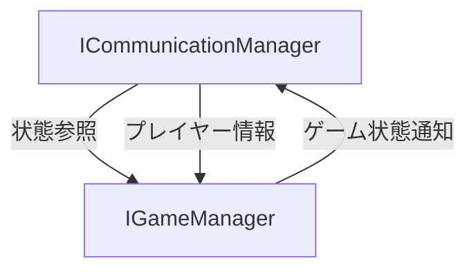
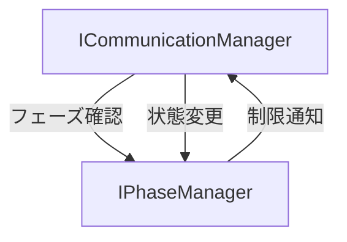

# ICommunicationManagerインターフェース 詳細設計書

## 1. インターフェースの責務

ICommunicationManagerは、マーダーミステリーゲーム内のプレイヤー間コミュニケーションを管理する中核インターフェースです。主な責務は以下の通りです：

- プレイヤー間のメッセージング制御
- 証拠や調査結果の共有機能の提供
- 投票システムの管理
- フェーズに応じたコミュニケーション制限の実装
- メッセージ履歴の管理

## 2. メソッド定義

### 2.1 チャットシステム

#### sendMessage()

```typescript
sendMessage(fromId: string, toId: string, message: string): Promise<boolean>
```

**目的**  
特定のプレイヤーから別のプレイヤーへメッセージを送信します。

**パラメータ**
- fromId: string - 送信者のプレイヤーID
- toId: string - 受信者のプレイヤーID
- message: string - 送信するメッセージ内容

**戻り値**  
- Promise<boolean> - メッセージ送信の成功/失敗

**使用シーン例**
- プレイヤー間の個別の情報交換
- 探偵による容疑者への尋問
- アリバイの確認

#### broadcastMessage()

```typescript
broadcastMessage(fromId: string, message: string): Promise<boolean>
```

**目的**  
全プレイヤーにメッセージをブロードキャストします。

**パラメータ**
- fromId: string - 送信者のプレイヤーID
- message: string - ブロードキャストするメッセージ

**戻り値**
- Promise<boolean> - ブロードキャストの成功/失敗

**使用シーン例**
- 重要な発見の共有
- 全体会議での発言
- システムアナウンス

#### sendNPCMessage()

```typescript
sendNPCMessage(npcId: string, playerId: string, message: string): Promise<boolean>
```

**目的**  
NPCからプレイヤーへメッセージを送信します。

**パラメータ**
- npcId: string - NPCの識別子
- playerId: string - 受信者のプレイヤーID
- message: string - NPCのメッセージ内容

**戻り値**
- Promise<boolean> - メッセージ送信の成功/失敗

**使用シーン例**
- NPCによるヒントの提供
- チュートリアルガイダンス
- 環境からの情報提供

### 2.2 情報共有機能

#### shareEvidence()

```typescript
shareEvidence(fromId: string, toId: string, evidence: Evidence): Promise<boolean>
```

**目的**  
プレイヤー間で証拠を共有します。

**パラメータ**
- fromId: string - 共有元プレイヤーID
- toId: string - 共有先プレイヤーID
- evidence: Evidence - 共有する証拠オブジェクト

**戻り値**
- Promise<boolean> - 共有操作の成功/失敗

**使用シーン例**
- 探偵による証拠の共有
- チーム間での情報交換
- 証拠分析結果の共有

### 2.3 投票システム

#### startVoting()

```typescript
startVoting(): Promise<boolean>
```

**目的**  
投票フェーズを開始します。

**戻り値**
- Promise<boolean> - 投票開始の成功/失敗

**使用シーン例**
- 議論フェーズ終了時
- 緊急投票の開始
- 容疑者特定のための投票

#### castVote()

```typescript
castVote(fromId: string, targetId: string): Promise<boolean>
```

**目的**  
プレイヤーの投票を記録します。

**パラメータ**
- fromId: string - 投票者のプレイヤーID
- targetId: string - 投票対象のプレイヤーID

**戻り値**
- Promise<boolean> - 投票記録の成功/失敗

## 3. 関連インターフェースとの依存関係

### 3.1 IGameManagerとの連携



- GameStateの参照によるプレイヤー状態の取得
- プレイヤーの役職に基づくコミュニケーション制限の実装
- ゲーム進行状況に応じたメッセージング制御

### 3.2 IPhaseManagerとの連携



- 現在のフェーズに基づく通信制限の適用
- フェーズ変更時のコミュニケーション設定の更新
- 投票フェーズの管理

## 4. コミュニケーション制御のルール

### 4.1 役職に基づく制限

| 役職 | 通信制限 |
|------|----------|
| 探偵 | 全員と通信可能 |
| 殺人者 | 共犯者のみと特別通信可能 |
| 共犯者 | 殺人者のみと特別通信可能 |
| 市民 | フェーズに応じて制限 |

### 4.2 フェーズごとの制限

| フェーズ | 通信制限 |
|----------|----------|
| PREPARATION | 全体通信可能 |
| INVESTIGATION | 役職に基づく制限適用 |
| DISCUSSION | 全体通信可能 |
| VOTING | 投票のみ可能 |

## 5. 設計上の注意点・制約事項

### 5.1 メッセージの同期制御

- メッセージ送信は非同期で実装
- 送信順序の保証が必要
- 履歴管理による整合性の確保

### 5.2 セキュリティ考慮事項

1. **メッセージの検証**
   - 不正なメッセージの検出
   - 送信者の権限確認
   - 受信者の有効性確認

2. **アクセス制御**
   - 役職に基づく制限の厳密な実装
   - フェーズごとの権限管理
   - 投票の一意性の保証

### 5.3 エラーハンドリング

```typescript
interface CommunicationError {
  type: "UNAUTHORIZED" | "INVALID_PHASE" | "INVALID_TARGET";
  message: string;
  details?: unknown;
}
```

## 6. 拡張性についての考慮事項

### 6.1 新しいコミュニケーション手段の追加

```typescript
interface ICommunicationManager {
  // 既存のメソッド
  
  // 将来的な拡張
  registerCommunicationChannel(channel: ICommunicationChannel): void;
  sendCustomMessage(
    fromId: string,
    toId: string,
    type: string,
    content: unknown
  ): Promise<boolean>;
}
```

### 6.2 カスタムメッセージタイプ

```typescript
interface CustomMessageType {
  type: string;
  validator: (content: unknown) => boolean;
  formatter: (content: unknown) => string;
}

interface ICommunicationManager {
  // 既存のメソッド
  
  // 将来的な拡張
  registerMessageType(messageType: CustomMessageType): void;
  removeMessageType(type: string): void;
}
```

### 6.3 拡張時の注意点

1. **後方互換性**
   - 既存のメッセージングシステムとの整合性維持
   - 古いメッセージフォーマットのサポート継続

2. **パフォーマンス**
   - メッセージキューの最適化
   - 履歴管理の効率化
   - リアルタイム通信の応答性確保