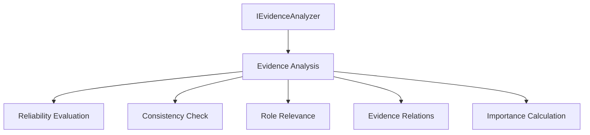
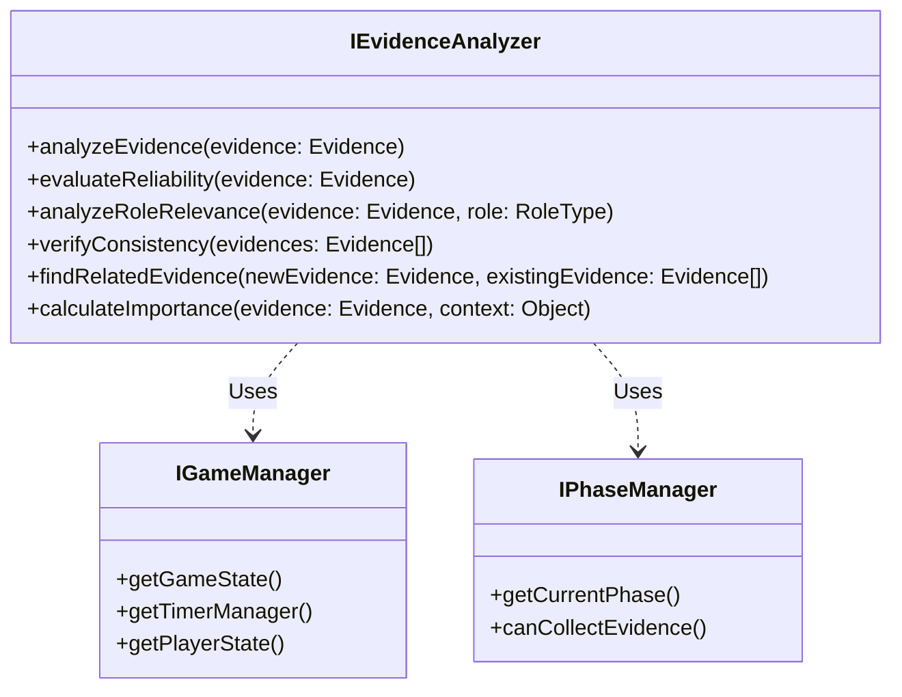
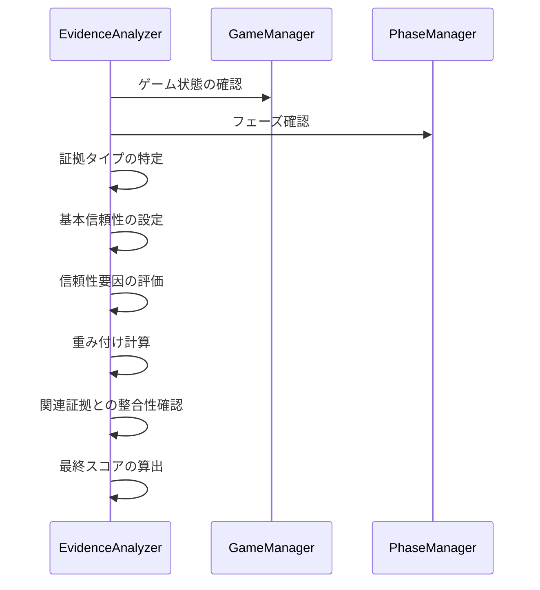

# IEvidenceAnalyzer インターフェース詳細設計書

## 1. インターフェースの責務

IEvidenceAnalyzerは、マーダーミステリーゲームにおける証拠分析システムの中核となるインターフェースです。以下の主要な責務を担います：

- 証拠の信頼性評価と分析
- 証拠間の関連性や整合性の検証
- 役職との関連性分析
- 証拠の重要度計算
- 証拠チェーンの構築と評価



## 2. メソッド定義

### 2.1 analyzeEvidence(evidence: Evidence): Promise<number>

**目的**: 個々の証拠の総合的な分析を行い、その価値を評価します。

**パラメータ**:
- evidence: Evidence
  - 分析対象の証拠オブジェクト
  - EvidenceTypesで定義された各種証拠タイプ（PHYSICAL, TESTIMONY等）に対応

**戻り値**: 
- Promise<number>
  - 0-100のスコア
  - 70以上: 高価値な証拠
  - 40-69: 中程度の価値
  - 0-39: 低価値または信頼性の低い証拠

**使用シーン例**:
```typescript
// 新しい証拠が発見された際の分析
const evidenceScore = await analyzer.analyzeEvidence(newEvidence);
if (evidenceScore >= 70) {
  // 重要な証拠として特別な処理
}
```

### 2.2 evaluateReliability(evidence: Evidence): Promise<number>

**目的**: 証拠の信頼性を評価します。

**パラメータ**:
- evidence: Evidence
  - 評価対象の証拠

**戻り値**:
- Promise<number>
  - 0-100の信頼性スコア
  - ReliabilityFactorの各要素を考慮した総合評価

**使用シーン例**:
```typescript
// 証言の信頼性評価
const reliability = await analyzer.evaluateReliability(testimonyEvidence);
if (reliability < 30) {
  // 信頼性の低い証言として警告
}
```

### 2.3 analyzeRoleRelevance(evidence: Evidence, role: RoleType): Promise<number>

**目的**: 特定の役職と証拠との関連性を分析します。

**パラメータ**:
- evidence: Evidence
  - 分析対象の証拠
- role: RoleType
  - 分析対象の役職

**戻り値**:
- Promise<number>
  - 0-100の関連性スコア
  - 80以上: 強い関連性
  - 50-79: 中程度の関連性
  - 0-49: 弱い関連性

**使用シーン例**:
```typescript
// 容疑者の役職と証拠の関連性チェック
const relevance = await analyzer.analyzeRoleRelevance(evidence, suspectRole);
if (relevance >= 80) {
  // 強い関連性として調査優先度を上げる
}
```

### 2.4 verifyConsistency(evidences: Evidence[]): Promise<{ score: number; inconsistencies: string[] }>

**目的**: 複数の証拠間の整合性を検証します。

**パラメータ**:
- evidences: Evidence[]
  - 検証対象の証拠配列

**戻り値**:
- Promise<{ score: number; inconsistencies: string[] }>
  - score: 0-100の整合性スコア
  - inconsistencies: 検出された矛盾点の説明配列

**使用シーン例**:
```typescript
// 複数の証言の整合性チェック
const result = await analyzer.verifyConsistency(testimonies);
if (result.inconsistencies.length > 0) {
  // 矛盾する証言の処理
}
```

### 2.5 findRelatedEvidence(newEvidence: Evidence, existingEvidence: Evidence[]): Promise<Map<string, number>>

**目的**: 新しい証拠と既存の証拠との関連性を分析します。

**パラメータ**:
- newEvidence: Evidence
  - 新しく発見された証拠
- existingEvidence: Evidence[]
  - 既存の証拠配列

**戻り値**:
- Promise<Map<string, number>>
  - キー: 関連する証拠のID
  - 値: 0-100の関連度スコア

**使用シーン例**:
```typescript
// 新証拠と既存証拠の関連性分析
const relations = await analyzer.findRelatedEvidence(newEvidence, existingEvidence);
for (const [evidenceId, score] of relations) {
  if (score >= 70) {
    // 強い関連性を持つ証拠の特別処理
  }
}
```

### 2.6 calculateImportance(evidence: Evidence, context: { phase: string; discoveredEvidence: Evidence[]; suspectRoles: RoleType[]; }): Promise<number>

**目的**: 現在のゲーム状況における証拠の重要度を計算します。

**パラメータ**:
- evidence: Evidence
  - 評価対象の証拠
- context: Object
  - phase: 現在のゲームフェーズ
  - discoveredEvidence: 既に発見された証拠配列
  - suspectRoles: 容疑者の役職配列

**戻り値**:
- Promise<number>
  - 0-100の重要度スコア

**使用シーン例**:
```typescript
// 証拠の重要度評価
const importance = await analyzer.calculateImportance(evidence, {
  phase: currentPhase,
  discoveredEvidence: allEvidence,
  suspectRoles: suspects
});
if (importance >= 90) {
  // 極めて重要な証拠として特別な通知
}
```

## 3. 関連インターフェースとの依存関係



### 3.1 IGameManagerとの依存関係

- ゲームの状態情報の取得
- プレイヤーの状態確認
- タイミング情報の利用

### 3.2 IPhaseManagerとの依存関係

- 現在のフェーズ情報の取得
- 証拠収集可能状態の確認
- フェーズに応じた分析ルールの適用

## 4. 証拠分析の制御ルール

### 4.1 信頼性評価の重み付け

```typescript
const reliabilityWeights = {
  TIME_PROXIMITY: 0.25,    // 時間的近接性
  WITNESS_CREDIBILITY: 0.2,// 証言者の信頼性
  PHYSICAL_EVIDENCE: 0.3,  // 物的証拠の存在
  CORROBORATION: 0.15,    // 他の証拠との整合性
  EXPERTISE: 0.1          // 専門家による分析
};
```

### 4.2 証拠タイプごとの基本信頼性

- PHYSICAL: 基本信頼性 80%
- TESTIMONY: 基本信頼性 60%
- ALIBI: 基本信頼性 70%
- CIRCUMSTANTIAL: 基本信頼性 50%
- DIGITAL: 基本信頼性 85%
- ROLE_SPECIFIC: 基本信頼性 75%

### 4.3 証拠分析フロー



## 5. 設計上の注意点・制約事項

### 5.1 証拠の整合性チェック

- タイムスタンプの矛盾検出
- 場所情報の整合性確認
- 証言内容の論理的矛盾チェック
- 物理的証拠との整合性確認

### 5.2 分析結果の信頼性確保

- 複数の評価指標の使用
- 重み付けの適切な調整
- 証拠間の相互検証
- 時系列での整合性確認

### 5.3 エラーハンドリング

1. 入力データの検証
```typescript
if (!evidence.validate()) {
  throw new EvidenceValidationError("Invalid evidence data");
}
```

2. 非同期処理のエラー処理
```typescript
try {
  await analyzer.analyzeEvidence(evidence);
} catch (error) {
  if (error instanceof EvidenceAnalysisError) {
    // 分析エラーの特別処理
  }
  // エラーのログ記録と適切な対応
}
```

3. 整合性エラーの処理
- 矛盾検出時の警告メカニズム
- エラーレベルに応じた対応
- 自動修正の可能性の検討

## 6. 拡張性についての考慮事項

### 6.1 新しい証拠タイプへの対応

1. EvidenceTypeの拡張性
```typescript
export enum EvidenceType {
  // 既存のタイプ
  PHYSICAL = "physical",
  TESTIMONY = "testimony",
  // 新規追加用
  FORENSIC = "forensic",     // 法医学的証拠
  BEHAVIORAL = "behavioral"  // 行動分析的証拠
}
```

2. 分析ロジックの拡張ポイント
```typescript
interface EvidenceAnalyzer {
  // 既存のメソッド
  analyzeEvidence(evidence: Evidence): Promise<number>;
  
  // 拡張用メソッド
  registerCustomAnalyzer(
    type: EvidenceType,
    analyzer: CustomEvidenceAnalyzer
  ): void;
}
```

### 6.2 分析アルゴリズムの追加方法

1. Strategy Patternの採用
```typescript
interface AnalysisStrategy {
  analyze(evidence: Evidence): Promise<number>;
}

class DefaultAnalysisStrategy implements AnalysisStrategy {
  // デフォルトの分析ロジック
}

class CustomAnalysisStrategy implements AnalysisStrategy {
  // カスタム分析ロジック
}
```

2. プラグイン形式での拡張性
```typescript
interface AnalysisPlugin {
  name: string;
  version: string;
  analyze(evidence: Evidence): Promise<number>;
}
```

### 6.3 将来の拡張を見据えた設計ポイント

1. 設定の外部化
```typescript
interface AnalysisConfig {
  weights: Map<ReliabilityFactor, number>;
  thresholds: Map<string, number>;
  customRules?: Array<AnalysisRule>;
}
```

2. イベントシステムの導入
```typescript
interface AnalysisEvent {
  type: string;
  evidence: Evidence;
  result: AnalysisResult;
  timestamp: number;
}
```

3. カスタムバリデーションの追加
```typescript
interface ValidationRule {
  name: string;
  validate(evidence: Evidence): boolean;
  errorMessage: string;
}