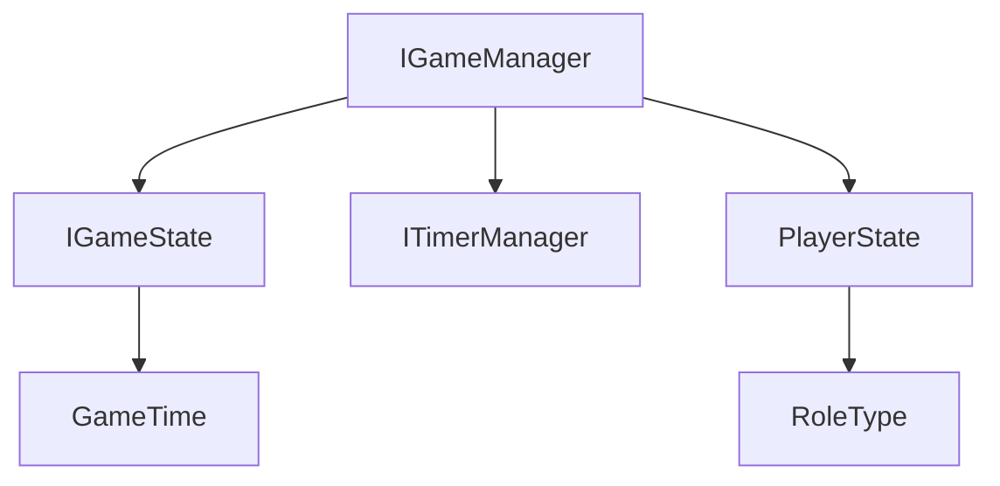

# IGameManagerインターフェース 詳細設計書

## 1. インターフェースの責務

IGameManagerは、マーダーミステリーゲームの中核となるゲーム状態管理機能を定義するインターフェースです。以下の主要な責務を持ちます：

- ゲームの現在の状態（実行中/停止中、開始時刻、残り時間）の提供
- タイマー管理機能へのアクセス提供
- プレイヤーの状態情報へのアクセス提供

このインターフェースは、特にLogManagerで必要となる最小限の操作を定義し、ゲーム状態の監視と記録を可能にします。

## 2. メソッド定義

### 2.1 getGameState()

```typescript
getGameState(): IGameState
```

#### 目的
現在のゲーム状態を取得します。

#### 戻り値
`IGameState`インターフェースに基づくゲーム状態オブジェクト：
- `isRunning`: boolean - ゲームが実行中かどうか
- `startTime`: number - ゲーム開始時のタイムスタンプ
- `remainingTime`: number - 現在のフェーズの残り時間

#### 使用シーン例
- ゲームの進行状況の監視
- ログ記録時のタイムスタンプ取得
- UI更新のトリガー

### 2.2 getTimerManager()

```typescript
getTimerManager(): ITimerManager
```

#### 目的
ゲーム内時間を管理するTimerManagerへのアクセスを提供します。

#### 戻り値
`ITimerManager`インターフェースを実装したオブジェクト：
- `getGameTime(): GameTime` - 現在のゲーム内時間を取得

#### 使用シーン例
- イベントのタイムスタンプ記録
- フェーズ切り替えのタイミング制御
- 時間依存のゲームロジック実行

### 2.3 getPlayerState()

```typescript
getPlayerState(playerId: string): PlayerState | undefined
```

#### パラメータ
- `playerId`: string - プレイヤーの一意識別子

#### 目的
指定されたプレイヤーの現在の状態情報を取得します。

#### 戻り値
`PlayerState`オブジェクトまたは`undefined`：
- プレイヤーが存在する場合、以下を含むPlayerStateオブジェクト：
  - `role`: RoleType - プレイヤーの役職
  - `location`: { x, y, z, dimension } - 現在位置
  - `inventory`: string[] - 所持アイテム
  - `collectedEvidence`: string[] - 収集した証拠
  - `isAlive`: boolean - 生存状態
  - `hasVoted`: boolean - 投票状態
  - `actionLog`: string[] - アクション履歴
  - `abilities`: Map<string, boolean> - 使用可能な能力
- プレイヤーが存在しない場合は`undefined`

#### 使用シーン例
- プレイヤーの行動可能性チェック
- 証拠収集状態の確認
- プレイヤー間のインタラクション制御

## 3. 関連インターフェースとの依存関係



### 3.1 直接的な依存
- IGameState
- ITimerManager
- PlayerState

### 3.2 間接的な依存
- GameTime（mc-action-loggerモジュールから）
- RoleType（GameTypesから）

## 4. 設計上の注意点・制約事項

1. **状態の不変性**
   - `getGameState()`が返す状態オブジェクトは、変更不可（イミュータブル）であるべき
   - 状態の変更は必ず実装クラス内部のメソッドを通じて行う

2. **非同期処理の考慮**
   - 現在のインターフェースは同期的な操作のみを定義
   - 将来的に非同期操作が必要になる場合は、インターフェースの拡張が必要

3. **エラー処理**
   - プレイヤーIDが存在しない場合は`undefined`を返す
   - 不正な状態へのアクセスは例外をスローせず、適切なフォールバック値を返す

4. **スレッドセーフティ**
   - 実装クラスは複数のイベントハンドラからの同時アクセスに対する安全性を確保する必要がある

## 5. 拡張性についての考慮事項

### 5.1 将来的な拡張ポイント

1. **状態監視機能の追加**
```typescript
interface IGameManager {
    // 既存のメソッド
    getGameState(): IGameState;
    getTimerManager(): ITimerManager;
    getPlayerState(playerId: string): PlayerState | undefined;

    // 将来的な拡張例
    subscribeToStateChanges(callback: (state: IGameState) => void): void;
    unsubscribeFromStateChanges(callback: (state: IGameState) => void): void;
}
```

2. **プレイヤー状態の詳細化**
```typescript
interface IGameManager {
    // 既存のメソッド
    
    // 将来的な拡張例
    getPlayerDetails(playerId: string): Promise<DetailedPlayerState>;
    getPlayerHistory(playerId: string): Promise<PlayerActionHistory>;
}
```

### 5.2 拡張時の注意点

1. **後方互換性**
   - 既存メソッドのシグネチャは維持
   - 新機能は既存の機能を破壊しない形で追加

2. **パフォーマンス考慮**
   - 新機能追加時もメモリ使用量とレスポンス時間を考慮
   - 必要に応じてキャッシュ機構の導入を検討

3. **モジュール性**
   - 新機能は既存の責務の範囲内に収まるよう設計
   - 必要に応じて新しいインターフェースを作成して責務を分離