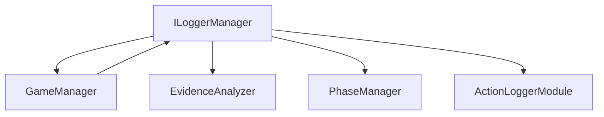

# ILoggerManager 詳細設計書

## 1. インターフェースの責務

ILoggerManagerは、マーダーミステリーゲームにおけるプレイヤーアクションとゲームイベントのロギングを担当する中核インターフェースです。主な責務は以下の通りです：

- ゲーム内で発生するすべてのアクションの記録
- プレイヤーの行動履歴の追跡
- ゲームの進行状況の監視
- 証拠収集活動のログ記録
- デバッグおよび分析用のデータ収集

## 2. メソッド一覧

### 2.1 logAction

```typescript
logAction(data: {
  type: string;
  playerId: string;
  details: unknown;
}): Promise<void>;
```

#### 目的
ゲーム内で発生したアクションをログとして記録します。

#### パラメータ詳細
- `type`: アクションの種類を示す文字列
  - 例：'evidence_collection', 'player_movement', 'chat_message'
- `playerId`: アクションを実行したプレイヤーの一意識別子
- `details`: アクションの詳細情報（型は実装時に具体化）

#### 戻り値
- Promise<void>: ログの記録が完了したことを示すPromise

#### 想定される使用シーン
```typescript
// 証拠収集アクションのログ記録
await loggerManager.logAction({
  type: 'evidence_collection',
  playerId: 'player123',
  details: {
    evidenceId: 'ev001',
    location: { x: 100, y: 50, z: 200 },
    timestamp: Date.now()
  }
});

// プレイヤー間のチャットログ
await loggerManager.logAction({
  type: 'chat_message',
  playerId: 'player456',
  details: {
    message: '怪しい足跡を見つけました',
    recipients: ['all'],
    timestamp: Date.now()
  }
});
```

### 2.2 getFilteredLogs（推奨拡張）

```typescript
getFilteredLogs(filters: {
  types?: string[];
  playerIds?: string[];
  startTime?: number;
  endTime?: number;
  limit?: number;
}): Promise<LogEntry[]>;
```

#### 目的
指定された条件に基づいてフィルタリングされたログを取得します。

#### パラメータ詳細
- `types`: 取得するアクションタイプの配列（オプショナル）
- `playerIds`: 対象プレイヤーIDの配列（オプショナル）
- `startTime`: ログ取得開始時刻（オプショナル）
- `endTime`: ログ取得終了時刻（オプショナル）
- `limit`: 取得する最大ログ数（オプショナル）

### 2.3 exportLogs（推奨拡張）

```typescript
exportLogs(format: 'json' | 'csv'): Promise<string>;
```

#### 目的
ログデータを指定されたフォーマットでエクスポートします。

#### パラメータ詳細
- `format`: エクスポート形式（'json'または'csv'）

## 3. 関連インターフェースとの依存関係

### 3.1 他のマネージャーとの連携


### 3.2 ログの収集と保存の仕組み
1. イベントキャプチャ層
   - GameManagerからのイベント受信
   - プレイヤーアクションの直接キャプチャ
   - システムイベントの監視

2. フィルタリング層
   - ログレベルによるフィルタリング
   - カスタムフィルターの適用
   - 重複排除

3. 永続化層
   - インメモリキャッシュ
   - ファイルシステムへの保存
   - 外部ストレージ連携（オプショナル）

## 4. ロギングシステムの設計

### 4.1 ログレベルの定義
```typescript
enum LogLevel {
  DEBUG = 0,
  INFO = 1,
  WARN = 2,
  ERROR = 3,
  CRITICAL = 4
}
```

### 4.2 フィルタリング機能
- ログレベルベースのフィルタリング
- プレイヤーIDベースのフィルタリング
- アクションタイプベースのフィルタリング
- 時間範囲ベースのフィルタリング

### 4.3 パフォーマンス考慮事項
- バッチ処理によるログ書き込み
- 非同期処理の活用
- メモリ使用量の最適化
- ログローテーション機能

## 5. 設計上の注意点・制約事項

### 5.1 ログの永続化方針
- インメモリキャッシュサイズの制限: 1000エントリー
- ファイル書き込み頻度: 60秒間隔
- ログローテーション: 1時間ごと
- 保持期間: 7日間

### 5.2 エラーハンドリング
- ログ書き込みエラーの再試行
- ディスク容量不足時の対応
- ネットワーク切断時の一時保存
- エラー状態の通知メカニズム

### 5.3 セキュリティ考慮事項
- プレイヤー個人情報の匿名化
- ログデータの暗号化オプション
- アクセス制御と監査
- セキュリティイベントの優先記録

## 6. 拡張性についての考慮事項

### 6.1 カスタムログフォーマット
```typescript
interface CustomLogFormat {
  template: string;
  variables: string[];
  formatter: (data: any) => string;
}
```

### 6.2 新しいログ出力先
- WebSocket出力
- 外部モニタリングサービス連携
- カスタムストレージプロバイダー

### 6.3 ログ分析機能
- リアルタイム分析機能
- パターン検出
- 異常検知
- 統計情報生成

## 7. 実装例

```typescript
class LoggerManager implements ILoggerManager {
  private actionLogger: ActionLoggerModule;
  private cache: LogEntry[] = [];
  
  constructor(config: LoggerConfig) {
    this.actionLogger = ActionLoggerModule.getInstance();
    this.actionLogger.initialize(config);
  }

  async logAction(data: {
    type: string;
    playerId: string;
    details: unknown;
  }): Promise<void> {
    try {
      // メモリキャッシュに追加
      this.cache.push({
        ...data,
        timestamp: Date.now(),
        level: this.determineLogLevel(data)
      });

      // キャッシュがしきい値を超えた場合の永続化
      if (this.cache.length >= 1000) {
        await this.flushCache();
      }
    } catch (error) {
      console.error('Failed to log action:', error);
      throw error;
    }
  }

  private determineLogLevel(data: LogEntry): LogLevel {
    // ログレベル判定ロジック
    return LogLevel.INFO;
  }

  private async flushCache(): Promise<void> {
    // キャッシュの永続化処理
  }
}