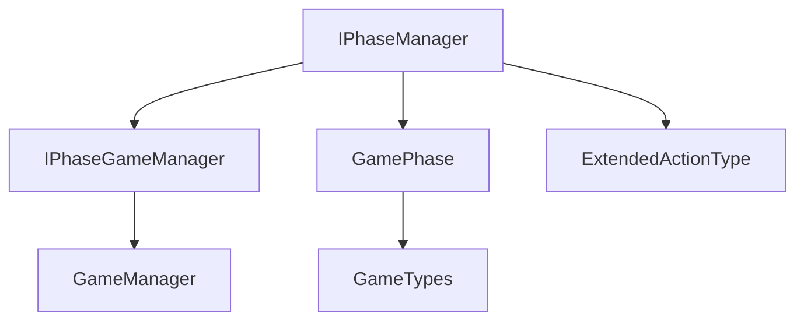
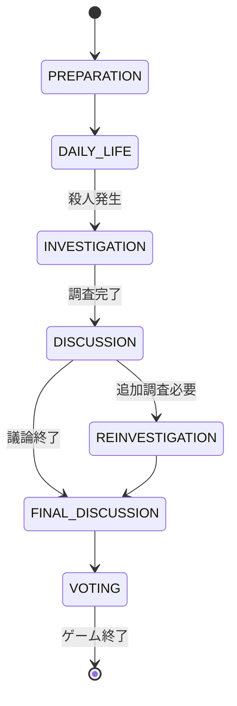

# IPhaseManagerインターフェース 詳細設計書

## 1. インターフェースの責務

IPhaseManagerは、マーダーミステリーゲームのフェーズ（段階）管理を担当する重要なインターフェースです。主な責務は以下の通りです：

- ゲームフェーズの状態管理と遷移制御
- フェーズごとの制限事項の定義と適用
- フェーズタイミングの管理
- アクション許可の判定

## 2. メソッド定義

### 2.1 getCurrentPhase()

```typescript
getCurrentPhase(): GamePhase
```

#### 目的
現在のゲームフェーズを取得します。

#### 戻り値
現在のGamePhase列挙値：
- PREPARATION: 準備フェーズ
- DAILY_LIFE: 日常生活フェーズ
- INVESTIGATION: 調査フェーズ
- DISCUSSION: 議論フェーズ
- REINVESTIGATION: 再調査フェーズ
- FINAL_DISCUSSION: 最終議論フェーズ
- VOTING: 投票フェーズ

#### 使用シーン例
- UI表示の更新
- フェーズ依存の機能の有効/無効切り替え
- ゲーム進行状況の確認

### 2.2 startPhase()

```typescript
startPhase(phase: GamePhase, duration: number): void
```

#### パラメータ
- phase: GamePhase - 開始するフェーズ
- duration: number - フェーズの制限時間（秒）

#### 目的
新しいフェーズを開始し、そのフェーズの制限時間を設定します。

#### 使用シーン例
- ゲーム開始時の準備フェーズへの移行
- 殺人発生後の調査フェーズへの移行
- タイムアウトによる次フェーズへの自動移行

### 2.3 isActionAllowed()

```typescript
isActionAllowed(action: ExtendedActionType): boolean
```

#### パラメータ
- action: ExtendedActionType - チェックするアクション

#### 目的
指定されたアクションが現在のフェーズで許可されているかを判定します。

#### 戻り値
- true: アクションが許可されている
- false: アクションが制限されている

#### 使用シーン例
- プレイヤーアクションの実行前の権限チェック
- UIの操作可能状態の制御
- 不正操作の防止

### 2.4 canVote(), canCollectEvidence(), canChat()

```typescript
canVote(): boolean
canCollectEvidence(): boolean
canChat(): boolean
```

#### 目的
現在のフェーズでの特定のアクション（投票、証拠収集、チャット）の許可状態を確認します。

#### 戻り値
- true: 機能が利用可能
- false: 機能が制限されている

#### 使用シーン例
- 投票UIの表示制御
- 証拠収集機能の有効化/無効化
- チャット機能の制御

### 2.5 getElapsedTime()

```typescript
getElapsedTime(): number
```

#### 目的
現在のフェーズの経過時間を取得します。

#### 戻り値
フェーズ開始からの経過時間（秒）

#### 使用シーン例
- 残り時間の表示
- タイムベースのイベントのトリガー
- プレイヤーへの時間警告

## 3. 関連インターフェースとの依存関係



### 3.1 IPhaseGameManagerとの関係

IPhaseGameManagerは、PhaseManagerが必要とする最小限のGameManager機能を定義します：

```typescript
interface IPhaseGameManager {
    logSystemAction(type: string, details: unknown): void;
}
```

このインターフェースにより、PhaseManagerはGameManagerへの直接的な依存を避けつつ、必要なシステムアクションのログ記録が可能になります。

## 4. フェーズ遷移の制御ルール

### 4.1 基本的な遷移フロー



### 4.2 フェーズごとの制限事項

各フェーズには以下の制限が適用されます：

```typescript
interface PhaseRestrictions {
    allowedActions: ExtendedActionType[];
    allowedAreas?: { x: number; y: number; z: number; radius: number }[];
    canVote: boolean;
    canCollectEvidence: boolean;
    canChat: boolean;
}
```

## 5. 設計上の注意点・制約事項

1. **シングルトンパターン**
   - PhaseManagerはシングルトンとして実装する必要がある
   - 複数のインスタンス生成による状態の不整合を防止

2. **フェーズの整合性**
   - フェーズ遷移は必ず定義された順序に従う
   - 不正なフェーズ遷移は許可しない

3. **タイミング管理**
   - 各フェーズの制限時間は厳密に管理
   - タイムアウト時は適切なイベント通知が必要

4. **スレッドセーフティ**
   - 複数のイベントハンドラからの同時アクセスに対する安全性確保
   - クリティカルセクションの適切な保護

## 6. 拡張性についての考慮事項

### 6.1 将来的な拡張ポイント

1. **フェーズリスナーの追加**
```typescript
interface IPhaseManager {
    // 既存のメソッド
    
    // 将来的な拡張
    addPhaseChangeListener(listener: (phase: GamePhase) => void): void;
    removePhaseChangeListener(listener: (phase: GamePhase) => void): void;
}
```

2. **カスタムフェーズの追加**
```typescript
interface IPhaseManager {
    // 既存のメソッド
    
    // 将来的な拡張
    registerCustomPhase(phase: GamePhase, restrictions: PhaseRestrictions): void;
    unregisterCustomPhase(phase: GamePhase): void;
}
```

### 6.2 拡張時の注意点

1. **後方互換性**
   - 既存のフェーズ遷移ロジックを破壊しない
   - 新フェーズ追加時は既存フェーズとの整合性を確保

2. **パフォーマンス**
   - フェーズ切り替え時のオーバーヘッドを最小限に
   - リスナー処理の最適化

3. **モジュール性**
   - 新機能追加時は責務の分離を維持
   - 必要に応じて新しいインターフェースを作成