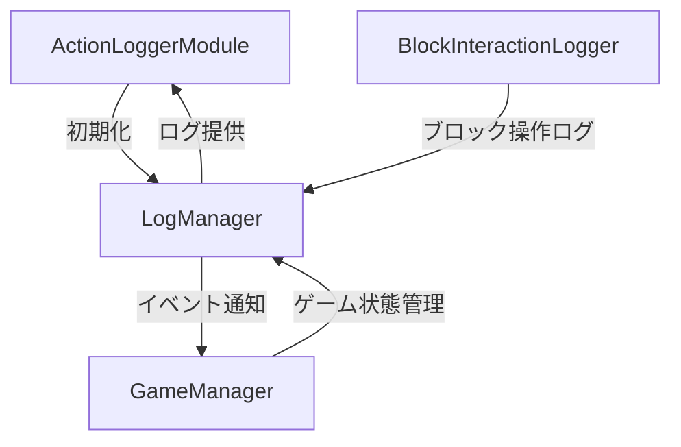
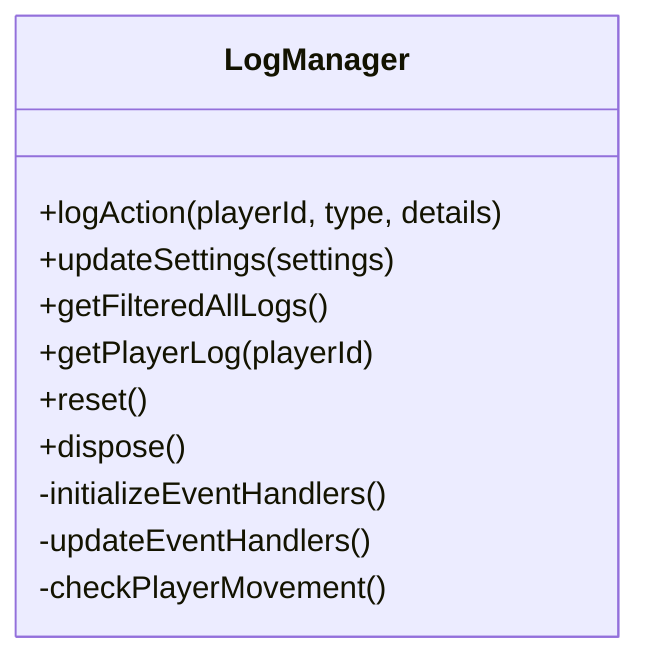
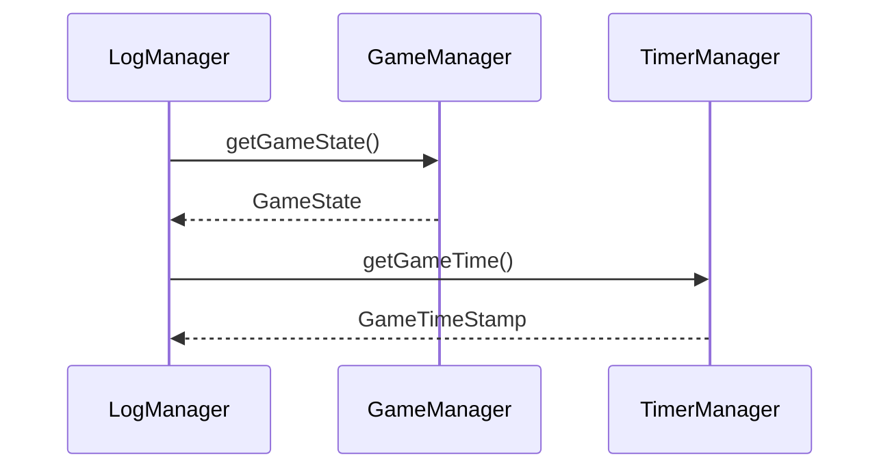

# LogManager.ts 詳細設計書

## 1. クラスの責務と概要

### 1.1 基本的な責務
- ILoggerManagerインターフェースの実装
- プレイヤーのアクションログの収集と管理
- ゲーム内イベントの監視とログ記録
- ログのフィルタリングと出力制御

### 1.2 ActionLoggerModuleとの統合方法


### 1.3 他のマネージャーとの連携方針
- GameManagerと連携したゲーム状態に応じたログ制御
- BlockInteractionLoggerとの連携による詳細なブロック操作ログの記録
- TimerManagerとの連携によるゲーム時間の記録

## 2. クラス構造

### 2.1 プロパティ定義
```typescript
class LogManager {
    // 設定関連
    private settings: LogSettings;
    private compositeFilter: CompositeLogFilter;
    
    // データストレージ
    private logs: Map<string, PlayerLog>;
    private lastJumpTime: Map<string, number>;
    private lastPositions: Map<string, Vector3>;
    
    // システム制御
    private movementCheckRunId: number | undefined;
    private handlerState: HandlerState;
    private subscriptions: SubscriptionMap;
}
```

### 2.2 定数定義
```typescript
private readonly DEFAULT_MOVEMENT_CHECK_INTERVAL = 2;
private readonly MIN_MOVEMENT_DISTANCE = 1.0;
private readonly MIN_JUMP_HEIGHT = 0.5;
private readonly JUMP_COOLDOWN = 500;
```

### 2.3 主要メソッド構成


## 3. ログ管理システムの実装詳細

### 3.1 ログレベルの実装
- INFO: 一般的な情報ログ
- ACTIVITY: プレイヤーの基本的な活動
- WARNING: 警告レベルのイベント
- ERROR: エラー発生時のログ
- DEBUG: 開発時のデバッグ情報

### 3.2 ログのフィルタリング機能
```typescript
interface LogFilter {
    actionType?: ActionType;
    minLevel?: LogLevel;
    custom?: (action: PlayerAction) => boolean;
}
```

### 3.3 パフォーマンス最適化施策
1. イベントハンドラの動的制御
   - フィルター設定に基づく必要なハンドラのみの有効化
   - 不要なハンドラの自動解除

2. 移動チェックの最適化
   - 設定可能なチェック間隔
   - 最小移動距離によるフィルタリング
   - ジャンプ検出のクールダウン制御

## 4. 他のマネージャーとの連携

### 4.1 GameManagerとの連携


### 4.2 BlockInteractionLoggerとの連携
1. ブロック操作イベントの委譲
2. 詳細なインタラクション情報の記録
3. フォールバック機能の実装

## 5. 実装上の注意点

### 5.1 エラーハンドリング
- 各イベントハンドラでのtry-catch実装
- エラーログの適切な記録
- システムの安定性確保

### 5.2 メモリ管理
- ログデータの定期的なクリーンアップ
- Map オブジェクトの適切な管理
- 未使用リソースの解放

### 5.3 スレッド安全性
- 非同期処理での競合状態の防止
- イベントハンドラの適切な登録解除
- 共有リソースへの安全なアクセス

## 6. テスト方針

### 6.1 ユニットテスト項目
1. ログ記録機能
   - 各アクションタイプの正常記録
   - 異常値のハンドリング
   - フィルタリング動作

2. イベント処理
   - 移動検知の正確性
   - 攻撃イベントの処理
   - インタラクションの記録

### 6.2 統合テスト項目
1. 他のマネージャーとの連携
   - GameManagerとの状態同期
   - TimerManagerとの時間同期
   - BlockInteractionLoggerとの連携

2. パフォーマンステスト
   - 大量ログ処理時の応答性
   - メモリ使用量の監視
   - イベントハンドラの負荷テスト