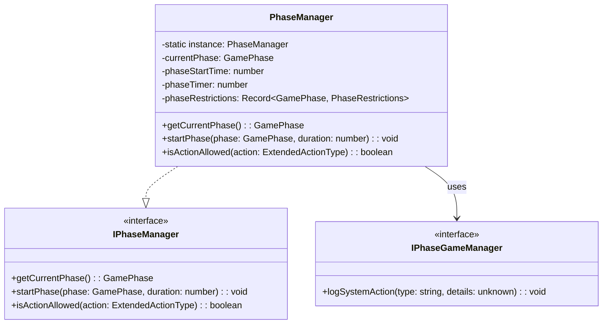
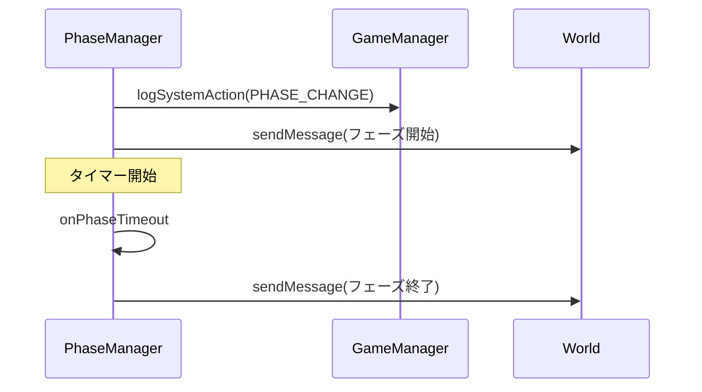
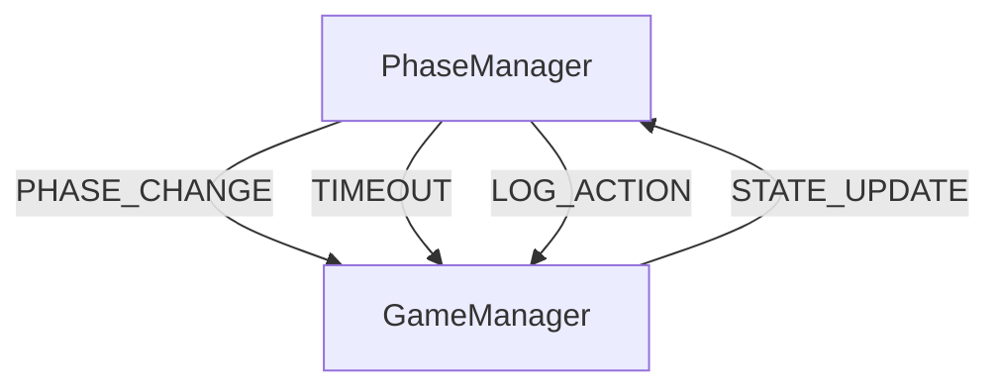

# PhaseManager クラス詳細設計書

## 1. クラスの責務と概要

PhaseManagerクラスは、マーダーミステリーゲームのフェーズ管理を担当する中核コンポーネントです。以下の主要な責務を持ちます：

- ゲームフェーズの状態管理と遷移制御
- フェーズごとの制限事項の管理
- タイマー管理とフェーズ自動遷移
- プレイヤー権限の制御
- GameManagerとの連携によるイベント管理

### 1.1 インターフェースの実装方針



### 1.2 フェーズ管理の方針

- イミュータブルなフェーズ状態管理
- タイムアウトによる自動フェーズ遷移
- フェーズごとの制限事項の厳格な管理
- イベントベースのフェーズ変更通知

### 1.3 GameManagerとの連携方針

- 疎結合な設計によるテスト容易性の確保
- IPhaseGameManagerインターフェースを介した最小限の依存関係
- イベントベースの状態同期
- ロギングによる状態変更の追跡

## 2. クラス構造

### 2.1 フェーズの状態管理プロパティ

```typescript
interface PhaseRestrictions {
    allowedActions: ExtendedActionType[];
    allowedAreas?: { x: number; y: number; z: number; radius: number }[];
    canVote: boolean;
    canCollectEvidence: boolean;
    canChat: boolean;
}

private static instance: PhaseManager | null;
private currentPhase: GamePhase;
private phaseStartTime: number;
private phaseTimer: number | undefined;
private readonly phaseRestrictions: Record<GamePhase, PhaseRestrictions>;
```

| プロパティ名 | 型 | 目的 |
|------------|-----|------|
| instance | static PhaseManager | シングルトンインスタンスの保持 |
| currentPhase | GamePhase | 現在のフェーズ状態 |
| phaseStartTime | number | フェーズ開始時のtick |
| phaseTimer | number | フェーズタイマーのID |
| phaseRestrictions | Record | フェーズごとの制限定義 |

### 2.2 フェーズ遷移メソッド

```typescript
public startPhase(phase: GamePhase, duration: number): void
private onPhaseTimeout(): void
```

- フェーズ遷移時の厳格な検証
- タイマーの適切な管理
- イベント発行によるシステム全体への通知
- エラー状態のグレースフルハンドリング

### 2.3 イベントハンドラ



### 2.4 プライベートヘルパーメソッド

- validatePhaseTransition: フェーズ遷移の検証
- cleanupPhaseResources: リソースのクリーンアップ
- notifyPhaseChange: フェーズ変更通知

## 3. フェーズ管理の実装詳細

### 3.1 フェーズ遷移のバリデーション

```typescript
private validatePhaseTransition(newPhase: GamePhase): boolean {
    // フェーズ遷移の検証ロジック
    return true;
}
```

### 3.2 タイマー管理

```typescript
private handlePhaseTimer(duration: number): void {
    if (this.phaseTimer !== undefined) {
        system.clearRun(this.phaseTimer);
    }
    this.phaseTimer = system.runTimeout(() => {
        this.onPhaseTimeout();
    }, duration * 20);
}
```

### 3.3 プレイヤー権限の制御

- アクション許可の判定
- エリアアクセスの制限
- コミュニケーション制御

### 3.4 イベント発行の仕組み

1. フェーズ変更イベント
2. タイムアウトイベント
3. 制限変更イベント

## 4. GameManagerとの連携

### 4.1 状態同期の方法



### 4.2 イベントの発行と購読

| イベント名 | 発行タイミング | 購読者 |
|-----------|--------------|--------|
| PHASE_CHANGE | フェーズ遷移時 | GameManager |
| PHASE_TIMEOUT | タイムアウト時 | GameManager |
| ACTION_RESTRICTED | アクション制限時 | GameManager |

### 4.3 依存性の解決方法

- コンストラクタインジェクション
- インターフェースベースの疎結合
- Null Objectパターンの活用

## 5. 実装上の注意点

### 5.1 競合状態の防止

```typescript
private synchronizedPhaseUpdate(operation: () => void): void {
    // クリティカルセクションの保護
    try {
        operation();
    } catch (error) {
        this.handleError(error);
    }
}
```

### 5.2 エラーハンドリング

```typescript
class PhaseManagerError extends Error {
    constructor(message: string, public code: ErrorCode) {
        super(message);
    }
}
```

### 5.3 パフォーマンス最適化

1. 状態更新の最適化
2. メモリ使用量の制御
3. イベント発行の効率化

### 5.4 メモリリーク防止

- タイマーの適切な解放
- イベントリスナーの解除
- 循環参照の防止

## 6. テスト方針

### 6.1 フェーズ遷移のテスト

```typescript
describe('PhaseManager - Phase Transitions', () => {
    let phaseManager: PhaseManager;
    
    beforeEach(() => {
        phaseManager = PhaseManager.create(mockGameManager);
    });

    it('should handle phase transitions correctly', () => {
        // フェーズ遷移のテスト
    });
});
```

### 6.2 タイマーのテスト

```typescript
describe('PhaseManager - Timer Management', () => {
    it('should handle timeouts correctly', async () => {
        // タイマー動作のテスト
    });
});
```

### 6.3 イベントハンドリングのテスト

- フェーズ変更イベントのテスト
- タイムアウト処理のテスト
- エラーケースのテスト

### 6.4 エラーケースのテスト

1. 無効なフェーズ遷移
2. タイマーの異常動作
3. 同時実行時の競合

## 7. 改善と拡張性

### 7.1 今後の改善点

1. フェーズ遷移ルールの外部設定化
2. パフォーマンスモニタリングの追加
3. より詳細なエラーレポーティング

### 7.2 拡張性の確保

- プラグイン機構の検討
- カスタムフェーズの追加容易性
- 設定のカスタマイズ性