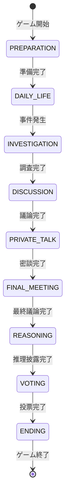

# マーダーミステリーゲーム プレイガイド

## 1. はじめに

マーダーミステリーゲームへようこそ！このゲームは中世ファンタジーの世界を舞台に、プレイヤーたちが殺人事件の謎を解き明かすマルチプレイヤー推理ゲームです。

### 基本情報
- プレイヤー数：4-20人
- 所要時間：約75分
- ゲームの目的：探偵・一般市民チームは真犯人を特定し、殺人者チームは罪を逃れることを目指します。

### チュートリアルシステム
ゲーム開始時に表示される対話型UIフォームによるチュートリアルで、5つのセクションに分けて詳細な説明を提供します：

1. **基本情報**
   - ゲームの概要
   - プレイヤー数と所要時間
   - チームの目的

2. **役職説明**
   - 探偵の能力と役割
   - 殺人者の特殊能力
   - 共犯者のサポート機能
   - 一般市民の職業記録

3. **ゲームの流れ**
   - 各フェーズの詳細な説明
   - 制限時間と目的
   - プレイヤーの行動指針

4. **操作方法**
   - 基本キー操作
   - システム制限の説明
   - 証拠収集の制限事項

5. **勝利条件**
   - 各チームの勝利条件
   - 共通の注意点
   - 基本戦略のヒント

### チュートリアル進行システム
- 「次へ」「前へ」ボタンで自由に移動可能
- 各ページは必要な時間だけ表示可能
- 初回は全ページの確認が必要
- 2回目以降はスキップオプションあり
- ページごとの詳細な説明と図解
- エラー時の回復システム搭載

## 2. 役職と特殊能力

### 探偵
- 事件の主要な調査者として活動
- **特殊能力**：
  - 詳細な現場検証が可能
  - 証拠の分析力が高い
  - 特殊な調査道具の使用が可能

### 殺人者
- 事件を引き起こす役職
- **特殊能力**：
  - 殺害方法の選択
  - 偽装工作
  - 証拠の隠蔽

### 共犯者
- 殺人者をサポートする役職
- **特殊能力**：
  - 殺人者のアリバイ作成
  - 証拠の改ざん
  - 情報かく乱

### 一般市民
- それぞれ固有の職業を持つ
- **職業別の特殊記録**：
  - 農家：作物の成長記録
  - 門番：出入りの記録
  - 商人：取引記録
  - 王/姫：執務記録
  - 看守：監視記録
  - 神父：告解記録
  - 宿屋の店主：宿泊記録
  - 村人：日常活動記録
  - 罪人：特殊記録なし

## 3. ゲームの進行

### ゲーム開始の手順

1. **プレイヤー人数の確認**
   - 最小プレイヤー数：4人
   - 最大プレイヤー数：20人
   - 推奨プレイヤー数：8-12人

2. **チュートリアルの確認**
   - 自動表示される3ページのチュートリアルを確認
   - 各ページは自動で切り替わり（約2秒）
   - 任意のアクションで次のページに進むことも可能

3. **ゲーム開始の準備**
   - 全プレイヤーがワールドに接続していることを確認
   - アドオンが正しく有効化されているか確認
   - 必要に応じて役職の割り当てを確認

### フェーズの流れ

### 自動フェーズ遷移システム

- 各フェーズは設定された制限時間が経過すると自動的に次のフェーズへ移行
- フェーズ遷移時には1秒のインターバルを挟む
- システムメッセージでフェーズの変更が通知される
- プログレスバーで現在の進行状況を確認可能

### フェーズタイマーシステム

#### タイマー表示
- 画面上部にプログレスバーと時間を表示
- 時間表示：分:秒形式（例: 5:00）
- フェーズ名：日本語表示（例: [準備フェーズ]）
  * 準備、日常生活、調査、会議、密談
  * 最終会議、推理披露、投票、エンディング
- プログレスバー表示：
  * 20ブロックで進行状況を視覚化
  * 緑色（▮）で残り時間を表示
  * 灰色（▯）で経過時間を表示
  * 5秒ごとに自動更新

#### 警告システム
- 残り30秒で警告表示開始
  - 点滅効果付きの警告メッセージ
  - フレーム付きの強調表示
  - 黄色での警告表示
- 残り10秒で表示が変化
  - 赤色表示に切り替え
  - より頻繁な点滅効果
- システムメッセージによる通知
  - 残り時間の定期的な通知
  - フェーズ終了の通知

### 各フェーズの詳細と制限時間

1. **準備フェーズ** (300秒/5分)
   - 役職の確認
   - 初期位置への移動
   - ルールの確認
   - プログレスバーで進行状況を把握

2. **日常生活フェーズ** (600秒/10分)
   - 日常的なタスクの実行
   - 他プレイヤーとの交流
   - 情報収集
   - タイマーで残り時間を確認

3. **調査フェーズ** (480秒/8分)
   - 現場の調査
   - 証拠の収集
   - 目撃者への聞き込み
   - アリバイの確認
   - プログレスバーで時間管理

4. **会議フェーズ** (420秒/7分)
   - 収集した情報の共有
   - 容疑者についての議論
   - 証拠の提示と検討
   - 警告システムで時間を把握

5. **密談フェーズ** (300秒/5分)
   - 少人数での情報交換
   - 非公開の推理共有
   - 戦略の相談
   - タイマーで時間を管理

6. **最終会議フェーズ** (420秒/7分)
   - 最終的な情報の共有
   - 決定的な証拠の提示
   - 最後の議論
   - プログレスバーで残り時間を確認

7. **推理披露フェーズ** (300秒/5分)
   - 各プレイヤーの推理発表
   - 証拠チェーンの提示
   - 最終的な疑惑の提示
   - 警告システムで時間を把握

8. **投票フェーズ** (180秒/3分)
   - 犯人だと思うプレイヤーへの投票
   - 点滅する警告表示で時間を認識
   - 結果発表

9. **エンディングフェーズ** (300秒/5分)
   - 結果の確認
   - 真相の解明
   - 勝敗の決定

### フェーズ自動遷移システム

- 各フェーズは制限時間経過後、自動的に次のフェーズへ移行
- 1秒のインターバルを挟んで次フェーズを開始
- システムメッセージでフェーズ変更を通知
- プログレスバーで進行状況を視覚的に確認可能

## 4. 証拠システム

### 証拠の種類

1. **物理的証拠**
   - アイテムとして収集可能
   - インベントリに保存
   - 状態が変化する可能性あり
   - 信頼性評価：70-100%（検証済みの場合さらに上昇）

2. **証言証拠**
   - NPCやプレイヤーからの情報
   - 目撃情報
   - 行動履歴
   - 信頼性評価：50-80%（役職により変動）

3. **役職特殊証拠**
   - 各役職固有の記録
   - 特定の役職のみアクセス可能
   - 信頼性評価：80-100%

### 証拠分析システム
- **信頼性評価要素**
  - 時間的近接性（20%）
  - 証人の信頼性（25%）
  - 物的証拠の品質（30%）
  - 他の証拠との整合性（15%）
  - 専門性（10%）

- **関連性分析機能**
  - 証拠チェーンの構築
  - 矛盾点の自動検出
  - 時空間的関連性の評価
  - 役職による重要度評価

- **高度分析機能**
  - 証拠群の一貫性検証
  - 時系列での整合性チェック
  - 証拠間の相互関係分析
  - 重要度スコアリング

### 証拠の収集方法
- 特定のブロックやアイテムとの対話
- NPCとの会話
- 他プレイヤーからの情報収集
- 役職固有の記録システムの活用

## 5. 勝利条件

### 探偵・市民チームの勝利条件
- 正しい犯人を特定し、投票で過半数の支持を得る
- 不正な証拠改ざんを発見する

### 殺人者チームの勝利条件
- 無実の人物が犯人として処罰される
- 投票で犯人を特定できない場合

## 6. ヒントとコツ

### 探偵・市民チーム向け
- 早期からできるだけ多くの情報を収集する
- 他プレイヤーのアリバイを細かくチェック
- 証拠は発見時刻と場所を必ずメモ
- 不自然な行動をするプレイヤーに注目

### 殺人者チーム向け
- 完璧なアリバイを準備
- 市民としての日常タスクもしっかり実行
- 証拠隠蔽は慎重に
- 議論では積極的に無実のプレイヤーを疑う

### 共通の注意点
- 時間管理を意識する
- 重要な証拠は写真やメモで記録
- 他プレイヤーの発言をよく聞く
- 直感だけでなく証拠に基づいて判断

## 7. トラブルシューティング

### 一般的な問題

1. **チュートリアル関連の問題**
   - チュートリアルUIが表示されない：
     * UIシステムの再読み込みを実行
     * @minecraft/server-ui モジュールの動作確認
     * ゲームを再起動して再試行
   - 進行できない/ボタンが反応しない：
     * UI表示を一度閉じて再表示
     * 別のフォームが開いていないか確認
     * 操作権限の確認
   - チュートリアルがスキップできない：
     * 初回は必ずすべてのページを確認する必要あり
     * スキップ機能は2回目以降のみ有効
     * エラー時は確認ダイアログで継続可能
   - 進行状態が保存されない：
     * プレイヤーIDの確認
     * セッション状態の確認
     * 必要に応じてチュートリアルを再実行

2. **ゲーム開始の問題**
   - プレイヤー数が不足：
     * 最小4人以上必要
     * 最大20人まで参加可能
   - アドオンの問題：
     * 正しく有効化されているか確認
     * 必要に応じて再インストール
   - 接続の問題：
     * 全員の接続状態を確認
     * ワールドの再読み込みを試す

3. **役職関連の問題**
   - 役職未割り当て：
     * 一度退出して再参加
     * ゲームリセットを試す
     * OP権限での手動割り当て

4. **タイマー表示の問題**
   - プログレスバーが表示されない：
     * チャット設定を確認
     * ゲームを再起動
     * F5キーで視点切り替えを試す
   - 警告が表示されない：
     * チャットの表示設定を確認
     * サウンド設定を確認
     * システムメッセージの有効化を確認
   - タイマーの同期ズレ：
     * ネットワーク接続を確認
     * ゲームの再接続を試す
     * サーバーとの時刻同期を確認

5. **フェーズ遷移の問題**
   - 自動遷移しない：
     * タイマーの動作を確認
     * サーバーの応答性を確認
     * 必要に応じてゲームをリセット
   - 不適切なタイミングでの遷移：
     * フェーズの順序を確認
     * タイマーの設定を確認
     * サーバーログを確認
   - フェーズが重複する：
     * ゲームを一度終了して再開
     * プレイヤーの再接続を試す
     * サーバー側の状態をリセット

6. **証拠収集の問題**
   - 現在のフェーズで証拠収集が許可されているか確認
   - インベントリに空きスロットがあるか確認
   - 証拠との正しい対話方法を確認
   - 証拠の収集制限に達していないか確認

7. **チャット関連の問題**
   - チャットメッセージが表示されない：
     * チャット設定を確認
     * ゲームを再起動
     * 通信状態を確認
   - 特定のフェーズでチャットができない：
     * 現在の役職とフェーズの制限を確認
     * チャット権限の設定を確認
     * システム状態の確認

8. **投票システムの問題**
   - 投票ができない：
     * 投票フェーズであることを確認
     * 既に投票済みでないか確認
     * UI表示の問題の場合はF5キーで視点を切り替え
   - 投票結果が表示されない：
     * システムメッセージの設定を確認
     * ゲームの進行状態を確認
     * サーバーとの同期を確認

### エラーメッセージ対応
- "Invalid phase transition": フェーズ移行の順序が正しくない
- "Evidence not found": 証拠IDが無効または削除済み
- "Action not allowed": 現在のフェーズで許可されていないアクション
- "Player not found": プレイヤーデータにアクセスできない
- "Vote already cast": 既に投票済み

### その他の注意点
- ラグが発生する場合は描画距離を下げる
- メモリ使用量が高い場合はワールドを再読み込み
- クラッシュした場合は動作ログを確認

## 8. UIとコントロール

### UI表示
- **アクションUI**: @minecraft/server-ui を使用した対話型フォーム
  - MessageFormData: 情報表示と選択
  - ActionFormData: 複数選択肢の提示
  - チュートリアル表示
  - 証拠収集
  - NPC対話
  - 証拠分析
  - 投票
  - エラー表示とリカバリー
- **チャットUI**: 標準チャットウィンドウ
  - プレイヤー間メッセージ
  - システム通知
  - フェーズ変更通知
- **アクションバー**: 画面下部にプレイヤー状態表示

### 基本コントロール
- **インベントリ操作**：
  - E：インベントリ開閉
  - 1-9：ホットバースロット選択
  - 左クリック：アイテム使用/選択
  - 右クリック：アクション実行

### システム制限
- **UI制限**：
  - Minecraft統合版のUI制約に準拠
  - カスタムUIは限定的な範囲でのみ使用可能
- **チャット制限**：
  - 調査フェーズ中は特定の役職間のみ会話可能
  - 探偵は常時全員と会話可能
- **証拠共有制限**：
  - 探偵以外は議論フェーズと最終議論フェーズのみ共有可能
  - 一度に共有できる証拠数に制限あり

## 9. コミュニケーションシステム

### チャット機能
- Minecraftの標準チャット機能を使用
- 全プレイヤーに表示される通常チャット
- システムからの通知メッセージ:
  * フェーズ変更通知
  * ゲームイベントの通知
  * 証拠発見の通知
  * 投票結果の通知

### 使用方法
- Tキーでチャットを開く
- メッセージを入力して送信
- システム通知は自動的に表示

## 10. システム制限と注意事項

### 技術的制限
- **プレイヤー数の制限**：
  - 最小プレイヤー数：4人
  - 最大プレイヤー数：20人
  - 推奨プレイヤー数：8-12人
- **証拠システムの制限**：
  - 一人あたりの最大収集可能証拠数：30個
  - 同時分析可能な証拠数：5個まで
  - 証拠の保持期限：フェーズ終了まで

### パフォーマンスに関する注意事項
- 多数のプレイヤーが同一エリアに集中すると処理負荷が上昇
- 証拠分析時は一時的にゲーム処理が遅くなる可能性あり
- 大量の証拠を同時に分析すると応答時間が長くなる
- チャットログは定期的にクリアされる（3000行超過時）

### プラットフォーム固有の制限事項
- **Minecraft要件**：
  - バージョン1.20.0以上が必要
  - 推奨メモリ：4GB以上
  - ストレージ空き容量：500MB以上
- **マルチプレイ制限**：
  - 全プレイヤーが同一バージョンである必要あり
  - クロスプラットフォームプレイ非対応
  - ホストの通信帯域により最大プレイヤー数が制限される可能性あり
- **デバイス制限**：
  - モバイルデバイスでは一部機能が制限される
  - タッチスクリーンでの操作は最適化されていない

## 11. 将来の拡張可能性

### 新規役職追加の可能性
- **拡張可能な役職システム**：
  - 新規役職の追加が可能な設計
  - 各役職に固有の特殊能力を実装可能
  - 役職間バランスの維持が必要
- **実装上の制限**：
  - 1ゲームでの最大役職種類：10種類
  - 各役職の特殊能力は最大3つまで
  - 新規役職はゲームバランスの検証が必要

### マップ拡張の可能性
- **新規マップ対応**：
  - カスタムマップの追加が可能
  - マップサイズは256x256ブロックまで
  - 最大8つの重要地点を設定可能
- **制限事項**：
  - マップ内の最大建造物数：50
  - 同時読み込み可能なエリア：半径128ブロック
  - カスタム建造物の最大高さ：64ブロック

### カスタムルールの追加可能性
- **カスタマイズ可能な要素**：
  - フェーズの時間設定
  - 役職の能力バランス
  - 証拠システムの信頼性評価基準
  - 勝利条件の調整
- **制限事項**：
  - ゲームの基本構造は変更不可
  - フェーズの順序は固定
  - 一部の重要な役職は削除不可

## 12. ロールと特殊能力ガイド

### 探偵の能力
- **証拠調査能力**:
  - 証拠の詳細な分析が可能
  - クールダウン: 30秒
  - フェーズ制限: なし
  - どのフェーズでも誰とでも会話可能
  - 常に証拠の共有が可能

### 殺人者の能力
- **証拠操作能力**:
  - 証拠の改ざんが可能
  - クールダウン: 60秒
  - 共犯者とのみ会話可能（調査フェーズ中）

### 共犯者の能力
- **プレイヤー干渉能力**:
  - 他プレイヤーとの相互作用
  - クールダウン: 45秒
  - 殺人者とのみ会話可能（調査フェーズ中）

### コミュニケーション制限
- **調査フェーズ中**:
  - 探偵: 誰とでも会話可能
  - 殺人者と共犯者: お互いのみ会話可能
  - その他: 会話不可
- **その他のフェーズ**:
  - 全員と会話可能

### 証拠共有システム
- **共有制限**:
  - 探偵: 常時共有可能
  - その他: 議論フェーズと最終議論フェーズのみ
- **前提条件**:
  - 自身が収集した証拠のみ共有可能
  - 証拠の信頼性は役職により変動

### 投票システム
- **投票ルール**:
  - 各プレイヤーは1回のみ投票可能
  - 投票フェーズ中のみ投票可能
  - 投票は変更不可
- **結果判定**:
  - 最多得票者が容疑者として処罰
  - 同数の場合は処罰なし