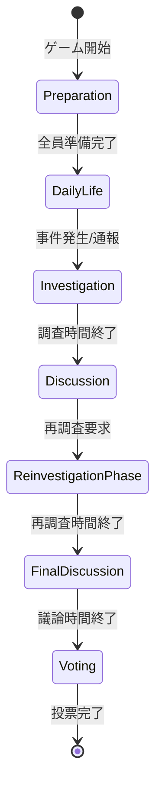

# マーダーミステリーゲーム プレイガイド

## 1. はじめに

マーダーミステリーゲームへようこそ！このゲームは中世ファンタジーの世界を舞台に、プレイヤーたちが殺人事件の謎を解き明かすマルチプレイヤー推理ゲームです。

### 基本情報
- プレイヤー数：4-20人
- 所要時間：約70-90分
- ゲームの目的：探偵・一般市民チームは真犯人を特定し、殺人者チームは罪を逃れることを目指します。

## 2. 役職と特殊能力

### 探偵
- 事件の主要な調査者として活動
- **特殊能力**：
  - 詳細な現場検証が可能
  - 証拠の分析力が高い
  - 特殊な調査道具の使用が可能

### 殺人者
- 事件を引き起こす役職
- **特殊能力**：
  - 殺害方法の選択
  - 偽装工作
  - 証拠の隠蔽

### 共犯者
- 殺人者をサポートする役職
- **特殊能力**：
  - 殺人者のアリバイ作成
  - 証拠の改ざん
  - 情報かく乱

### 一般市民
- それぞれ固有の職業を持つ
- **職業別の特殊記録**：
  - 農家：作物の成長記録
  - 門番：出入りの記録
  - 商人：取引記録
  - 王/姫：執務記録
  - 看守：監視記録
  - 神父：告解記録
  - 宿屋の店主：宿泊記録
  - 村人：日常活動記録
  - 罪人：特殊記録なし

## 3. ゲームの進行

### フェーズの流れ

```mermaid
stateDiagram-v2
    [*] --> Preparation: ゲーム開始
    Preparation --> DailyLife: 全員準備完了
    DailyLife --> Investigation: 事件発生/通報
    Investigation --> Discussion: 調査時間終了
    Discussion --> ReinvestigationPhase: 再調査要求
    ReinvestigationPhase --> FinalDiscussion: 再調査時間終了
    FinalDiscussion --> Voting: 議論時間終了
    Voting --> [*]: 投票完了
```

### 各フェーズの詳細

1. **準備フェーズ**（10分）
   - 役職の確認
   - 初期位置への移動
   - ルールの確認

2. **生活フェーズ**（最大3日）
   - 日常的なタスクの実行
   - 他プレイヤーとの交流
   - 情報収集

3. **調査フェーズ**（20分）
   - 現場の調査
   - 証拠の収集
   - 目撃者への聞き込み
   - アリバイの確認

4. **会議フェーズ**（15分）
   - 収集した情報の共有
   - 容疑者についての議論
   - 証拠の提示と検討

5. **再調査フェーズ**（15分）
   - 新たな証拠の収集
   - 不明点の確認
   - アリバイの再検証

6. **最終会議フェーズ**（10分）
   - 最終的な情報の共有
   - 決定的な証拠の提示
   - 最後の議論

7. **投票フェーズ**
   - 犯人だと思うプレイヤーへの投票
   - 結果発表

## 4. 証拠システム

### 証拠の種類

1. **物理的証拠**
   - アイテムとして収集可能
   - インベントリに保存
   - 状態が変化する可能性あり

2. **証言証拠**
   - NPCやプレイヤーからの情報
   - 目撃情報
   - 行動履歴

3. **役職特殊証拠**
   - 各役職固有の記録
   - 特定の役職のみアクセス可能
   - 高い信頼性

### 証拠の収集方法
- 特定のブロックやアイテムとの対話
- NPCとの会話
- 他プレイヤーからの情報収集
- 役職固有の記録システムの活用

## 5. 勝利条件

### 探偵・市民チームの勝利条件
- 正しい犯人を特定し、投票で過半数の支持を得る
- 不正な証拠改ざんを発見する

### 殺人者チームの勝利条件
- 無実の人物が犯人として処罰される
- 投票で犯人を特定できない場合

## 6. ヒントとコツ

### 探偵・市民チーム向け
- 早期からできるだけ多くの情報を収集する
- 他プレイヤーのアリバイを細かくチェック
- 証拠は発見時刻と場所を必ずメモ
- 不自然な行動をするプレイヤーに注目

### 殺人者チーム向け
- 完璧なアリバイを準備
- 市民としての日常タスクもしっかり実行
- 証拠隠蔽は慎重に
- 議論では積極的に無実のプレイヤーを疑う

### 共通の注意点
- 時間管理を意識する
- 重要な証拠は写真やメモで記録
- 他プレイヤーの発言をよく聞く
- 直感だけでなく証拠に基づいて判断

## 7. ゲームの開始方法

### ゲームの開始準備
1. Minecraftを起動し、ワールドに参加
2. マーダーミステリーアドオンが有効化されていることを確認
3. 最小プレイヤー数（4人）が集まっていることを確認

### ゲームの開始手順
1. minecraft:clockアイテム（時計）を使用してゲームを開始
   - 誰でも開始可能（OP権限不要）
   - 自動的にゲームセッションが作成される

### ゲームフェーズの進行
1. **準備フェーズ**（10分）
   - 役職が自動的に割り当てられる
     * 探偵：1人（固定）
     * 殺人者：1人（固定）
     * 共犯者：1人（固定）
     * 残りのプレイヤー：一般市民
   - 各プレイヤーは役職をチャット通知で確認

2. **生活フェーズ**
   - 通常の活動が可能
   - 殺人者が殺人を実行するまで継続

3. **調査フェーズ**（20分）
   - 殺人発生後に自動開始
   - 証拠収集と調査活動

4. **議論フェーズ**（15分）
   - 全体での情報共有と討論
   - 証拠の提示と検証

5. **再調査フェーズ**（15分）
   - 追加の証拠収集
   - 新たな疑問点の確認

6. **最終議論フェーズ**（10分）
   - 最後の情報共有
   - 結論に向けた討論

7. **投票フェーズ**（5分）
   - 犯人だと思うプレイヤーへの投票
   - 過半数の票を集めたプレイヤーが処刑

### タイムリミット
各フェーズには固定の制限時間が設定されており、自動的に次のフェーズに移行します。

## 8. UIとコントロール

### 画面レイアウト
- 上部：ゲーム進行状況バー
- 左下：インベントリショートカット
- 右下：アクションボタン
- 中央下：チャットウィンドウ

### 主要なボタン
- E：インベントリ開閉
- Q：アイテムドロップ
- F：調査モード切替
- T：チャット開始
- Tab：プレイヤーリスト

### ショートカットキー
- 1-9：インベントリスロット選択
- F5：視点切替
- Shift：スニーク（証拠収集モード）
- Ctrl：特殊アクション実行

### インベントリの使用
- 左クリック：アイテム選択/使用
- 右クリック：アイテム詳細確認
- ドラッグ＆ドロップ：アイテム移動
- Shift+クリック：即時移動

## 9. コミュニケーションシステム

### チャット機能
- Minecraftの標準チャット機能を使用
- 全プレイヤーに表示される通常チャット
- システムからの通知メッセージ:
  * フェーズ変更通知
  * ゲームイベントの通知
  * 証拠発見の通知
  * 投票結果の通知

### 使用方法
- Tキーでチャットを開く
- メッセージを入力して送信
- システム通知は自動的に表示