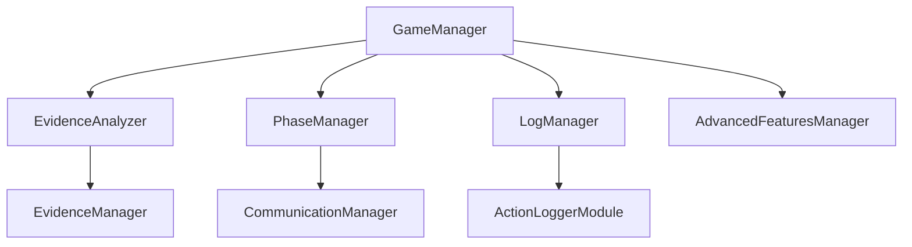

# マーダーミステリーゲーム システムアーキテクチャ設計書

## 1. システム概要

本システムは、Minecraft上で動作するマーダーミステリーゲームのアドオンとして実装されています。プレイヤー間の相互作用、証拠収集、分析、推理を通じて犯人を特定することを目的としています。

### 1.1 主要機能

- プレイヤーロール管理（探偵、殺人者、共犯者など）
- 証拠システム（物理的証拠、証言の収集と分析）
- ゲームフェーズ管理（準備、調査、議論、投票など）
- アクションログ記録
- 証拠分析と信頼性評価

## 2. アーキテクチャ概要

システムは以下のアーキテクチャパターンに基づいて設計されています：

### 2.1 アーキテクチャスタイル

- **マネージャーベースアーキテクチャ**
  - 各機能領域を独立したマネージャークラスとして実装
  - 疎結合な設計で拡張性と保守性を確保
  - インターフェースを通じた明確な責務の分離

### 2.2 設計原則

- **SOLID原則の適用**
  - 単一責任の原則：各マネージャーは明確に定義された責務を持つ
  - インターフェース分離：ILoggerManager, IEvidenceAnalyzerなど
  - 依存関係逆転：具象クラスではなくインターフェースに依存

### 2.3 パターン

- **シングルトン**：GameManagerの一元管理
- **オブザーバー**：ゲームイベントの監視と通知
- **ストラテジー**：証拠分析アルゴリズムの切り替え
- **ファクトリー**：証拠オブジェクトの生成管理

## 3. コンポーネント構成

### 3.1 コアコンポーネント

1. **GameManager**
   - ゲーム全体の状態管理
   - プレイヤーロールの管理
   - フェーズ制御
   ```mermaid
   classDiagram
     class GameManager {
       -gameState: GameState
       -config: GameConfig
       +getInstance()
       +getGameState()
       +logAction()
     }
     GameManager --|> IPhaseGameManager
     GameManager --|> ILoggerManager
   ```

2. **EvidenceAnalyzer**
   - 証拠の信頼性評価
   - 証拠間の関連性分析
   - 証拠チェーンの構築
   ```mermaid
   classDiagram
     class EvidenceAnalyzer {
       -analyses: Map
       -relations: Map
       +analyzeEvidence()
       +evaluateReliability()
       +findRelatedEvidence()
     }
     EvidenceAnalyzer --|> IEvidenceAnalyzer
   ```

3. **PhaseManager**
   - ゲームフェーズの制御
   - タイミング管理
   - フェーズ遷移ロジック

4. **LogManager**
   - アクションログの記録
   - ログフィルタリング
   - エクスポート機能

### 3.2 補助コンポーネント

1. **CommunicationManager**
   - プレイヤー間のコミュニケーション管理
   - メッセージング系統

2. **AdvancedFeaturesManager**
   - 拡張機能の管理
   - 追加コンテンツの制御

## 4. 依存関係図



## 5. 主要インターフェース

### 5.1 ILoggerManager
```typescript
interface ILoggerManager {
  logAction(data: {
    type: string;
    playerId: string;
    details: unknown;
  }): Promise<void>;
}
```

### 5.2 IEvidenceAnalyzer
```typescript
interface IEvidenceAnalyzer {
  analyzeEvidence(evidence: Evidence): Promise<number>;
  evaluateReliability(evidence: Evidence): Promise<number>;
  findRelatedEvidence(evidenceId: string): Evidence[];
}
```

### 5.3 IPhaseManager
```typescript
interface IPhaseManager {
  getCurrentPhase(): GamePhase;
  transitionToPhase(phase: GamePhase): Promise<void>;
  isPhaseComplete(): boolean;
}
```

## 6. データフロー

### 6.1 証拠収集フロー
1. プレイヤーが証拠を発見
2. EvidenceManagerが証拠オブジェクトを生成
3. EvidenceAnalyzerが証拠を分析
4. GameManagerが証拠をゲーム状態に統合

### 6.2 アクションログフロー
1. ゲーム内アクションの発生
2. LogManagerがアクションをキャプチャ
3. フィルタリングとメタデータの追加
4. ストレージへの永続化

## 7. スケーラビリティと拡張性

### 7.1 拡張ポイント
- カスタム証拠タイプの追加
- 新しい分析アルゴリズムの実装
- フェーズカスタマイズ
- ログフィルターの拡張

### 7.2 設定による制御
- ゲーム設定の外部化
- プレイヤー数の柔軟な調整
- フェーズタイミングのカスタマイズ
- 証拠関連パラメータの調整

## 8. UIシステム

### 8.1 コンポーネント構成
```typescript
interface UIManager {
  showTutorial(player: Player): Promise<void>;
  showError(player: Player, message: string): Promise<void>;
  showConfirmation(player: Player, message: string): Promise<boolean>;
}
```

### 8.2 チュートリアルシステム
```typescript
interface TutorialPage {
  title: string;
  body: string[];  // 配列として管理し、join("\n")で結合
}

// シンプルな進行状態管理
const tutorialProgress = new Map<string, boolean>();

// チュートリアル表示関数
async function showTutorial(player: Player): Promise<void> {
  let currentPage = 0;
  
  // ページ遷移ループ
  while (currentPage < TUTORIAL_PAGES.length) {
    // ページ表示とナビゲーション
    const form = new MessageFormData()
      .title(page.title)
      .body(page.body)
      .button2("次へ")
      .button1("前へ");

    // キャンセル処理
    // 進行状態管理
    // エラーハンドリング
  }
  
  // 完了記録
  await gameManager.logSystemAction("TUTORIAL_COMPLETED", {
    playerId: player.id,
    timestamp: Date.now()
  });
}
```

### 8.3 UI状態管理
```typescript
// チュートリアルの進行状態
interface TutorialState {
  hasCompleted: boolean;      // チュートリアル完了状態
  currentPage: number;        // 現在のページ位置
  canSkip: boolean;          // スキップ可能かどうか
}

// フォーム管理
const FormTypes = {
  TUTORIAL: "tutorial",
  ERROR: "error",
  CONFIRM: "confirm",
  NAVIGATION: "navigation"
} as const;

// フォーム表示管理
interface FormManager {
  showTutorialPage(player: Player, page: TutorialPage): Promise<void>;
  showError(player: Player, error: Error): Promise<boolean>;
  showConfirmation(player: Player, message: string): Promise<boolean>;
}
```

### 8.4 エラーハンドリング
```typescript
// エラー処理フロー
async function handleTutorialError(error: Error, player: Player): Promise<void> {
  // エラーのログ記録
  await gameManager.logSystemAction("TUTORIAL_ERROR", {
    error: error.message
  });

  // プレイヤーへのエラー通知
  const errorForm = new MessageFormData()
    .title("エラー")
    .body(`エラーが発生しました。\n${error.message}\n\n続行しますか？`)
    .button2("続行")
    .button1("中止");

  const result = await errorForm.show(player);
  if (result.canceled || result.selection === 1) {
    throw new Error("ユーザーによるキャンセル");
  }
}

// エラーリカバリー
interface ErrorRecovery {
  retryCount: number;
  lastError: Error | null;
  canRecover: boolean;
}
```

### 8.5 実装の特徴
- 非同期処理の適切な処理
- エラー発生時の適切なフォールバック
- ユーザー操作の柔軟なハンドリング
- プログレス状態の永続化なし（セッションのみ）

## 9. 技術スタック

- **言語**: TypeScript
- **プラットフォーム**: Minecraft Bedrock Edition
- **フレームワーク**:
  - Minecraft Scripting API
  - @minecraft/server
  - @minecraft/server-ui
- **外部依存**:
  - ActionLoggerModule (サブモジュール)
  - UIコンポーネントライブラリ

## 10. 将来の拡張性

### 10.1 予定されている機能
- AIによる証拠分析の強化
- リアルタイムプレイヤーフィードバック
- 高度な証拠チェーン可視化
- カスタムシナリオエディタ
- チュートリアルのカスタマイズ機能
- マルチ言語対応

### 10.2 UI/UX改善計画
- アニメーション効果の追加
- カスタムフォントとスタイル
- インタラクティブなヘルプシステム
- プレイヤー進捗の視覚化
- モバイル向け最適化

### 10.3 技術的負債への対応
- パフォーマンス最適化
- コードカバレッジの向上
- ドキュメンテーションの充実
- テスト自動化の拡充
- UIコンポーネントのモジュール化
- エラーハンドリングの強化