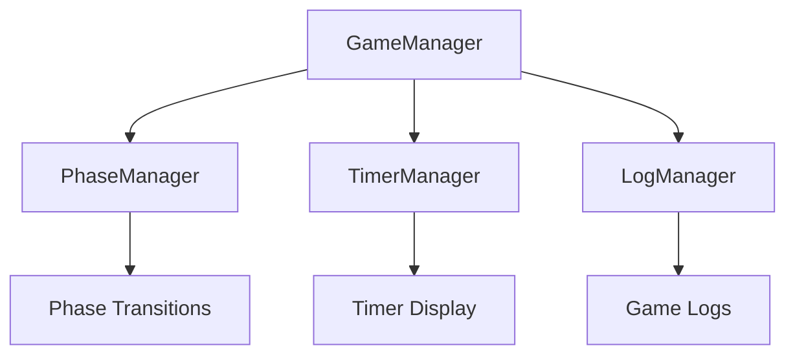
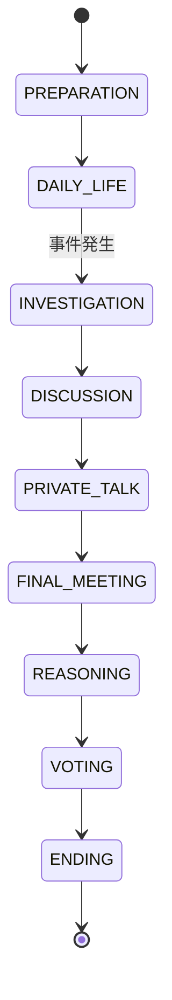
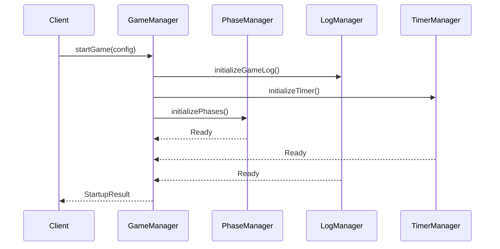

# フェーズ構造と開始処理の設計書

## 1. 概要

このドキュメントでは、マーダーミステリーゲームのフェーズ構造と開始処理の詳細設計について定義します。

### 1.1 設計の目的
- フェーズの明確な定義と遷移ルールの確立
- ゲーム開始処理の独立性確保
- タイマー表示の視認性と管理性の向上

### 1.2 アーキテクチャ図



## 2. フェーズ構造の詳細

### 2.1 フェーズ定義

```typescript
export enum GamePhase {
    PREPARATION = "preparation",       // 準備フェーズ
    DAILY_LIFE = "daily_life",        // 日常生活フェーズ
    INVESTIGATION = "investigation",   // 調査フェーズ
    DISCUSSION = "discussion",        // 会議フェーズ
    PRIVATE_TALK = "private_talk",    // 密談（再調査）フェーズ
    FINAL_MEETING = "final_meeting",  // 最終会議フェーズ
    REASONING = "reasoning",          // 推理披露フェーズ
    VOTING = "voting",               // 投票フェーズ
    ENDING = "ending"                // エンディングフェーズ
}
```

### 2.2 各フェーズの詳細仕様

#### 2.2.1 準備フェーズ (PREPARATION)
- 目的：ゲームの初期設定とプレイヤーの役割割り当て
- 機能：
  - プレイヤー情報の初期化
  - 役職の割り当て
  - 初期アイテムの配布
- 終了条件：全プレイヤーの準備完了

#### 2.2.2 日常生活フェーズ (DAILY_LIFE)
- 目的：通常の活動と事件発生の機会提供
- 機能：
  - 自由な移動とアイテム使用
  - プレイヤー間のコミュニケーション
  - 事件発生のトリガー管理
- 終了条件：事件発生または時間切れ

#### 2.2.3 調査フェーズ (INVESTIGATION)
- 目的：証拠収集と初期調査
- 機能：
  - 証拠の収集と記録
  - 現場検証機能
  - 証言の収集
- 終了条件：制限時間経過

#### 2.2.4 会議フェーズ (DISCUSSION)
- 目的：収集した情報の共有と議論
- 機能：
  - 全体会議の進行
  - 証拠の提示機能
  - 議論ログの記録
- 終了条件：制限時間経過

#### 2.2.5 密談フェーズ (PRIVATE_TALK)
- 目的：追加調査と個別の情報交換
- 機能：
  - 個別の会話機能
  - 追加証拠の収集
  - アリバイの確認
- 終了条件：制限時間経過

#### 2.2.6 最終会議フェーズ (FINAL_MEETING)
- 目的：最終的な情報共有と議論
- 機能：
  - 全体会議の進行
  - 最終証拠の提示
  - 結論に向けた議論
- 終了条件：制限時間経過

#### 2.2.7 推理披露フェーズ (REASONING)
- 目的：各プレイヤーの推理発表
- 機能：
  - 推理内容の入力
  - プレゼンテーション機能
  - 質疑応答の管理
- 終了条件：全プレイヤーの発表完了

#### 2.2.8 投票フェーズ (VOTING)
- 目的：犯人の特定と投票
- 機能：
  - 投票システム
  - 集計機能
  - 結果の集計と表示
- 終了条件：全プレイヤーの投票完了

#### 2.2.9 エンディングフェーズ (ENDING)
- 目的：ゲーム結果の表示と振り返り
- 機能：
  - 結果発表
  - スコア計算
  - プレイログの表示
- 終了条件：結果確認の完了

### 2.3 フェーズ遷移ルール



## 3. 開始処理の設計

### 3.1 ゲーム開始処理

```typescript
interface GameStartupConfig {
    playerCount: number;
    timeSettings: PhaseTimings;
    evidenceSettings: EvidenceSettings;
    roleDistribution: RoleDistribution;
}

interface StartupResult {
    success: boolean;
    gameId: string;
    startTime: number;
    initialPhase: GamePhase;
    error?: string;
}
```

### 3.2 初期化フロー



### 3.3 タイマー表示仕様

#### 3.3.1 表示フォーマット
```typescript
interface TimerDisplay {
    currentPhase: GamePhase;
    remainingTime: {
        minutes: number;
        seconds: number;
    };
    progress: number; // 0-100のパーセンテージ
}
```

#### 3.3.2 表示更新ルール
- 更新頻度：1秒間隔
- 表示位置：画面右上固定
- 警告表示：残り時間30秒で点滅
- フェーズ表示：現在のフェーズ名を日本語で表示

## 4. テストケース

### 4.1 フェーズ遷移テスト
- [ ] 各フェーズが正しい順序で遷移すること
- [ ] 不正なフェーズ遷移が拒否されること
- [ ] フェーズ固有の機能が適切に有効/無効化されること

### 4.2 タイマー機能テスト
- [ ] タイマーが正確に動作すること
- [ ] 表示が1秒ごとに更新されること
- [ ] フェーズ切り替え時にタイマーがリセットされること
- [ ] 一時停止/再開が正しく機能すること

### 4.3 開始処理テスト
- [ ] 正しい初期状態でゲームが開始されること
- [ ] プレイヤー人数の妥当性チェックが機能すること
- [ ] 役職が適切に割り当てられること
- [ ] エラー時に適切なメッセージが返されること

### 4.4 ログ機能テスト
- [ ] ゲーム開始時にログが正しく初期化されること
- [ ] フェーズ変更が正しくログされること
- [ ] プレイヤーアクションが適切に記録されること
- [ ] エラー状態が正しくログされること

## 5. 実装の優先順位

1. フェーズ構造の基本実装
2. タイマー表示機能の実装
3. 開始処理の実装
4. ログ機能の統合
5. テストケースの実装
6. UI/UXの改善

## 6. 注意事項

### 6.1 パフォーマンス要件
- フェーズ遷移の遅延: 100ms以内
- タイマー表示の更新遅延: 16ms以内
- ログ書き込みの非同期処理

### 6.2 エラーハンドリング
- フェーズ遷移エラーの適切な処理
- タイマーの同期ズレへの対応
- ネットワーク遅延への対応

### 6.3 セキュリティ考慮事項
- プレイヤーの役職情報の保護
- 不正な遷移の防止
- ログデータの整合性確保

## 7. 今後の拡張性

### 7.1 考慮すべき拡張ポイント
- カスタムフェーズの追加
- タイマー表示のカスタマイズ
- 新しい役職の追加
- イベントシステムの拡張

### 7.2 将来的な改善案
- フェーズごとのBGM対応
- マルチサーバー対応
- リプレイ機能の追加
- 観戦モードの実装