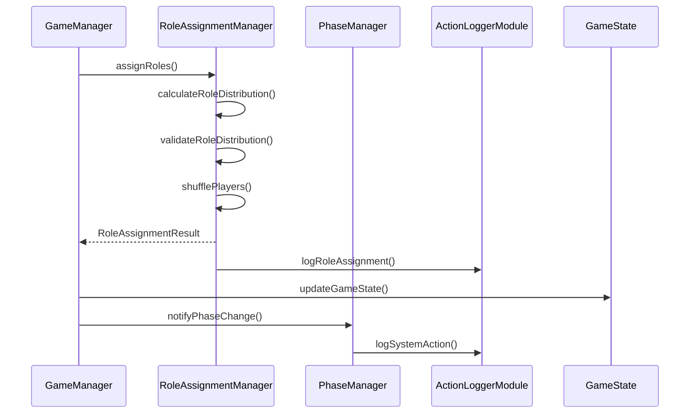

# 役職ランダム割り当て機能の設計

## 概要

プレイヤーに役職をランダムに割り当てる機能を実装する。この機能は以下の要件を満たす必要がある：

1. PhaseManagerと連携して準備フェーズで役職を割り当てる
2. mc-action-loggerと連携して役職割り当てをログに記録する
3. プレイヤーに役職が与えられたことを通知する
4. 役職の種類やバランスを適切に管理する

## システム設計

### 新規クラス: RoleAssignmentManager

```typescript
interface RoleAssignmentConfig {
  roleDistribution: {
    [key in RoleType]?: number;
  };
  minPlayers: number;
  maxPlayers: number;
}

interface RoleAssignmentResult {
  success: boolean;
  assignments: Map<string, RoleType>;
  error?: string;
}

class RoleAssignmentManager {
  private static instance: RoleAssignmentManager | null = null;
  private gameManager: GameManager;
  private config: RoleAssignmentConfig;
  private loggerModule: ActionLoggerModule;
  private eventHandlers: Map<string, Function>;

  private constructor(gameManager: GameManager) {
    this.gameManager = gameManager;
    this.config = this.getDefaultConfig();
    this.loggerModule = ActionLoggerModule.getInstance();
    this.eventHandlers = new Map();
    this.registerEventHandlers();
  }

  public static getInstance(gameManager: GameManager): RoleAssignmentManager {
    if (!RoleAssignmentManager.instance) {
      RoleAssignmentManager.instance = new RoleAssignmentManager(gameManager);
    }
    return RoleAssignmentManager.instance;
  }

  public async assignRoles(players: string[]): Promise<RoleAssignmentResult>;
  private calculateRoleDistribution(playerCount: number): Map<RoleType, number>;
  private validateRoleDistribution(distribution: Map<RoleType, number>): boolean;
  private shufflePlayers(players: string[]): string[];
  private logRoleAssignment(playerId: string, role: RoleType): void;
  private registerEventHandlers(): void;
  private handlePhaseChange(phase: GamePhase): void;
  private handlePlayerJoin(playerId: string): void;
  private handlePlayerLeave(playerId: string): void;
}
```

### 主要コンポーネント間の関係



## 詳細設計

### 1. イベント駆動アーキテクチャ

```typescript
interface RoleAssignmentEvent {
  ROLE_ASSIGNED: {
    playerId: string;
    role: RoleType;
    timestamp: number;
    gameState: GameState;
  };
  ROLE_DISTRIBUTION_CALCULATED: {
    distribution: Map<RoleType, number>;
    playerCount: number;
    gameState: GameState;
  };
  ROLE_VALIDATION_ERROR: {
    error: string;
    distribution: Map<RoleType, number>;
    gameState: GameState;
  };
}

// イベントハンドラの登録
private registerEventHandlers(): void {
  this.gameManager.on('phaseChanged', (phase: GamePhase) => {
    if (phase === GamePhase.PREPARATION) {
      this.handlePreparationPhase();
    }
  });

  this.gameManager.on('playerJoined', (playerId: string) => {
    const gameState = this.gameManager.getGameState();
    this.validatePlayerCount(gameState.players.size);
  });
}
```

### 2. パフォーマンス要件

- 役職割り当て処理: 100ms以内
- メモリ使用量: プレイヤー数 × 1KB以内
- イベント発火遅延: 16ms以内

### 3. 役職分配ロジック

```typescript
interface RoleDistributionRule {
  playerRange: [number, number];
  distribution: {
    [RoleType.DETECTIVE]: number;
    [RoleType.KILLER]: number;
    [RoleType.ACCOMPLICE]: number;
    [RoleType.CITIZEN]: number;
  };
}

private readonly ROLE_DISTRIBUTION_RULES: RoleDistributionRule[] = [
  {
    playerRange: [4, 6],
    distribution: {
      [RoleType.DETECTIVE]: 1,
      [RoleType.KILLER]: 1,
      [RoleType.ACCOMPLICE]: 0,
      [RoleType.CITIZEN]: -1 // 残りのプレイヤー
    }
  },
  // ... その他のルール
];
```

### 4. エラーハンドリング

```typescript
class RoleAssignmentError extends Error {
  constructor(
    message: string,
    public code: 'INVALID_PLAYER_COUNT' | 'INVALID_DISTRIBUTION' | 'ASSIGNMENT_FAILED',
    public gameState: GameState
  ) {
    super(message);
    this.name = 'RoleAssignmentError';
  }
}

private handleError(error: Error): void {
  const errorDetails = {
    message: error.message,
    code: error instanceof RoleAssignmentError ? error.code : 'UNKNOWN_ERROR',
    timestamp: system.currentTick,
    gameState: error instanceof RoleAssignmentError ? error.gameState : this.gameManager.getGameState()
  };

  this.loggerModule.logSystemAction('ROLE_ERROR', errorDetails);
}
```

### 5. セキュリティ対策

```typescript
interface EncryptedRoleData {
  encryptedRole: string;
  iv: string;
  timestamp: number;
}

private encryptRoleData(role: RoleType, playerId: string): EncryptedRoleData {
  // AES暗号化を使用
  const { encrypted, iv } = encrypt({
    role,
    playerId,
    timestamp: system.currentTick
  });

  return {
    encryptedRole: encrypted,
    iv,
    timestamp: system.currentTick
  };
}
```

## テスト方針

### 1. 単体テスト

```typescript
describe('RoleAssignmentManager', () => {
  describe('calculateRoleDistribution', () => {
    test.each([
      [4, { DETECTIVE: 1, KILLER: 1, ACCOMPLICE: 0, CITIZEN: 2 }],
      [7, { DETECTIVE: 1, KILLER: 1, ACCOMPLICE: 1, CITIZEN: 4 }],
      // ... その他のケース
    ])('プレイヤー数 %i での役職分配', (playerCount, expected) => {
      const result = manager.calculateRoleDistribution(playerCount);
      expect(result).toEqual(expected);
    });
  });
});
```

### 2. 統合テスト

- [ ] GameManagerとの連携テスト
- [ ] PhaseManagerとの連携テスト
- [ ] mc-action-loggerとの連携テスト
- [ ] エラーハンドリングの検証
- [ ] パフォーマンステスト

## 実装の優先順位

1. **基本機能** (P0)
   - 役職割り当てロジック
   - GameManagerとの連携
   - 基本的なエラーハンドリング

2. **イベントシステム** (P1)
   - イベントハンドラの実装
   - フェーズ連携
   - 状態管理の改善

3. **セキュリティ機能** (P2)
   - 役職情報の暗号化
   - アクセス制御
   - ログセキュリティ

4. **拡張機能** (P3)
   - カスタム役職システム
   - 役職バランス調整
   - 統計分析機能

## 今後の検討事項

1. カスタム役職の追加方法
2. 役職バランスの動的調整
3. プレイヤー数の変動への対応
4. パフォーマンス最適化の方法