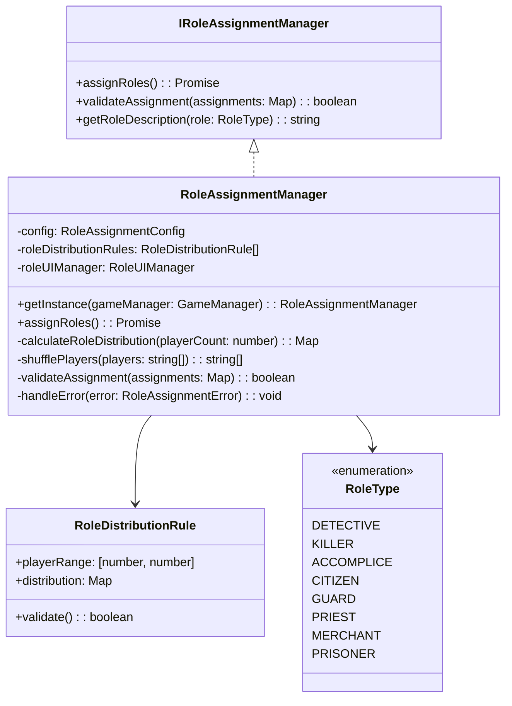
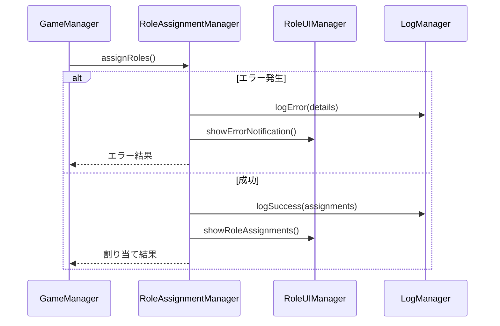

# 役職割り当てシステム設計書

## 1. 概要

### 1.1 目的
プレイヤーへの役職割り当てを管理し、ゲームの公平性とバランスを保ちながら、柔軟な役職システムを提供する。

### 1.2 主要機能
- プレイヤー数に応じた適切な役職分配
- 役職のバランス調整
- カスタム役職のサポート
- 詳細なログ記録
- エラーハンドリング
- UIフィードバック

## 2. システム設計

### 2.1 クラス構造


### 2.2 データ構造

```typescript
interface RoleAssignmentConfig {
  roleDistribution: {
    [key in RoleType]?: number | "dynamic";
  };
  minPlayers: number;
  maxPlayers: number;
  balanceRules: RoleBalanceRule[];
}

interface RoleBalanceRule {
  roleType: RoleType;
  minPercentage?: number;
  maxPercentage?: number;
  dependentRoles?: {
    role: RoleType;
    ratio: number;
  }[];
}

interface RoleProperties {
  name: string;
  description: string;
  team: "DETECTIVE" | "KILLER" | "NEUTRAL";
  abilities: string[];
  restrictions: string[];
}

type RoleDistributionStrategy = "fixed" | "dynamic" | "percentage";
```

## 3. 役職システムの仕様

### 3.1 基本仕様
- プレイヤー数: 4-20人
- 基本役職: 探偵、殺人者、共犯者、市民
- 拡張役職: 看守、神父、商人、罪人

### 3.2 役職分配ルール

#### プレイヤー数による分配
```typescript
const distributionRules: RoleDistributionRule[] = [
  {
    playerRange: [4, 6],
    distribution: new Map([
      [RoleType.DETECTIVE, 1],
      [RoleType.KILLER, 1],
      [RoleType.CITIZEN, "dynamic"]
    ])
  },
  {
    playerRange: [7, 12],
    distribution: new Map([
      [RoleType.DETECTIVE, 1],
      [RoleType.KILLER, 1],
      [RoleType.ACCOMPLICE, 1],
      [RoleType.CITIZEN, "dynamic"]
    ])
  },
  {
    playerRange: [13, 20],
    distribution: new Map([
      [RoleType.DETECTIVE, 2],
      [RoleType.KILLER, 1],
      [RoleType.ACCOMPLICE, 2],
      [RoleType.CITIZEN, "dynamic"]
    ])
  }
];
```

### 3.3 バランスルール
- 探偵チームと殺人者チームの比率を調整
- 特殊役職の出現確率を制御
- プレイヤー数に応じた役職の動的調整

## 4. 拡張性と制約

### 4.1 拡張性
- カスタム役職の追加サポート
- 役職分配ルールのカスタマイズ
- バランスルールの調整機能

### 4.2 制約
- 最小プレイヤー数: 4人
- 最大プレイヤー数: 20人
- 必須役職の保証（探偵、殺人者）

## 5. エラーハンドリング

### 5.1 エラータイプ
```typescript
type RoleAssignmentErrorCode =
  | "INVALID_PLAYER_COUNT"
  | "INVALID_DISTRIBUTION"
  | "ASSIGNMENT_FAILED"
  | "BALANCE_RULE_VIOLATED"
  | "MISSING_REQUIRED_ROLE";
```

### 5.2 エラーハンドリングフロー


## 6. 動作確認項目

### 6.1 基本機能の確認
- [ ] 正しい数の役職が割り当てられる
- [ ] プレイヤー数に応じた適切な分配
- [ ] ランダムな割り当ての確認
- [ ] 必須役職の存在確認

### 6.2 エラーケースの確認
- [ ] プレイヤー数不足時のエラー
- [ ] プレイヤー数超過時のエラー
- [ ] 無効な分配ルール時のエラー
- [ ] バランスルール違反時のエラー

### 6.3 パフォーマンスの確認
- [ ] 大人数時の割り当て速度
- [ ] メモリ使用量
- [ ] エラー発生時の応答性

## 7. UIフローと通知

### 7.1 役職割り当て時のUI
1. 割り当て開始通知
2. 進行状況表示
3. 役職確認画面
4. エラー時の通知

### 7.2 表示内容
- 役職名と説明
- チーム情報
- 特殊能力
- 制限事項

## 8. ログ記録

### 8.1 記録項目
- 割り当てイベント
- エラー発生
- バランス調整
- プレイヤーの確認状態

### 8.2 ログフォーマット
```typescript
interface RoleAssignmentLog {
  eventType: "ASSIGNMENT" | "ERROR" | "BALANCE" | "CONFIRMATION";
  timestamp: number;
  details: {
    playerId?: string;
    role?: RoleType;
    error?: RoleAssignmentErrorCode;
    message: string;
  };
  gameState: GameState;
}