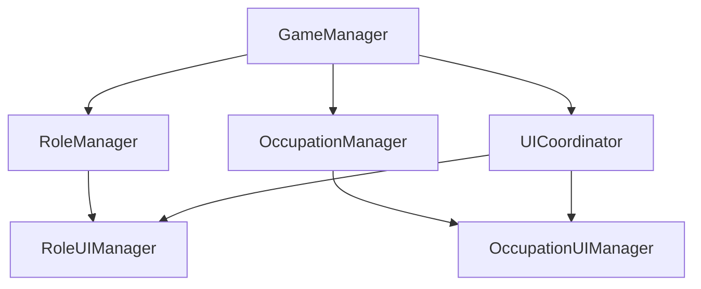

# GameManagerへの職業システム統合設計書

## 1. 概要

GameManagerに職業システムを統合し、役割と職業の連携を実現する設計を行います。



## 2. コンポーネントの追加

### 2.1 OccupationManager

```typescript
interface OccupationAssignmentConfig {
  assignmentRules: {
    [key in RoleType]: {
      allowedOccupations: OccupationType[];
      forbiddenOccupations: OccupationType[];
    };
  };
  balanceRules: {
    minOccupationDiversity: number;
    maxSameOccupation: number;
  };
}

class OccupationManager {
  assignOccupations(
    players: PlayerState[],
    config: OccupationAssignmentConfig
  ): Map<string, OccupationType>;

  validateOccupationAssignment(
    roleAssignments: Map<string, RoleType>,
    occupationAssignments: Map<string, OccupationType>
  ): boolean;

  getPlayerOccupation(playerId: string): OccupationType | null;
}
```

### 2.2 UICoordinator

```typescript
class UICoordinator {
  private roleUIManager: RoleUIManager;
  private occupationUIManager: OccupationUIManager;

  showPlayerInfo(playerId: string): void;
  updateAbilityUI(playerId: string): void;
  handleAbilityUse(
    playerId: string,
    abilityId: string,
    source: "role" | "occupation"
  ): Promise<boolean>;
}
```

## 3. GameManagerの拡張

### 3.1 新しいプロパティ

```typescript
export class GameManager {
  private occupationManager: OccupationManager;
  private uiCoordinator: UICoordinator;
  private occupationUIManager: OccupationUIManager;
}
```

### 3.2 初期化プロセスの拡張

```typescript
private initialize() {
  // 既存の初期化
  this.gameState = this.createInitialGameState();
  this.actionLogger = ActionLoggerModule.getInstance();
  this.logManager = new PlayerActionLogManger(ActionLoggerGameManager.getInstance());
  
  // 新しいコンポーネントの初期化
  this.occupationManager = OccupationManager.getInstance(this);
  this.occupationUIManager = OccupationUIManager.getInstance(this);
  this.uiCoordinator = new UICoordinator(
    this.roleUIManager,
    this.occupationUIManager
  );
}
```

### 3.3 ゲーム開始プロセスの拡張

```typescript
public async startGame(config: GameStartupConfig): Promise<StartupResult> {
  try {
    // 既存の処理
    await this.roleAssignmentManager.assignRoles();

    // 職業の割り当て
    await this.occupationManager.assignOccupations(this.gameState.players, {
      assignmentRules: config.occupationRules,
      balanceRules: config.balanceRules,
    });

    // UIの初期化
    for (const player of this.gameState.players) {
      this.uiCoordinator.showPlayerInfo(player.playerId);
    }

    return {
      success: true,
      gameId: this.gameState.gameId,
      startTime: this.gameState.startTime,
      initialPhase: GamePhase.PREPARATION,
    };
  } catch (error) {
    // エラーハンドリング
  }
}
```

## 4. 状態管理の拡張

### 4.1 GameStateの拡張

```typescript
interface GameState {
  // 既存のプロパティ
  players: PlayerState[];
  phase: GamePhase;
  // 新しいプロパティ
  occupations: Map<string, OccupationType>;
  occupationAbilities: Map<string, AbilityState[]>;
}

interface AbilityState {
  id: string;
  source: "role" | "occupation";
  cooldown: number;
  remainingUses: number;
}
```

### 4.2 フェーズ管理の拡張

```typescript
enum GamePhase {
  // 既存のフェーズ
  PREPARATION = "preparation",
  DAILY_LIFE = "dailyLife",
  // 新しいフェーズ
  OCCUPATION_SELECTION = "occupationSelection",
  ABILITY_TRAINING = "abilityTraining",
}
```

## 5. イベントシステムの拡張

### 5.1 新しいイベント

```typescript
interface OccupationEvents {
  onOccupationAssigned: (playerId: string, occupation: OccupationType) => void;
  onOccupationAbilityUsed: (
    playerId: string,
    abilityId: string,
    result: boolean
  ) => void;
  onOccupationInteraction: (
    sourceId: string,
    targetId: string,
    interactionType: string
  ) => void;
}
```

## 6. 実装手順

1. GameStateの拡張
   - [ ] PlayerStateにoccupationフィールドを追加
   - [ ] 職業関連の状態管理を追加

2. マネージャーの実装
   - [ ] OccupationManagerの実装
   - [ ] UICoordinatorの実装

3. GameManagerの更新
   - [ ] 新しいコンポーネントの統合
   - [ ] 初期化プロセスの拡張
   - [ ] ゲーム開始ロジックの更新

4. イベントシステムの拡張
   - [ ] 職業関連イベントの追加
   - [ ] イベントハンドラーの実装

5. UI統合
   - [ ] 役割・職業情報の統合表示
   - [ ] 能力UIの統合

## 7. エラーハンドリング

```typescript
class OccupationError extends Error {
  constructor(
    message: string,
    public code: "INVALID_ASSIGNMENT" | "RULE_VIOLATION" | "ABILITY_ERROR",
    public details: Record<string, unknown>
  ) {
    super(message);
    this.name = "OccupationError";
  }
}
```

## 8. パフォーマンス考慮事項

1. 状態更新の最適化
   - バッチ処理による一括更新
   - 差分更新の実装

2. メモリ管理
   - 不要なUIの破棄
   - イベントリスナーの適切な解除

3. 非同期処理の最適化
   - Promise.allの活用
   - 適切なエラーバウンダリの設定