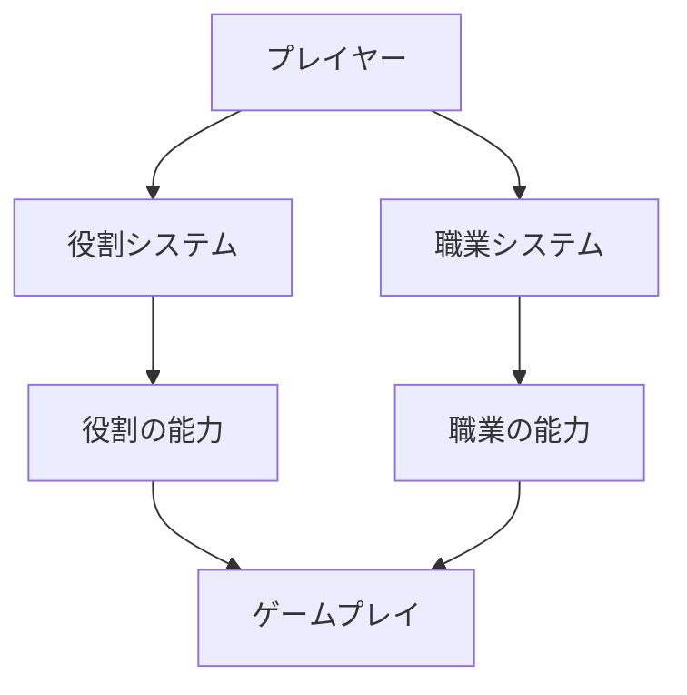
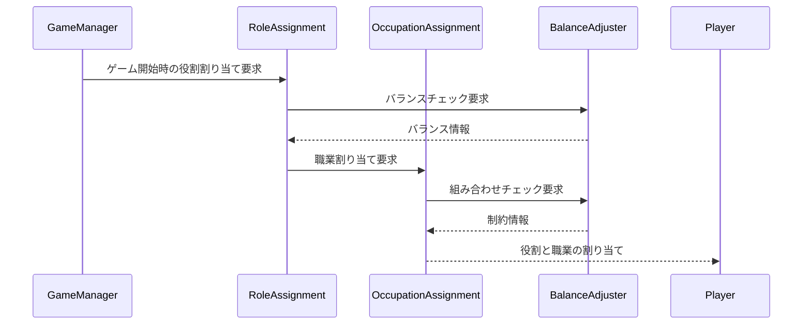

# 役割と職業の分離システム設計書

## 1. システム概要

本設計は、ゲーム内の「役割システム」と「職業システム」を分離し、より柔軟で戦略的なゲームプレイを実現するためのものです。



### 1.1 分離の目的

1. 戦略の多様化
   - 役割と職業の組み合わせによる新たな戦略の創出
   - プレイヤー間の駆け引きの深化

2. バランス調整の容易化
   - 役割と職業それぞれの能力を独立して調整可能
   - 組み合わせの制限による不均衡の防止

3. コンテンツの拡張性向上
   - 新しい役割や職業の追加が容易
   - 既存の組み合わせに影響を与えずに拡張可能

## 2. システム設計

### 2.1 データ構造

```typescript
// 役割の種類
enum RoleCategory {
  DETECTIVE = "detective",
  KILLER = "killer",
  ACCOMPLICE = "accomplice",
  CITIZEN = "citizen"
}

// 職業の種類
enum OccupationType {
  GUARD = "guard",
  PRIEST = "priest",
  MERCHANT = "merchant",
  PRISONER = "prisoner"
}

// プレイヤーの状態
interface PlayerState {
  playerId: string;
  role: RoleCategory;
  occupation: OccupationType;
  abilities: PlayerAbilities;
}

// プレイヤーの能力
interface PlayerAbilities {
  roleAbilities: RoleAbility[];
  occupationAbilities: OccupationAbility[];
}

// 役割の能力
interface RoleAbility {
  id: string;
  name: string;
  description: string;
  coolDown: number;
  requirements: AbilityRequirement;
  effect: AbilityEffect;
}

// 職業の能力
interface OccupationAbility {
  id: string;
  name: string;
  description: string;
  coolDown: number;
  requirements: AbilityRequirement;
  effect: AbilityEffect;
}

// 組み合わせ制約
interface CombinationConstraint {
  role: RoleCategory;
  allowedOccupations: OccupationType[];
  forbiddenOccupations: OccupationType[];
}
```

### 2.2 処理フロー



### 2.3 バランス調整メカニズム

1. 役割バランス
   - 各役割の出現率調整
   - プレイヤー数に応じた役割比率の自動調整

2. 職業バランス
   - 職業の能力強度評価
   - 役割との相性評価

3. 組み合わせ制御
   - 禁止される組み合わせの定義
   - 推奨される組み合わせの重み付け

## 3. 実装詳細

### 3.1 ファイル構造

```
src/
├── types/
│   ├── RoleTypes.ts
│   ├── OccupationTypes.ts
│   └── PlayerTypes.ts
├── managers/
│   ├── RoleManager.ts
│   ├── OccupationManager.ts
│   └── BalanceManager.ts
└── systems/
    ├── RoleSystem.ts
    ├── OccupationSystem.ts
    └── CombinationSystem.ts
```

### 3.2 主要コンポーネント

1. RoleManager
   - 役割の割り当て
   - 役割固有の能力管理
   - 役割間のバランス調整

2. OccupationManager
   - 職業の割り当て
   - 職業固有の能力管理
   - 職業スキルの解除条件管理

3. BalanceManager
   - 組み合わせの評価
   - バランス統計の収集
   - 動的なバランス調整

## 4. 制約条件

### 4.1 役割と職業の組み合わせルール

| 役割 | 許可される職業 | 禁止される職業 |
|------|----------------|----------------|
| 探偵 | すべて | なし |
| 殺人者 | 看守, 商人, 罪人 | 神父 |
| 共犯者 | 商人, 罪人 | 看守, 神父 |
| 市民 | すべて | なし |

### 4.2 プレイヤー数による制限

| プレイヤー数 | 探偵 | 殺人者 | 共犯者 | 市民 |
|------------|------|--------|--------|------|
| 4-6        | 1    | 1      | 0-1    | 2-4  |
| 7-9        | 1    | 1      | 1      | 4-6  |
| 10+        | 1-2  | 1      | 1-2    | 6+   |

## 5. 動作確認項目

### 5.1 基本機能の確認

- [ ] 役割の正常な割り当て
- [ ] 職業の正常な割り当て
- [ ] 役割と職業の組み合わせ制約の適用
- [ ] プレイヤー数に応じた役割比率の調整

### 5.2 能力の確認

- [ ] 役割固有の能力が正常に機能
- [ ] 職業固有の能力が正常に機能
- [ ] 能力の重複が適切に処理
- [ ] クールダウンシステムの動作

### 5.3 バランスの確認

- [ ] 不正な組み合わせの防止
- [ ] 能力の相互作用の検証
- [ ] バランス統計の収集
- [ ] 動的バランス調整の機能

## 6. 拡張性

### 6.1 新規コンテンツの追加手順

1. 役割の追加
   - 役割の定義
   - 能力の実装
   - バランス調整値の設定

2. 職業の追加
   - 職業の定義
   - 能力の実装
   - 組み合わせ制約の設定

### 6.2 バランス調整の仕組み

1. データ収集
   - 勝率統計
   - 能力使用統計
   - プレイヤーフィードバック

2. 自動調整
   - 能力値の微調整
   - 組み合わせ制約の更新
   - マッチメイキングの最適化

## 7. 今後の展開

1. Phase 1: 基本システムの実装
   - 役割と職業の分離
   - 基本的な組み合わせルール
   - 初期バランス調整

2. Phase 2: 拡張機能の追加
   - 新規役割・職業の追加
   - 詳細な統計システム
   - バランス自動調整

3. Phase 3: システムの最適化
   - パフォーマンス改善
   - UI/UX の向上
   - フィードバックに基づく調整