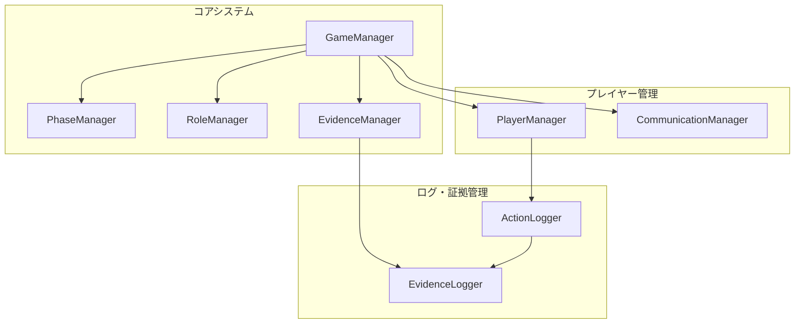
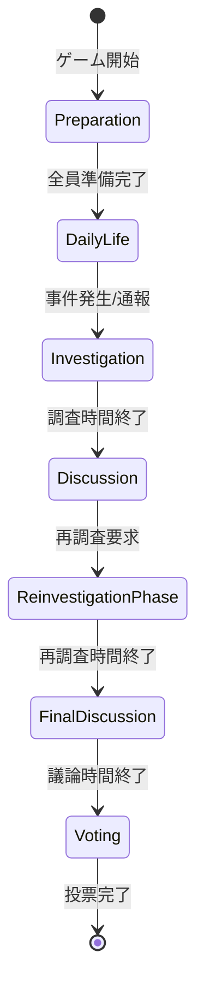
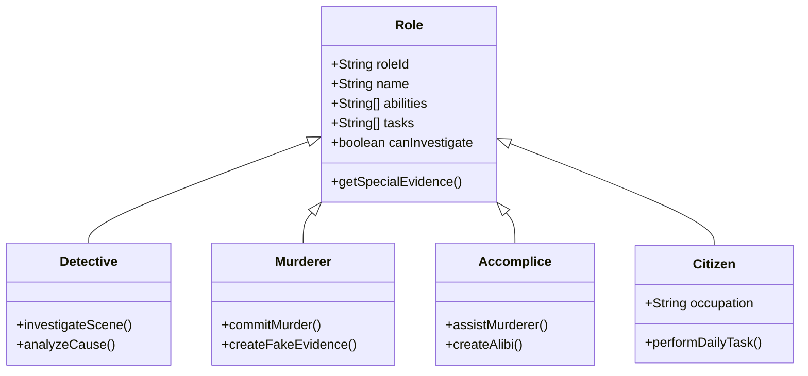
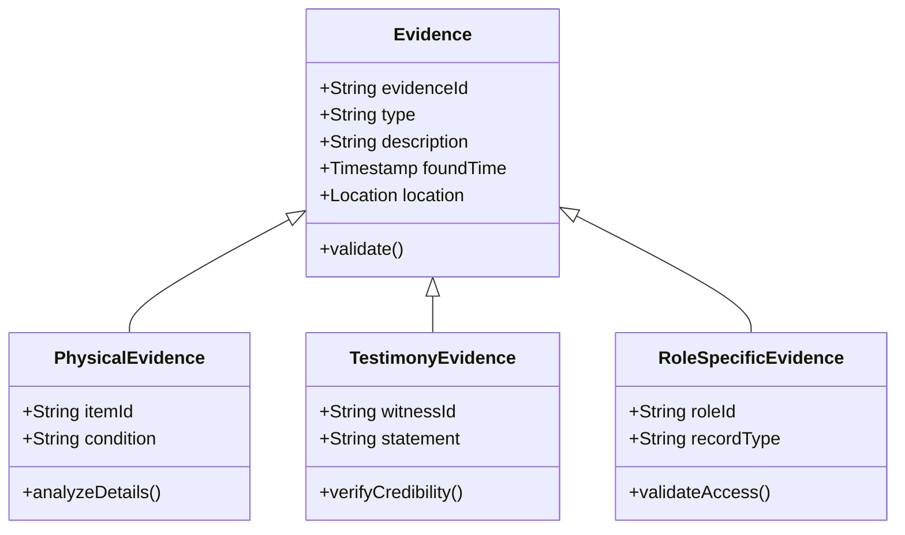
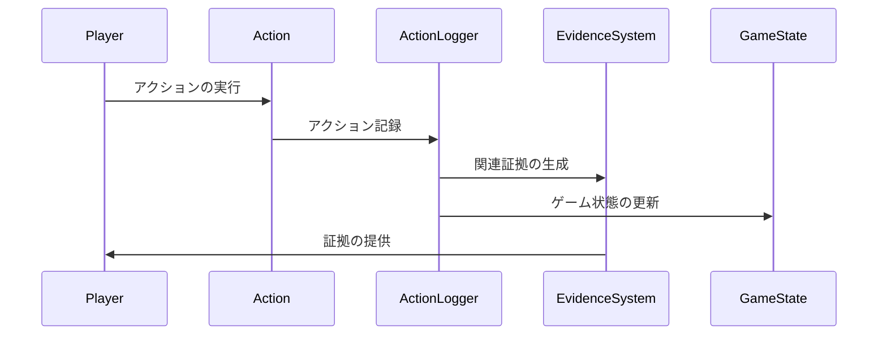

# マーダーミステリーゲーム 設計書

## 1. システム概要

### 1.1 基本情報
- プレイヤー数: 4-20人
- 所要時間: 約70-90分（準備10分 + 生活フェーズ最大3日 + 調査20分 + 会議15分 + 再調査15分 + 最終会議10分 + 推理・投票）

### 1.2 システム構成図



## 2. ゲームフェーズ設計

### 2.1 フェーズ遷移図



### 2.2 フェーズ詳細

1. **準備フェーズ (10分)**
   - 役職の割り当て
   - マップの初期化
   - プレイヤーの初期位置配置
   - ゲームルールの説明

2. **生活フェーズ (最大3日)**
   - 通常の活動（各役職に応じたタスク）
   - 殺人者による行動
   - NPCとの会話
   - 証拠の収集

3. **調査フェーズ (20分)**
   - 現場検証
   - 証拠収集
   - 目撃者への聞き込み
   - アリバイの確認

4. **会議フェーズ (15分)**
   - 全体での情報共有
   - 容疑者の推論
   - 証拠の提示

5. **再調査フェーズ (15分)**
   - 追加の証拠収集
   - 新たな情報の確認
   - アリバイの再確認

6. **最終会議フェーズ (10分)**
   - 最終的な情報共有
   - 最後の議論

7. **投票フェーズ**
   - 容疑者の指名
   - 投票
   - 結果発表

## 3. 役職システム設計

### 3.1 役職一覧



### 3.2 特殊能力設計

1. **探偵**
   - 詳細な現場検証が可能
   - 証拠の分析力が高い
   - 特殊な調査道具の使用が可能

2. **殺人者**
   - 殺害方法の選択
   - 偽装工作が可能
   - 証拠の隠蔽が可能

3. **共犯者**
   - 殺人者のアリバイ作成
   - 証拠の改ざんが可能
   - 情報かく乱が可能

4. **一般市民（職業別）**
   - 農家: 作物の成長記録
   - 門番: 出入りの記録
   - 商人: 取引記録
   - 王/姫: 執務記録
   - 看守: 監視記録
   - 罪人: なし
   - 村人: 日常活動記録
   - 神父: 告解記録
   - 宿屋の店主: 宿泊記録

## 4. 証拠システム設計

### 4.1 証拠の種類



### 4.2 証拠収集システム

1. **物理的証拠**
   - 特定のブロックやアイテムとのインタラクション
   - インベントリへの保存
   - 証拠の状態管理

2. **証言証拠**
   - NPCとの会話
   - プレイヤーの目撃情報
   - 記録された行動履歴

3. **役職特殊証拠**
   - 各役職固有の記録
   - アクセス制限の管理
   - 信頼性の検証

## 5. ActionLogger活用設計

### 5.1 ログ収集システム



### 5.2 アクション定義拡張

```typescript
enum MurderMysteryActionType {
    // 基本アクション
    INVESTIGATE_SCENE,
    COLLECT_EVIDENCE,
    TALK_TO_NPC,
    
    // 役職特殊アクション
    PERFORM_MURDER,
    CREATE_ALIBI,
    ANALYZE_EVIDENCE,
    
    // システムアクション
    PHASE_CHANGE,
    VOTE_CAST,
    EVIDENCE_SHARE
}
```

### 5.3 ログフィルター設定

1. **フェーズ別フィルター**
   - 各ゲームフェーズでの有効なアクション
   - 役職ごとの許可されたアクション

2. **証拠収集フィルター**
   - 有効な証拠収集アクション
   - 証拠の信頼性確認

3. **コミュニケーションフィルター**
   - プレイヤー間の対話記録
   - NPCとの会話記録

## 6. データ構造設計

### 6.1 ゲームステート

```typescript
interface GameState {
    // ゲーム基本情報
    gameId: string;
    phase: GamePhase;
    startTime: number;
    currentDay: number;
    
    // プレイヤー情報
    players: Map<string, PlayerState>;
    roles: Map<string, Role>;
    
    // 証拠情報
    evidenceList: Evidence[];
    collectedEvidence: Map<string, string[]>;
    
    // 投票情報
    votes: Map<string, string>;
    
    // ゲーム進行状態
    isActive: boolean;
    murderCommitted: boolean;
    investigationComplete: boolean;
}
```

### 6.2 プレイヤーステート

```typescript
interface PlayerState {
    // 基本情報
    playerId: string;
    role: Role;
    location: Location;
    
    // インベントリ
    inventory: Item[];
    collectedEvidence: Evidence[];
    
    // 状態フラグ
    isAlive: boolean;
    hasVoted: boolean;
    
    // アクション履歴
    actionLog: PlayerAction[];
    
    // 特殊能力状態
    abilities: Map<string, boolean>;
}
```

### 6.3 証拠データ

```typescript
interface Evidence {
    // 基本情報
    evidenceId: string;
    type: EvidenceType;
    description: string;
    
    // 発見情報
    discoveredBy: string;
    discoveryTime: number;
    location: Location;
    
    // 証拠の状態
    reliability: number;
    isVerified: boolean;
    
    // 関連情報
    relatedPlayers: string[];
    linkedEvidence: string[];
}
```

## 7. 実装方針

### 7.1 優先順位

1. コアシステムの実装
   - フェーズ管理
   - 役職システム
   - 基本的なアクションロギング

2. 証拠システムの実装
   - 証拠の収集
   - 証拠の管理
   - 証拠の分析

3. コミュニケーションシステムの実装
   - チャットシステム
   - 情報共有機能
   - 投票システム

4. 高度な機能の実装
   - 役職特殊能力
   - 証拠の信頼性システム
   - 統計・分析機能

### 7.2 技術スタック

- TypeScript/JavaScript
- Minecraft Bedrock Edition API
- ActionLogger Module
- カスタムUI要素

### 7.3 拡張性

1. 新規役職の追加
2. カスタム証拠タイプの追加
3. ゲームルールの調整
4. マップの拡張